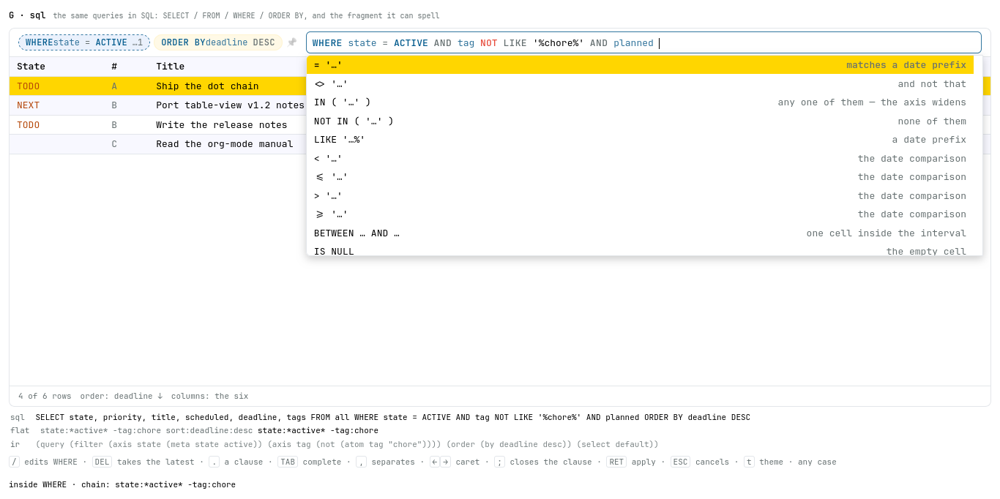

# Spike — seven ways for “.” to open a query

**Date:** 2026-08-21 · **After:** the additive-filters work
(`docs/proposals/done/2026-08-20-additive-filters.md`), whose closing section
reads the language as one dataframe pipeline —
`df.filter(…).orderBy(…).select(…)` — and the two-door split the shell already
ships: `/` edits the narrowing half, `.` the whole expression, and both open the
same text field.

The ask, in the user's words:

> make `.` visually different from `/` in the inline search box. `.` should
> visually spawn a dot and autocomplete the three functions —
> `.(filter|sort|columns)` — and after completion look like a completed function
> in an IDE: `.filter(...)` where the parens' inside completes filter options,
> `.sort(...)` sort options, `.columns(...)` column names.

So the question is not what `.` DOES — it already opens the whole grammar — but
whether the whole grammar can be **read as a chain of calls** at the moment it is
typed, while the flat `?q=` string stays the one truth underneath. A later ask
put the same question to a language a reader already knows — *a minimal
SQL-compatible language for the same queries* — and G is that tab: same string
underneath, same badges on the strip, `SELECT` / `FROM` / `WHERE` / `ORDER BY`
on top. The chain is a
VIEW of that string; every tab here composes the same string and shows it applied.
Seven looks, built to be argued with. **Open `index.html`** — they are tabs.

**F is the picked look.** It is D's machinery — badges on the chip strip, `/`
editing one, `DEL` taking one — with a **Haskell expression inside the parens**,
and a lisp normal form under the box proving the two readers agree. What the
rounds of argument changed is under [Argued and amended](#argued-and-amended),
and every amendment is pinned in `check.mjs`.

Everything here is throwaway. The fixture is invented; the palette, the docked
box, the chip voices and the dropdown are glance's own, lifted from
`Page/Style.hs` and `assets/table-view.js`, so the look is judged at the real
hues and the real metrics.

| file | what it draws |
| --- | --- |
| `index.html` | the tabbed shell; each variant runs in its own `<iframe>` |
| `a-control.html` | the control: today's `.` — the whole flat grammar in one field |
| `b-plain-chain.html` | the dot, the three calls, plain text between the parens |
| `c-ide-chain.html` | the editor look: coloured calls, a ghost argument list, per-stage completion |
| `d-stage-pills.html` | a closed call joins the chip strip as a badge; `/` edits one, `DEL` takes one |
| `e-echo-line.html` | C's entry, plus the flat `?q=` echoed live underneath |
| `f-typed-dsl.html` | **the picked look** — D's machinery, Haskell inside the parens, the normal form under it |
| `g-sql.html` | the same queries in SQL: clause badges, and the fragment of SQL this grammar can carry |
| `rig.js` | the fixture, the grammar, both doors, THREE readers, the normal form, the docked box |
| `pane.css` | the box, the strip, the dropdown, the table, both palettes |
| `check.mjs` | the complaint, mechanised |
| `shots.mjs` | the seven screenshots, headless |
| `bidi.mjs` | the fold-marks spike's Firefox driver, copied so this directory stands alone |
| `a-control.png` … `g-sql.png` | each tab at its own moment |

Keys are the shell's own, plus what a chain needs: `.` chains the next call,
`TAB` completes, `(` takes the call, `,` separates arguments, `)` closes the
stage, `←`/`→` walk the caret, `RET` applies, `ESC` steps back a rung, `t` swaps
the theme. In A, B, C and E, `/` opens the flat filter door. In **D, F and G** it
is the filter STAGE's edit key, `DEL` is the chain's own backspace, and in F
alone `-` and `+` are the two sign helpers — **G gives both signs back to the
text**, because `CURRENT_DATE + INTERVAL '30' DAY` needs them to type. In G `;`
closes a clause where `)` closes a stage, and `.` opens a statement with no dot
in it. `ESC` parts by DIALECT rather than by tab: a rung on a ladder in the flat
door and in D, and in **F and G** the cancel itself — one press for the whole
edit (round 14).

## What each tab argues

| | `.` opens | inside the parens | where the chain lives | `/` | `DEL` |
| --- | --- | --- | --- | --- | --- |
| A control | the flat field | — (a dot is a character) | nowhere | the flat door | — |
| B plain chain | a dot and three calls | plain text, completed | the box | the flat door | — |
| C ide chain | a dot and three calls | coloured, ghosted, per-stage | the box | the flat door | — |
| D stage pills | a dot and three calls | as C | the chip strip | edits the filter stage | takes the latest stage |
| E echo line | a dot and three calls | as C | the box | the flat door | — |
| **F typed dsl** | a dot and three calls | **Haskell** | the chip strip | edits the filter stage | takes the latest stage |
| G sql | four clause keywords, no dot | **SQL**, and no parens at all | the chip strip | edits the `WHERE` clause | takes the latest clause |

- **A** is the baseline and it fails on purpose: `.` opens the same field `/`
  opens, one step wider. A dot in it is a character, and the dropdown lists
  `state:`, `scheduled:`, `substring:` and `sort:` in one flat run — the
  narrowing keys and a shaping key spelled alike, which is precisely the
  confusion the ask is about (`a-control.png`).
- **B** makes the smallest claim that is still a chain: a query has STAGES.
- **C** spends the ink: the call name in the reserved word's own hue, the
  punctuation dim, the arguments coloured per part, a ghost argument list in
  empty parens, and a closed call collapsing to its first argument and a count.
- **D** moves the finished chain OUT of the box: each closed call is a badge on
  the chip strip, in the strip's own hue law, and the box holds only the stage
  being written. The strip becomes the flat query grouped back into stages.
- **E** keeps C's entry and adds the proof in words: the flat string, live,
  under the box — what stands quiet, what the chain is adding lit.
- **F — the picked look** — is D with the argument language changed. See below.
- **G** asks the ask again in a language nobody has to be taught: the same three
  stages under `SELECT` / `FROM` / `WHERE` / `ORDER BY`. It is F's machinery
  with SQL's words, and the whole of its argument is the FRAGMENT — which SQL
  this flat grammar can carry, and what it says about the queries when the
  answer is "not that one".


*F with an order committed and `/` pressed: the filter badge is dashed in the
box's own accent because it is open in the box, `tag /= "chore"` ligates its
inequality, a second field has just been opened onto its quoted slot, and the
offers over that slot lead with the constructor. Under the box, the flat string
and the normal form.*

## F, the typed surface

```haskell
.filter(state = Active, tag /= "chore", priority = ["A", "B"])
.sort(columns = [Desc "Deadline", "Title"])
.columns("State", "Deadline")
```

**The three signatures.** `.filter(…)` takes kwargs. `.sort(…)` takes ONE kwarg
whose list carries the chain in written order. `.columns(…)` takes POSITIONAL
names. Positionals and kwargs coexist the usual way, positionals first — a bare
literal in `.filter(…)` is free text, so `.filter("milk", state = Active)` is
`substring:milk state:*active*`.

**Column names are quoted strings everywhere**, in both shaping stages. A custom
column is any name at all — `columns:owner` reads the property drawer — so the
set is OPEN, and the closed/open law that put the tree's keywords on the string
side puts the columns there with them. Constructors stay the metas' alone.

**The direction is a constructor applied to the name** — `Desc "Deadline"`, the
closed word taking the open string, which is the same figure as `state = Active`
beside `state = "TODO"`. It is per SEGMENT, which is what the flat grammar needs
(`sort:state:desc->title` and `sort:state->title:desc` are different orders), and
it leaves the quotes meaning taken-as-written everywhere. `Asc` is spellable and
never emitted, matching the flat grammar's "nothing or `:asc`", so a round trip
prints what the reader typed. The rejected spelling is the flat suffix smuggled
into a literal (`"Deadline:desc"`); under this reading that string is a column
NAME with a colon in it, which is not one of the six — see the corners.

**Case carries nothing.** `active`, `Active` and `ACTIVE` are one name, and so
are `FILTER` and `filter`; a bare name is resolved by LOOKUP in the closed world
— the constructors, the wrappers, `not`/`raw`, and the stage's own fields —
never by its first letter. **Quoting is the one disambiguation left**: bare
means the closed world, quoted means an open value, and a bare name nothing
answers to is an error the surface marks rather than a string it invents. What
STANDS after an accept is the canonical spelling — constructors capitalised,
fields in the lower case the flat keys wear — because the accept is the
formatter's moment. The rewrite is case-only, so no offset moves.

- **Record syntax for the fields.** `state = Active`, spaces around the `=`.
  A field is a name the grammar already has — the twelve keys — so the surface
  can name nothing the flat string cannot.
- **Bare constructors for the closed roster.** `Active`, `Inactive`, `Empty`,
  `Archive` — `docs/query.md`'s starred family, one constructor each, plus
  `None` in `.sort(…)` and `Asc`/`Desc` on its columns. They are **one shared
  sum type, not one per field**: `*empty*` is legal on all six column keys and
  on `planned`, so per-field types would need qualified names (`State.Empty`,
  `Tag.Empty`, …) for a distinction the grammar does not make. The FIELD decides
  which constructors are legal — `state = Archive` is a type error, and the
  surface marks it — which is the Haskell reading, where a field's type is what
  restricts its constructors.
- **Double-quoted literals for the open values.** `state = "TODO"`, because the
  keywords are the TREE's, not the language's. **A quoted string is a literal,
  the flat grammar's own quoting law**: `tag = "-chore"` searches for a tag
  spelled `-chore` and is never a negation. That is `substring:"-x"`'s rule,
  said in Haskell.
- **Haskell lists for the alternatives.** `state = ["TODO", "DONE"]` composes to
  `state:TODO|DONE`.
- **`/=` for the negation**, the Prelude's own. `tag /= "chore"` is `-tag:chore`;
  `state /= ["TODO", "DONE"]` is `-state:TODO|DONE`, "neither" — the negation
  scopes the WHOLE token, alternatives included, which is the flat grammar's own
  De Morgan pin. `not (…)` is accepted as the wrapper for what an operator on a
  field cannot carry, and is what the `-` key spawns on empty ground.
- **Free text is `substring = "milk"`**, with a bare `"milk"` accepted as the
  same thing. The axis the proposal calls `text` is `substring:`'s and free
  text's shared one, and `substring` is the key that actually exists — a field
  called `text` would name something no flat string can spell. The bare string
  is free text said the way the flat grammar says it — the positional argument
  of `.filter(…)` — and both compose to `substring:milk`.
- **`raw "…"` is the escape hatch**, and it is the surface admitting it is not
  total. See the corners.

### The three decisions

1. **Negation is an operator, the sign is a key.** `-` inside the filter parens
   flips the kwarg under the caret between `=` and `/=`, and flips it back; on
   empty ground it spawns `not (|)`. Typing `/=` by hand does the same thing.
   The sign is never a character in this surface — there is nowhere for it to
   be one.
2. **The additive sign is a list helper.** `+` on a kwarg turns its value into a
   Haskell list with a fresh slot: `state = "TODO"` becomes `state = ["TODO", |]`,
   and a list already there gains another slot. Lists compose to the flat
   alternation, which on a bare axis is exactly what the flat `+` means —
   `k:v₁|v₂ ≡ k:v₁ +k:v₂`, the proposal's law 5, and the normal form proves it
   mechanically. What the key CANNOT reach is law 5's other half; see the
   corners.
3. **A lisp normal form is the proof.** Two parsers — the flat grammar's own and
   F's typed one — build TERMS independently and hand them to one builder, which
   writes the additive proposal's denotation as an s-expression: axes sorted by
   key, each axis `(P∪N ≠ ∅ ∧ base) ∨ wide`, with `and`/`or` flattened, sorted
   and deduped so associativity, commutativity and idempotence are quotiented
   away. Two spellings that MEAN the same thing print the same bytes.

```
state:*active* -tag:chore
.filter(state = Active, tag /= "chore")

  ⇓ both readers

(query (filter (axis state (meta state active))
               (axis tag (not (atom tag "chore"))))
       (order default) (select default))
```

The line is echoed live under F's box, **read from the typed reader while the
table is served by the flat one** — so a divergence between the two paths shows
on the screen as well as in the check.

## G, the SQL surface

The ask, in the user's words:

> a minimal SQL-compatible language for the same queries — SELECT [columns, *
> by default] [FROM default] WHERE {filters} ORDER BY [sort spec].

```sql
SELECT state, deadline, owner
  FROM work
 WHERE state = ACTIVE
   AND tag NOT LIKE '%chore%'
   AND deadline <= CURRENT_DATE + INTERVAL '30' DAY
 ORDER BY deadline DESC, title
```



*G with an `ORDER BY` committed and `/` pressed: the `WHERE` badge is dashed in
the box's own accent because it is open, the `AND` the gesture appended stands
at the tail, and `planned` has just been named — so the offers are the operators
**that column** takes. There is no `LIKE '%…%'` among them, `planned` matching a
date PREFIX and never a substring; there is a `BETWEEN`, and an `IS NULL`. Under
the box, the statement whole, the flat string, and the normal form.*

**A clause is a badge, and the statement is the view.** D's machinery answered
sixteen rounds of argument about badges, `/`, `DEL`, the caret-edge offers and
the cancel; a statement line would re-answer all of it inside a text field,
which is variant A's failure wearing SQL's words. Three grounds beyond
inheritance: the clause is the unit a reader EDITS, and `/` reopening `WHERE`
alone is what the strip is for; SQL's clause order is fixed, and badges keep it
by construction where a line would have to police it; and the strip is a view of
the flat string, which has no clause order at all. **The cost is that SQL is a
SENTENCE and the pills cut it into words** — so the sentence is given back under
the box, live, beside the flat string and the IR. The entry is clause by clause;
the reading is whole. The corner that leaves is a reader who wants to PASTE a
statement, and g has nowhere to put one.

**`.` opens something with no dot in it.** The spike's question was always what
`.` OPENS, and the dot was the dot-chain's own spelling of the answer. G opens a
STATEMENT: no dot is drawn, and the four clause keywords are the offers. That is
why `DOT` and `PARENS` are declared departures with rungs of g's own — `KEYWORD`
and `HEAD` — rather than quietly failing.

**The clause ends where the next one begins**, which is SQL's rule and the one
gesture g does not have to invent: the reserved word closes what stands and
opens what follows, whether it is taken from the offers or typed (`ORDER `
alone opens nothing — it is `BY ` that finishes the keyword). `;` closes a
clause without opening one, which is the one key g spends on a gesture SQL does
not have: SQL ends a STATEMENT with it and a clause with nothing at all.

### The fragment, which is the whole of the argument

The flat grammar is **axes-AND with per-axis disjunction**: the query is a
conjunction over axes, and each axis is `(P∪N ≠ ∅ ∧ base) ∨ wide`. So the SQL
that composes is exactly the SQL that shape can hold:

- **`AND` composes across anything.** It is the flat string's space, and on one
  axis it is the intersection — which needs no name here, a repeated column
  being the conjunction itself. (F could not repeat a record field and had to
  invent `All [...]`.)
- **`OR` composes only between predicates of ONE column.** Every arm on one
  axis, at most one of them a base — a conjunction, or anything negated — and
  the rest the widenings the flat `+` spells.
- **A cross-axis `OR` is REFUSED**, by name: `OR across columns has no flat
  spelling — see the axis law`. The word itself is marked, the line stands in
  the hint row, and **the clause composes nothing at all**.

That last rule is g's own, and it parts from F on purpose. F loses a term it
cannot say and counts it (`lost`), because a kwarg fails at a LEAF. An `OR` is
the SHAPE of an expression, and dropping one arm of it would compose a
strictly WEAKER query — more rows than were asked for, which is the one
direction a reader cannot check. So the refusal is per EXPRESSION: nothing
composes, and the reader sees the table widen to say so.

**Precedence is what most often refuses a reader's `OR`.** `AND` binds tighter,
so a one-column `OR` written beside another column's predicate hands it an arm
that spans both, and the refusal is TRUE of what was written. The reader's
answer is the parens, and they are SQL's own — `state = ACTIVE AND (tag = 'web'
OR tag = 'docs')`. The check pins both halves, because a diagnostic that fires
where a reader thinks it should not is worth as much argument as one that does
not fire at all.

### The mappings

| SQL form | flat form | note |
| --- | --- | --- |
| `WHERE state = 'TODO'` | `state:TODO` | the key's own test, and never SQL's equality |
| `WHERE state = ACTIVE` | `state:*active*` | the closed roster, bare — SQL enums read that way |
| `WHERE tag <> 'chore'` · `!=` | `-tag:chore` | either spelling |
| `WHERE NOT (tag = 'chore')` | `-tag:chore` | the wrapper, where the operator cannot reach |
| `WHERE state IN ('TODO', 'DONE')` | `state:TODO\|DONE` | the alternation |
| `WHERE state NOT IN ('TODO', 'DONE')` | `-state:TODO\|DONE` | "neither" — the negation scopes the whole token |
| `WHERE NOT (tag = 'a' OR tag = 'b')` | `-tag:a\|b` | De Morgan, the direction that works |
| `WHERE tag = 'web' AND tag = 'docs'` | `tag:web tag:docs` | the intersection, with no name |
| `WHERE (tag = 'a' AND tag = 'b') OR tag = 'c'` | `tag:a tag:b +tag:c` | **law 5's parting case** |
| `WHERE title LIKE '%ship%'` | `title:ship` | the infix law, said out loud |
| `WHERE deadline LIKE '2026-08%'` | `deadline:2026-08` | the prefix law, said out loud |
| `WHERE priority IS NULL` | `priority:*empty*` | SQL already had the word |
| `WHERE priority IS NOT NULL` | `-priority:*empty*` | |
| `WHERE deadline < CURRENT_DATE` | `deadline:<*today*` | overdue |
| `WHERE deadline <= CURRENT_DATE + INTERVAL '30' DAY` | `deadline:<=*today*+30d` | `DAY`/`WEEK`/`MONTH`/`YEAR`, singular or plural |
| `WHERE deadline = DATE '2026-01-31' + INTERVAL '1' MONTH` | `deadline:2026-01-31+1m` | months and years CLIP — February's last day |
| `WHERE planned BETWEEN CURRENT_DATE AND CURRENT_DATE + INTERVAL '30' DAY` | `planned:*today*..*today*+30d` | one cell INSIDE the interval |
| `WHERE substring LIKE '%milk%'` | `milk` | free text is the column that exists |
| `FROM work` | `tag:work` | a dataset is a tag |
| `FROM work, home` | `tag:work\|home` | the comma is a UNION |
| `FROM *` · `all` · `default` · omitted | — | the whole store |
| `SELECT *` | `columns:State,#,Title,Scheduled,Deadline,Closed,Tags` | seven, and the default view is six |
| `SELECT state, deadline` | `columns:state,deadline` | key or header, case-blind |
| `SELECT owner` | `columns:owner` | the app's custom column, drawer and all |
| `SELECT "ship date"` | `columns:ship date` | the delimited identifier, for what a bare one cannot spell |
| `ORDER BY deadline DESC, title` | `sort:deadline:desc->title` | the comma is the arrow |
| `ORDER BY NULL` | `sort:*none*` | document order, MySQL's own spelling |
| absent `ORDER BY` | — | the default chain |

**Quoting is SQL's, and it is the one thing g has that F does not.** `'value'`
is a literal and `"name"` an identifier — two quote characters, where F had one
and had to spend it on the closed/open law. So **g's columns are bare and
case-folded**, which is SQL's own convention and reads the way a reader expects,
and a custom column with a space in it still has a spelling. The three
namespaces then differ, and that is the design rather than an accident:
`WHERE`'s is CLOSED (the twelve keys, and a bare name nothing answers to is an
error), `ORDER BY`'s is closed to the six the chain can carry, and `SELECT`'s
and `FROM`'s are OPEN — the custom columns are the tree's property drawers and
the datasets are its tags, so no roster can close either.

**`LIKE`'s wildcards must name the key's own test.** The flat grammar has ONE
test per key — exact on `state` and `priority`, a PREFIX on the dates, INSIDE on
`title`, `tag` and free text — and `key:value` never says which. A pattern says
it: `'%x%'` is the infix test, `'x%'` the prefix, `'x'` the exact. Where the
shape IS that key's test the pattern composes; where it asks for one the grammar
does not have it is refused, naming the test the key actually runs. `'%x'` is
refused outright — nothing here anchors at the END of a cell — and so is `_`,
and a `%` in the middle. **This is the one law g states that neither other
surface can.** The cost is its twin: `=` on an infix key is not SQL's equality
at all — `title = 'ship'` matches "Ship the dot chain" — because `=` means the
key's own test and the key's own test is a substring search.

**The dates are the flat grammar's, resolved at compile.** `CURRENT_DATE` is
`*today*`, `+ INTERVAL 'N' UNIT` is the shift, and every law under them is
`Filter.hs`'s own: the shift resolves to a plain day literal before any row is
asked, `w` is seven days, and `m` and `y` are `addGregorianMonthsClip` /
`addGregorianYearsClip` — Jan 31 `+1m` is February's last day and Feb 29 `+1y`
is the 28th. The rig reads ONE PINNED DAY rather than the wall clock, because a
check that moved with the calendar would be a check about the calendar. **The
IR resolves the shift too**, which is what lets `deadline:<=*today*+30d` and
`deadline:<=2026-09-20` print the same bytes — the denotation is the day, and
the spelling is the reader's. The one form g cannot spell is the flat grammar's
BARE shift (`deadline:+30d`, today-relative): SQL's `INTERVAL` is an operand and
wants something to be added to.

**`FROM` names a dataset, and a dataset is a tag.** A tree has one row space and
its tags cut it into sets, so the tag axis IS the table namespace and `FROM
work` is `tag:work`. Three consequences, each pinned:

- **The comma is a UNION.** SQL's comma is a cross join — two relations, and
  every row a PAIR of rows. There is one row space here and a dataset is a
  SUBSET of it, so the only composition that leaves a row a row is the union,
  which is already the flat grammar's per-axis disjunction. The intersection
  needs no comma either: `FROM work WHERE tag = 'urgent'` says it, both landing
  on the tag axis where **the axis law ANDs them** — a consequence of the law
  rather than a rule of the clause.
- **An unknown dataset composes all the same.** The tags are the tree's, so the
  namespace is open and `tag:nosuch` serving nothing is the truthful answer —
  the flat grammar's own behaviour, and never an error the surface invents.
- **`FROM` cannot survive a commit.** It composes onto the tag axis, and the
  strip is the flat string grouped back into stages, so after `RET` the dataset
  reappears inside the `WHERE` badge. The wire keeps the meaning and loses the
  word.

**`default` is a word two layers use.** `FROM default` is g's alias for the
whole store; `view:default` is the app's saved view, a query with a name. They
never meet — one is a dataset alias in a surface, the other a stored `?q=` — but
a reader who has seen both will read the second into the first. It is the kind
of collision a shipped surface should rename rather than explain.

**`SELECT *` is seven where the default view is six.** The star is the NAMED
default set — `State`, `#`, `Title`, `Scheduled`, `Deadline`, `Closed`, `Tags` —
and `Query.hs`'s `viewColumns` has six of those, `closed` being a CUSTOM column
that reads the `CLOSED:` planning stamp (`customCell`'s own first line). So the
star composes an EXPLICIT `columns:` token and is not the absent one; the two
print IRs that part, and the check holds them apart on purpose. **`closed` is
the difference, and it is the user's call**: what a reader means by "everything"
includes when the row was finished, and what the app shows by default does not.
An absent `SELECT` cannot happen in SQL, which requires the clause — in the rig
a reader may open `WHERE` first and never write one, and then the flat default
stands. What lets the rendered statement always write a `SELECT` without
changing what it says is one normalisation: **naming every column of the default
view, in its own order, IS the default.**

**`SELECT`'s open names are the app's custom columns**, read from the headline's
corresponding property — `columns:owner` reads the `:OWNER:` drawer pair and
`closed` the planning stamp, which is `resolveColumns`/`customCell`'s own split
(`docs/query.md`'s custom-column section). So `SELECT owner, title` composes
`columns:owner,title` and invents nothing; the rig gives two fixture rows an
`:OWNER:` pair so the toy table DRAWS the drawer values rather than describing
them, and the clause's completion offers the builtins plus a rig-local property
vocabulary standing in for the `/properties` door.

### What SQL affords, and what it refuses

**Affords.** `IN ('a','b')` is the alternation said the way everyone already
spells it, where the flat `|` has to be learned and F's list has to be typed
with brackets. `BETWEEN A AND B` is the range in words, and on `planned` it is
the one reading no pair of tokens has — ONE cell inside the interval. `IS NULL`
is the empty cell, which is the meta the flat grammar spells most awkwardly and
the one F needed a constructor for. A repeated column is the intersection, which
record syntax could not spell at all. And **the parenthesised one-axis `OR` is
law 5's parting case** — `(tag = 'a' AND tag = 'b') OR tag = 'c'` — the single
shape F must escape into `raw "…"`, because the per-axis law IS a disjunction of
a conjunction with alternatives and SQL has both parens and `OR`. **G needs no
escape hatch.** That is the sharpest thing this variant found.

**Refuses.** The general boolean algebra, and it refuses it by NAME rather than
by silence. A cross-axis `OR` has no flat spelling; two bases on one axis have
none (`tag <> 'a' OR tag <> 'b'` is ¬a ∨ ¬b); `NOT` over an intersection is De
Morgan's and no conjunction of negated tokens says it; a comparison off the
three date keys would compose a substring search for the operator; and a `LIKE`
pattern whose shape is not the key's test asks for a match the grammar cannot
run. Ten refusals in all, each with its own sentence, each composing nothing,
each pinned in `check.mjs` with the empty query's own IR beside it — including
the two the first pass stated in prose and never asked for: a `%` in the middle
of a pattern, and a widening OR'd again (`((a AND b) OR c) OR d`, where the flat
list of three arms composes and the NESTED one cannot). `parseSqlWhere` speaks an
eleventh sentence, for `NOT` over a widening, that no expression can reach — a
`+` term only ever arrives beside the base it widens, so `NOT` sees an
intersection and says so first.

**The IR is the proof, three ways.** G's reader compiles to the SAME lisp normal
form as the flat grammar's and F's, reached without either. Twenty-nine paired
spellings print the same bytes in all three readers; seven flat queries rendered
INTO a statement and read back print theirs; eight pairs whose semantics part
print IRs that part with them. Where a row's three READ differently that is the
finding: the `raw "…"` rows are the shape kwargs cannot say, and the date rows
are the shift **F carries as an opaque literal because it has no date grammar at
all** — the third reader is what showed that.

## Argued and amended

The tabs were built, looked at, and changed. Each round is a decision the screen
produced and the check now holds:

1. **D over B/C/E.** The chain belongs where the chips already are: one badge per
   call rather than one chip per token, and the box holding only the live stage.
   (Rounds 5-6 pick F, on D's machinery unchanged, and the head of this file
   says so.)
2. **The comma joins the space as the argument separator.** A call's arguments
   are separated by commas everywhere else. Per stage the comma composes to that
   stage's own flat separator — a space in `filter`, the arrow in `sort`, itself
   in `columns`. (Round 12 makes the comma the GESTURE's own; round 17 makes
   G's separator `AND`.)
3. **The accept went dry and final.** Taking a completion inside the parens
   inserts exactly what it says — no trailing space — closes the offers, and
   does not reopen them; the next keystroke is what asks again. (Round 11 finds
   the edge of this: it is true of a finished TERM, not of every accept.)
4. **`/` and `DEL` became the chain's own keys.** `/` reopens the standing
   `.filter(…)` and the commit rewrites that badge IN PLACE; `DEL` at the strip
   level is the chain's backspace, stage-sized and last in first out.
5. **F: the argument language went typed**, on D's machinery unchanged.
6. **…and then Haskell**, not Python: record syntax, constructors, `/=`, lists,
   quoted literals. The idiom is the user's call; what it cost is in the corners.
7. **The key and its equals come with an opened quoted slot.** Completing
   `state` — or typing its `=` — leaves `state = "|"` with the caret between the
   quotes, so the reader types the value and never the punctuation. The offers
   over that slot still lead with the constructors, and **accepting one swallows
   the quotes** (`state = Active`) where accepting a literal keeps them: a
   constructor is no string. Both stay dry. (Round 17 splits it in G: the COLUMN
   accept opens no slot and the OPERATOR does, and the slot SPENDS its opening
   quote.)
8. **The stages gained signatures, and the columns went quoted.** `.sort(…)`
   takes a `columns` kwarg whose list is the chain; `.columns(…)` takes
   positional names; and every column name in both is a QUOTED STRING, because
   custom columns make the set open and the closed/open law is what decides
   which side of the quotes a value sits on. The opened-slot rule went with
   them: `.columns(` spawns its first positional slot with the call, a comma
   spawns the next, and the sort list's items are offered quoted. (Round 8 hung
   the direction off a `:desc` suffix inside the name; round 10 took it back.)
9. **The DSL went case-blind, and the accept became the formatter.** Any case
   parses; the canonical spelling is what stands afterwards. This is the round
   that moves the whole disambiguating burden onto the quotes — see the corners.
10. **The direction reconciled with the proposal, on the spike's own grounds.**
   Round 8 spelled it `"Deadline:desc"`; the proposal
   (`docs/proposals/proposed/2026-08-21-the-typed-dsl-behind-the-dot-door.md`,
   "`.sort(…)`, and the direction spelling") settled `Desc "Deadline"`, and it
   wins on the argument this README had already written against itself — the
   suffix is a second grammar hidden inside a literal, the one place the quotes
   would not have meant taken-as-written. The re-zipping objection that carried
   the suffix only ever touched the PARALLEL-KWARG shape (`desc = [...]`), which
   both documents reject; a constructor applied to its own string is per segment
   exactly as the suffix was. So `Asc`/`Desc` are back in the roster as the two
   direction constructors, the offers give each column once bare and once under
   `Desc`, and the suffix spelling is now an unknown column.
11. **The dry law's edge is the VALUE, never the position.** A reader hit it:
   RET over a key gave `.filter(state = "")` with the caret in the slot and no
   offers at all. Round 3's "an accept closes the offers" had been read as a
   fact about ACCEPTS, and it is a fact about finished TERMS — a key accept
   finishes nothing, it moves the reader to a new position, and a position's
   own offers stand at once. The rule is now the caret: an accept that leaves
   it INSIDE what it just wrote (`state = "|"`, `not (|)`, `columns = ["|"]`,
   `All ["|"]`) asks again; one that lands after a completed term is final.
   Both entry routes — the key accept and the equals typed by hand — are now
   pinned apart in `check.mjs`, because the regression had killed one and left
   the other standing.
12. **`/` adds a condition, and the comma is the gesture's own.** Reopening the
   standing filter badge used to land at the tail of the last argument
   (`tag /= "chore"|`), which is where a reader goes to EDIT one. `/` is not
   that: it is the add-a-condition key, so it now appends the comma itself and
   lands on a fresh argument (`tag /= "chore", |`) with that position's offers
   standing — round 11's law applied to a gesture rather than an accept. Two
   edges came with it: an EMPTY stage gets no comma, there being nothing to
   follow; and a fresh argument the reader never writes leaves no trace, the
   dangling comma going at the close so the badge returns to its previous
   spelling byte for byte. Editing an argument already written stays what it
   always was — a cursor movement.
13. **A slash in the typed surface is exact.** Once `/` acts mid-stage it needs
   a line, and the typed surface has one the flat dialect does not: every open
   value is quoted, so a slash INSIDE a string is a character
   (`title = "a/b"`) and everywhere else it is the gesture. D keeps the old
   rule — it quotes nothing by default, so the line is not available there.
14. **ESC cancels input, and that is the whole of what it does.** F had
   inherited D's graduated ladder — the offers, then what is half-written, then
   the box — and the reader's own rule takes it away: **one press abandons an
   open edit WHOLE**, whether or not the menu stands over it and whether or not
   anything was typed. The stage comes back spelled the way the edit found it,
   byte for byte; the comma a `/` summoned goes with the rest of what the edit
   wrote, wanting no rule of its own; and the box goes back to the strip it was
   summoned from. **The reader's escape is from the EDIT, never from the
   menu** — in a typed surface the offers are incidental to the input, standing
   over a position rather than being asked for, so cancelling the input takes
   them with it. "What the edit found" is what cost the work. The pre-edit
   spelling is remembered at edit-OPEN, because `/` writes into the stage before
   the reader does and because the typed text has to go too — `closeStage`'s
   dangle-strip is the nucleus and it is not enough on its own. A stage that was
   closed but not yet asked for lives in the BOX rather than in the chips, so
   the cancel is the only thing that can put it back; it puts back the spelling
   the edit found, not the one it was given. And a `/` pressed inside another
   stage's parens interrupts an edit still being WRITTEN, so the box comes back
   to that one open rather than leaving it at the chain level. **The rule is
   the DSL door's alone**: D keeps its ladder and the flat door keeps the
   shipped two-step, so the spike still shows both answers side by side and
   `check.mjs` holds each dialect to its own.
15. **A complete term ends the conversation.** A reader with the caret after a
   finished value — `tag /= "chore"|` — found the offers still standing and
   `RET` taking one, so the key never reached the apply and the filter could
   not be committed from that position at all. Round 11 read the dry law
   forwards — an accept that lands INSIDE what it wrote asks again — and this
   is the same law read backwards. **Offers stand at fresh and UNFINISHED
   positions**; a position whose TERM is finished — a closed string literal, a
   constructor that stands alone, a closed list or wrapper — carries none, and
   `RET` there applies the stage exactly as it does on untouched ground. It is
   the term's completeness and never a gesture's, so it holds whichever path
   asked: the quote stepped over, the caret walked back onto the tail, the sign
   helpers, a repaint. One predicate, one place — `dslDone`, read in
   `cxOffer`'s typed branch, where every path meets. The counter-cases are what
   keep it honest: a comma is a fresh position and offers at once, a half-typed
   `Archiv` is still being written, and a caret inside a literal offers the way
   it always did — the open world finishes nothing. `Desc`, `All`, `not` and
   `raw` are unfinished too, being closed words still waiting for an argument,
   which makes the roster a question of ARITY rather than of spelling.
   (The other half of the law — that a caret which MOVES re-asks — was still
   nineteen hand-placed calls at the time, and one of them was missing; see
   round 18.)
16. **The DSL warns where the grammar is merely honest.** `tag = All ["docs",
   "chore"], tag /= "chore"` composes `tag:docs tag:chore -tag:chore`, and no
   row can answer it. Both bindings are LEGAL — the collision rule forbids one
   shape carrying two values, and `=` and `/=` are two operators — and the flat
   grammar is right to serve the empty table, the emptiness being the truthful
   answer. So this is a **warning and never a refusal**: the query composes and
   applies exactly as it would have, both bindings are marked, and one line
   under the box says which value contradicts which. Two rules, read over the
   ATOMS the surface composes rather than over its text, so however a binding
   was spelled it is judged the same: **a value both required and refused** on
   one axis, and **two requirements one CELL cannot answer at once**. Which
   axes are single-valued is the key's OWN test rather than a list of names,
   and a widened axis is not read at all — both in the corners. The ink says
   the same thing: the pair keeps its syntax colouring and takes the warning's
   dotted amber over it, where `cx-bad`'s wavy red would be calling a legal
   binding an error.

17. **A seventh tab, in SQL.** The ask was *a minimal SQL-compatible language
   for the same queries*, and the round is what that costs and what it buys.
   The machinery is D's and F's unchanged — clause badges on the strip, `/` on
   the narrowing clause, `DEL` stage-sized, the caret-edge offers, the dry
   accept, the complete-term silence, the one-press cancel, the contradiction
   warning — and every one of those laws is INHERITED rather than restated,
   because the door is the typed door and g is a typed surface. What the round
   pinned per variant is only what SQL's grammar makes read differently:
   **the operator is a choice** (a column accept opens no slot and still asks
   again, SQL having ten operators where record syntax has one); **there are
   two quote characters**, so the completeness predicate reads both and the
   columns can be bare; **the connective is a word**, so the position between
   two predicates is one F does not have and its offers are `AND`/`OR`/the next
   keyword; **the separator per gesture is `AND`**, where F's is the comma; and
   **the two signs go back to being characters**, because `CURRENT_DATE +
   INTERVAL '30' DAY` needs them to type. That last one is the round's neatest
   collision: round 1's "the sign is a key, never a character" held only because
   F had nowhere for a sign to be one, and the date shift is what took the keys
   away. The fragment law, the mappings and the corners are under
   [G, the SQL surface](#g-the-sql-surface); `check.mjs` holds twenty-two rungs
   for the tab, nine of them g's own, and twenty-five mutants stand behind them.

18. **A law with nineteen homes has none.** Round 15 gave the silence one
   predicate, `dslDone`, and every path met there. Its other half — *a caret
   that moves re-asks the position* — was still spelled by hand, `cxOffer()`
   beside `paint()`, at nineteen sites; the twentieth, `)` stepping over the
   closer that `not ( … )` had just written, moved the caret and repainted
   without asking. Three keystrokes reached round 15's own reported bug again:
   the field offers stood over a closed wrapper and `RET` spliced a field into
   it instead of applying the stage. The fix is not the missing call, it is the
   HOME — `moved()`, which every write and every walk now goes through — and a
   rung that drives the three keystrokes. **The same shape, one level up:** what
   parted the four dialects was asked in five idioms across some sixty sites, so
   it is now one table, `DIALECT`, with a named slot per law and one reader,
   `D()`; nothing else reads `S.look.dsl` or `S.look.sql`. The laws that two
   dialects shared and each had written out — the fragment under the caret, the
   opened slot's far quote, the reverse-walk formatter, the painter's walk and
   its warning overlay, the flat spelling of a chain and a column list, the five
   quote-aware scanners, the empty cell, the meta roster — each keep one home
   with the dialects calling it. Nothing moved — the whole run is green — and
   four things the spike had STATED and never asked are now rungs: the `planned`
   range, driven on the case that parts it from the token pair rather than on a
   wide interval where the two readings agree; the two refusals spoken in prose
   and never driven; the empty cell per key, where `planned` names two; and a
   departed door that quietly comes back.

19. **The rosters stopped carrying the law.** Round 18 gave the dialects one
   table; this round finishes the same sweep over the laws no dialect owns.
   *A name is offered when it case-blindly EXTENDS the fragment* was spelled
   thirty-four times in two shapes — half of them folding only the fragment,
   correct by the accident of every roster being lowercase, so a roster that
   gained a capital would have gone silent with nothing to show for it. It is
   `starts` now, and every menu and the painter's half-typed test ask there.
   With it: the menu's key contract, which the two doors had written out twice
   (`menuKey`, taking the accept and whether `ESC` is the menu's to answer);
   the key-and-header resolution, which had four spellings and now has one
   (`colOf`, with the `tag`/`tags` alias left at the two edges because it points
   opposite ways); and the flat `sort:`/`columns:` readers, whose second copy
   existed only so `raw "…"` could smuggle a shaping token into F — the one path
   where a divergence would make the escape hatch mean something other than the
   string it quotes (`segsOf`, `namesOf`). Two constants left over from rounds
   the spelling had moved on from went, and the `FROM` clause's error branch —
   filtering on a field nothing sets, so it could only ever answer `[]` — became
   the law it was standing in for: the dataset namespace is OPEN and an unworn
   tag is not an error the surface may invent. **And the check split the two
   things it had been saying at once:** what the API answers without a keystroke
   is the rig's law and not a tab's, so the three dialect law tables are asked
   ONCE PER DIALECT in a LAW pass and the rungs inside the loop keep the
   keystrokes. The flat table had been evaluated identically on five tabs. No
   variant departs any of it, no rung left the roster, and a red line now names
   which half moved.

Rounds 4 and 5 cost the spike its own control. `/` was identical in all tabs on
purpose, and `check.mjs` asserted it; D's, F's and G's departure is now DECLARED
there (`DEPARTS`) rather than dropped, so the four tabs that keep a flat door
still owe each other one and the run still says so. G departs twice over — the
two keys the way D sent them, and `DOT`/`PARENS` because a SQL surface has
neither — and both departures are answered by rungs of its own rather than
excused.

## What the grammar resists

The places where the surface and the flat string disagree. They are the
argument, not the polish; every one is verified in `check.mjs` or by the
round-trip corpus.

- **Quoting now carries the whole disambiguation, and it is load-bearing.**
  With case gone, nothing else tells a closed name from an open value:
  `state = active` is the meta, `state = "active"` is a keyword spelled
  `active`, and `state = chore` is an ERROR rather than a search for `chore`.
  That is a good law — it is the flat grammar's own, where quoting is the only
  escape — but it means a reader who forgets the quotes gets a marked word
  instead of a query, where the flat box would simply have searched. The gain
  is that a typo can no longer silently become a free-text needle.
- **Column names had to leave the constructors.** `Deadline` looks exactly like
  a constructor and cannot be one: custom columns read the property drawer, so
  the set is open and no roster can close it. Quoting them puts them with the
  keywords, and it costs the reader two characters on every column name in
  every shaping stage — the price of the law being uniform.
- **The direction found a home, and the suffix became a bad name.** The
  constructor form keeps the quotes meaning taken-as-written everywhere, which
  the `:desc` suffix could not. The cost is that `["Deadline:desc"]` no longer
  means anything: read as written it names a column with a colon in it, and the
  sort chain takes the six column keys only. F MARKS it and composes nothing for
  that segment — the flat grammar refuses such a query outright (HTTP 400,
  naming the token), and a rig with no refusal path can only make the segment
  take effect nowhere and say so on the screen. **Never document order**: a
  stage whose segments all fail to resolve reads as an ABSENT stage, because
  document order is a meaning nobody asked for. (The rig drops where the server
  refuses — that tolerance is the rig's, and it is uniform across both readers.)
- **The kwargs surface is not total, and `raw "…"` is where it says so.** An
  axis carrying BOTH a base and a widening — `priority:[#A] +priority:[#B]` —
  has no kwargs spelling: one field takes one expression, where the flat form is
  a per-axis PAIR, `(P∪N ≠ ∅ ∧ base) ∨ wide`. This is law 5's parting case, the
  one the `+` key can never reach, and the one the proposal itself names as
  "the reason the chain form stops sufficing". F renders such an axis as
  `raw "priority:[#A] +priority:[#B]"` — the flat string quoted into the typed
  surface rather than mis-said in it — and the IR proves the two readings still
  agree.
- **A list had to choose OR, so the intersection needed a name.** `tag = ["web",
  "glance"]` is the alternation (`tag:web|glance`). Today's repeated
  `tag:web tag:glance` INTERSECTS, and record syntax cannot repeat a field, so
  the unchosen reading is spelled `tag = All ["web", "glance"]` — and `All`
  spreads over its ELEMENTS, not its atoms, so `All ["web", ["glance", "docs"]]`
  stays two tokens and keeps the inner alternation. (It did not, at first; the
  round-trip rung caught it.) `Any [...]` is the bare list's own name.
- **`not (…)` cannot carry an intersection.** `not (tag = All ["web","glance"])`
  is ¬(a ∧ b) = ¬a ∨ ¬b, and no conjunction of negated tokens says that. F names
  the refusal rather than composing something else.
- **`=` and `/=` are two different languages.** `=` is record syntax's binding;
  `/=` is the Prelude's inequality. The pair reads well — the argument list
  reads as a comprehension's guard list, where the commas are `&&` — but the
  fully consistent alternatives are `==`/`/=` throughout (comparison) or
  `=`/`not (…)` throughout (record plus wrapper). F accepts `not (…)` too, so
  the second is spellable; the mix is the picked one.
- **The enum roster is closed at the METAS and open at the keywords.** `Active`,
  `Inactive`, `Empty`, `Archive` are the language's; `"TODO"` is the tree's, out
  of its own `#+TODO:` line. So the constructors can only ever cover the starred
  family, and a per-tree keyword stays a quoted literal. A surface that promised
  `State.TODO` would be promising to know a tree it has not read.
- **An opened slot spends the space.** The reader types `state = TODO"` and gets
  `state = "TODO"`: the space typed after the `=` is the one the slot already
  inserted, so the first keystroke inside an empty slot is not a second one.
  The cost is that a value which genuinely OPENS with a space cannot be typed
  into a slot — it wants `raw`.
- **The chain's separator is a legal character in every argument.** `title:v1.2`,
  a URL in free text — a dot inside the parens has to TYPE, so `.` is the chain
  operator only OUTSIDE them. Every chaining tab costs one more key: `)` closes
  the stage and the next `.` chains.
- **The chain is honest for `filter` and lies for `sort` and `columns`.**
  `df.filter(p).filter(q)` is `filter(p ∧ q)`. But `.sort(a).sort(b)` in THIS
  grammar is `sort:a->b`, a chain EXTENSION where `orderBy` replaces, and
  `.columns(X).columns(Y)` concatenates where `select` replaces. D and F fold
  the shaping stages so the strip never shows two of either.
- **“+2 more” is taken.** An IDE collapses a long argument list with a count and
  spells it with a plus; this grammar has spent the sign, so the count rides an
  ellipsis (`…2`).
- **Collapsing eats the operator.** A closed badge shows its first argument and a
  count, so `state = Active, tag /= "chore"` reads `state = Active …1` — the
  negation is exactly what a reader most needs to see and exactly what the
  compact spelling hides.
- **Empty parens are not the same as no stage.** `.sort()` contributes nothing,
  so the default chain stands; `sort:` in the flat grammar IS the empty chain —
  document order. Document order can therefore only be SPELLED, as `.sort(None)`.
- **An accidental `ESC` costs the whole condition.** The rule is absolute, so a
  press meant for the dropdown takes the edit with it: a
  `not (tag = All ["web", "glance"])` typed character by character into an open
  filter is gone on one key, and this rig has no undo and proposes none. That is
  the rule's **accepted cost**, not a case to soften. A cancel that kept the
  typed text would be a commit under another name, and a ladder that makes the
  reader press twice to leave is exactly what the rule removes; what the surface
  owes in exchange is that the key never surprises — the same answer over an
  open menu, over typed text, and over a summon nothing was typed into. The
  cost is bounded by what an edit HOLDS, which is one stage: everything already
  committed to the strip is untouched, and a `/`-edit of a standing badge cannot
  lose more than what was typed since the `/`.
- **A stage closed but not yet asked for lives in the box.** `)` sends a badge
  to the strip, but the chips do not have it until `RET` — so where a `/`-edit
  of a COMMITTED badge can simply let go and let the chips speak, an edit of a
  pending one has to be spelled back by hand, and so does an edit the summon
  interrupted mid-parens. That is the whole reason the pre-edit spelling is
  remembered rather than recomputed, and it is the one rung where a wrong memory
  shows: in the `/`-summon routes the dangling comma cannot survive a cancel,
  because the stage carrying it does not.
- **What “single-valued” means is the key's TEST, not the key.** The tempting
  rule is "every key but `tag`, the tags cell being the one list", and it would
  warn about queries the grammar answers happily: `title:ship title:chain` is
  satisfiable because a title CONTAINS both, and `deadline:2026 deadline:2026-08`
  because one prefix extends the other. So the roster is the match itself —
  `state` and `priority` compare a cell EXACTLY, `scheduled` and `deadline`
  compare a PREFIX, and `title`, `planned`, free text and `tag` all look INSIDE,
  where two requirements sit together. A false warning is worse than a silent
  one, so the rule is spelled at the test.
- **The metas are not judged at all.** `state = All [Active, Empty]` composes
  `state:*active* state:*empty*` and is satisfiable — `*active*` takes the empty
  state in with it — and the overlaps of the starred family are a law of their
  own. No pair a meta is in is read, so a genuinely contradictory pair of metas
  goes unsaid. That is the cost of not writing the family's overlap table twice.
- **The warning names a PAIR**, because a sentence has to name what contradicts
  what. Three requirements that disagree only three at a time — every two of
  them satisfiable — go unsaid, and the empty table is left to speak for itself.
- **The collapse can hide the binding the warning is about.** A closed badge
  shows its first argument and a count, so a marked binding may be inside one
  and out of sight; the BADGE takes the mark then, in a dotted border rather
  than a rule, which is the same corner as “collapsing eats the operator”.
- **A widened axis is never warned about.** `(P∪N ≠ ∅ ∧ base) ∨ wide` has a
  second way to be true, so a contradiction in the base is not the query's — and
  since `+` is exactly what F cannot always spell, the axes that go unread are
  the ones most likely to be wearing `raw "…"`.
- **G: `=` is not equality on the infix keys.** `title = 'ship'` matches "Ship
  the dot chain", because `=` composes the key's OWN test and `title`'s is a
  substring search. Every other surface hides the same fact; SQL is the one that
  promises otherwise, and the promise is the corner. `LIKE '%ship%'` is where a
  reader can say which test they meant, and the offers name it in the aside — so
  the surface tells the truth twice and the operator still reads wrong once.
- **G: precedence refuses more readers than the axis law does.** `AND` binds
  tighter than `OR`, so `state = ACTIVE AND tag = 'web' OR tag = 'docs'` hands
  the `OR` an arm spanning two columns and is refused — correctly, of what was
  written, and surprisingly, of what was meant. The parens are the answer and
  they are SQL's own; the diagnostic cannot say "you meant the other reading"
  without guessing which.
- **G: a refusal is not a block, in this rig.** A refused clause composes
  nothing, so a reader who commits one loses the whole clause and the table
  widens. The flat grammar's own answer is HTTP 400 naming the token; a rig with
  no refusal path can only compose nothing and say so, which is the tolerance
  this spike already declares for unknown sort segments. A shipped surface would
  refuse the COMMIT, and that is one more thing the fragment law would owe.
- **G: `FROM` cannot survive a commit.** A dataset is a tag, so the clause
  composes onto the tag axis, and the strip is the flat string grouped back into
  stages — after `RET` the dataset reappears inside the `WHERE` badge. The wire
  keeps the meaning and loses the word, and no display rule can put it back
  without guessing which tag token was once a `FROM`.
- **G: `SELECT *` is seven and the default view is six.** `closed` is the
  difference — a custom column reading the planning stamp — so the star composes
  an explicit `columns:` token and cannot be the absent one. Two spellings that
  a reader would call the same thing print IRs that part, and the check holds
  them apart on purpose.
- **G: `default` is a word two layers use.** `FROM default` is the dataset alias
  for the whole store; `view:default` is the app's saved view. They never meet,
  and a reader who has seen both will read one into the other.
- **G: the opened slot spends the opening quote.** A reader types `tag = 'web'`
  and gets exactly that, the quote the slot inserted being the one that stands —
  which is round 7's cost line asked of the character SQL opens a literal with.
  The price is the same: a value that genuinely opens with a quote cannot be
  typed into a slot, and a bare CONSTRUCTOR cannot be typed into one at all —
  it has to be taken from the offers, which swallow the quotes for it.
- **G: `;` is spent on a clause.** SQL ends a STATEMENT with it and a clause with
  nothing at all, so this is the one gesture g borrows rather than inherits. A
  reader who types `;` meaning "run it" gets a closed clause and has to press
  `RET` after all.
- **G: the two signs are characters again.** `-` and `+` were keys in F because
  the surface had nowhere for them to be characters; `CURRENT_DATE + INTERVAL
  '30' DAY` is that nowhere. So the negation flip and the list helper have no
  keys here, and both spellings — `<>` and `IN (…)` — have to be typed or taken.
- **G: three namespaces wear one syntax.** A bare identifier is a closed key in
  `WHERE`, a closed sortable in `ORDER BY`, and anything at all in `SELECT` and
  `FROM`. The same word is an error in one clause and a column in another, and
  the only thing that tells a reader which is the clause they are standing in.
- **G: the date comparisons are unread by the contradiction warning.** An axis
  carrying an operator or a range is skipped whole, because `deadline >= A AND
  deadline <= B` is answered every day of the year and interval satisfiability
  is a law nobody asked for. So a genuinely empty interval goes unsaid, which is
  the same trade the metas already have.
- **`DEL` is already spoken for.** `docs/query.md`: "`@` … drills into `ref:ID`
  behind a breadcrumb; `DEL` pops back." The stage eraser and the crumb pop want
  the same key in the same state. One of them has to move.
- **`/` and `.` stop being the same control.** A structured composer is a
  focusable box with a model, not a text field, so the two-step ESC, the dead
  Backspace, the strip's `×` and `stripLastToken` are all answered twice — and
  under D/F, `stripLastToken` becomes stage-sized, which is what `DEL` now does.
  Under F the two-step ESC is answered with ONE press, so the shell's ladder and
  the typed door's cancel are two different keys wearing one name.

## The check

```sh
node check.mjs                     # every variant
node check.mjs g-sql.html          # one
node shots.mjs                     # the seven PNGs
node shots.mjs g-sql.html          # one, when only that moment moved
```

Three **LAW** lines come first, and they belong to no tab. What the API answers
without a keystroke is the RIG's law and not a variant's — `stageString` reads
the `DIALECT` table and nothing else — so each dialect's table is asked once:
**LAW-FLAT**, the flat dialect's twelve compose-equalities and the warning's own
law over flat queries; **LAW-DSL**, the typed dialect's twenty-one and F's case
law; **LAW-SQL**, `AND`'s forty-four, covering every mapping in the table above,
and G's. The rungs below keep the KEYSTROKES, which are each tab's own, so a red
`LAW-*` says the rig's law moved where a red COMMA says this tab's keys did. The
flat table had been asked on five tabs where it takes the same branch; running
one tab still runs that tab's dialect's law and no other.

Every variant: **BOOT**, **DOT** (`.` spawns one dot and offers exactly
`filter`/`sort`/`columns`), **PARENS** (the taken call opens them and the caret
lands INSIDE them — in DOM order and on the screen), **CHAIN** (a scripted
sequence composes exactly `state:TODO sort:deadline` and `RET` applies it: two
rows, deadline order, empties last), **COMMA** (one drive through the tab's own
separator, composing `state:TODO tag:web sort:state->title`, since a law nothing
types is a law about nothing), **DRY** (an accept lands bare with
the offers closed, and the next keystroke wakes them), **ESC** (the ladder in
the dialect that owns it: three rungs in the flat door and in D — the offers,
what is half-written, the box, the strip untouched — and exactly ONE in F and G,
where the same press takes all three), **SETTLED**.
G swaps DOT and PARENS too, for **KEYWORD** (`.` spawns no dot at all and offers
exactly `SELECT`/`FROM`/`WHERE`/`ORDER BY`) and **HEAD** (the taken clause draws
its keyword and the caret lands after it, in DOM order and on the screen, with
no paren anywhere) — and its COMMA rung drives `AND` where the others drive a
comma, the forty-four spellings behind it being LAW-SQL's.
Tabs with a flat door also owe **SLASH** (the narrowed door still refuses
`sort:title` in the shell's own sentence). **SIG** is captured in EVERY tab,
because a departure owes the same symmetry a declared miss does: the four that
keep the door owe each other a byte for byte identical signature, and the three
that LEFT it owe the opposite — one that differs. A departure that quietly came
back reds the control at the foot.
D, F and G swap those for **SLASH-STAGE** (the reopened badge, which in the typed
dialect ends `, ` with the offers standing and the field names leading),
**SLASH-FRESH** (an empty or absent stage opens with no comma, offers standing),
**SLASH-ABANDON** (a fresh argument never written leaves the badge byte for byte
as it was), **DEL-STAGE** and **DEL-INSIDE**.

F owes nine more:

- **ESC-ABANDON** — the reader who walks OUT of an edit, where SLASH-ABANDON is
  the one who closes an untouched one. Three routes in — a bare `/` summon, one
  with a condition typed into it, and one where the caret was walked back into
  an argument already written and that argument retyped — and out of each of
  them ONE press restores the whole picture: chips, box, rows, hint and the two
  lines under them, byte for byte, with the box closed. Each route first pins
  that the edit HAD something to lose — the dangling comma, the standing offers,
  the typed text — so the rung cannot pass by cancelling nothing. The typed
  route's loss is the text and the comma and NOT the offers: what it typed is a
  complete condition, so the menu is already down over it by round 15's law, and
  the rung pins that too, which makes it a second site for the law.
- **ESC-RESTORE** — what the edit found goes back, in the two places the chips
  cannot speak for it. A stage closed but not yet ASKED FOR lives in the box, so
  the cancel is the only thing that can put it back, and what it puts back is
  the spelling the edit found rather than the one it was given; a second press,
  with no edit open, takes the box and the uncommitted stage with it. And an
  edit the summon INTERRUPTED — `/` is legal inside another stage's parens — is
  still being written, so the box returns to it open, with its caret and its
  offers where they stood.
- **SIGNS** — `-` flips `=` to `/=` and back, `+` turns the value into
  `["TODO", |]` with the caret in the slot, and the flat string each composes is
  the grammar's own.
- **SLOT** — the two entry routes, pinned apart. RET over the key yields
  `state = ""` with the caret between the quotes AND the offers standing, led by
  that field's own constructors (`Active`, `Inactive`, `Empty`) with the tree's
  quoted keywords under them; typing the `=` by hand opens the same slot with
  the same offers, led by `tag`'s own pair; the value accept is the one that is
  final — dry, closed, and a repaint does not resurrect it; taking a constructor
  swallows the slot's quotes where taking a literal keeps them; and typing past
  the closing quote steps over it.
- **DONE** — SLOT's law read backwards. A closed literal with the caret stepped
  over its far quote, a finished constructor with the caret WALKED onto its tail
  rather than left there by the accept, and a `not (…)` the reader shut: over
  each of them the menu is down and one `RET` applies the stage — the badge
  lands, the flat string is the grammar's own, the door closes. The
  counter-cases ride the same drives: a comma is a fresh position and its offers
  stand at once, taking the comma back puts the menu down again, one step short
  of `Archive` the name is still being written and offers, and a trailing space
  changes nothing because the TERM decides and not the offset. A fourth case
  drives the caret-edge law at the site round 18 found missing: TAB `not ( … )`,
  press `)` to step over the closer the OFFER wrote, and the menu has to be down
  over the finished wrapper and `RET` has to apply the stage. Revert the re-ask
  and the rung reds on both halves at once.
- **WARN** — the contradiction, and that it is a courtesy. The user's own pair
  (`tag = All ["docs", "chore"]` beside the badge's `tag /= "chore"`) marks BOTH
  bindings and leaves the innocent one alone, says
  `tag: "chore" is both required and refused — no row can carry that`, composes
  all four tokens and APPLIES them, empty table and all, with the badge marked
  afterwards; the near miss (`All ["docs"]` alone) stays quiet through the same
  drive. The law itself belongs to no dialect — `unsat` reads flat queries and G
  inherits it whole — so it is asked in LAW-FLAT: the single-valued rule fires
  on the `All`-spelled `state:TODO state:DONE` and stays quiet on two tags, on a
  meta pair, on a nested prefix, on two titles, on an alternation with a
  survivor on either side of the sign, and on a widened axis.
- **QUOTED** — the shaping signatures. `.columns(` spawns its positional slot
  with the call and the offers complete INTO the quotes; a comma spawns the
  next slot; `.sort(` offers `columns = [""]` and then quoted names, each once
  bare and once under `Desc`; and the three signatures compose
  `columns:State,Deadline`, `sort:deadline:desc->title` and their kin. A bare
  word in `.columns(…)` composes NOTHING, and `["Deadline:desc"]` — a name with
  a colon in it — is marked, composes nothing, and does not fall back to
  document order.
- **CASE** — `NOT (TAG = "chore")` typed in any case stands as
  `not (tag = "chore")` once the stage closes and composes `-tag:chore`; a
  half-typed `sta` is not yet marked; `startzz` is. That a bare name nothing
  answers to is left exactly as written, marked, and composes nothing takes no
  keystrokes to ask, so it is LAW-DSL's.
- **IR** — the corpus. Thirty-two paired spellings (flat against typed) must
  print the same bytes; seven flat queries rendered INTO the surface and read
  back must too — the `/`-edit's own path, `raw "…"` included; and six pairs
  whose semantics part must print IRs that part with them. **The rung has to
  bite both ways**: drop the sort-and-dedupe from the normal form and the
  order/idempotence pairs go red; conjoin the widening instead of disjoining it
  and law 5's agreement pair goes red; let `All` flatten and the intersection
  pairs go red; stop `raw` reaching the flat reader and the escape-hatch pairs
  go red; stop a constructor normalising to its meta and every meta pair goes
  red; make names case-sensitive again and the case pairs go red; stop the
  formatter and the canonical display goes red; let a bare unknown name become
  a value and the mark goes red; read the `:desc` suffix as a direction again,
  or stop the direction constructor applying to its string, or start emitting
  `Asc`, or let an unknown segment mean document order, and the sort rungs go
  red; close the offers on the key accept — the reported regression, put back on
  purpose — and both key routes go red, one at a time. **Twenty-five negative
  tests were run in all**, each on the rung that owns it, and the two slot
  routes were broken separately to prove the rung tells them apart. The gesture
  round added five more — land at the tail again, append the comma where nothing
  stands, let it survive the close, open the position with no offers, and drop
  the rewrite flag on a second `/` — and the last of those found a real bug
  before the rung did: a second `/` mid-edit turned the rewrite into an
  addition, so the badge's tokens would have landed twice. The cancel round
  added seven: keep the menu on the top rung and the ESC rung goes red along
  with all three walk-out routes; take the edit but leave the box standing and
  the same four go; remember the pre-edit spelling AFTER the gesture appends its
  comma, or put the typed text back in place of the remembered spelling, or
  forget to put the pending stage back at all, or leave the interrupted edit at
  the chain level, and ESC-RESTORE goes red on each; and drop the `S.look.dsl`
  gate so the cancel reaches D, and D's own ladder goes red on D's page. The
  restore mutants land on ESC-RESTORE and not on the `/`-summon routes, which is
  the corner itself: in those routes the comma cannot outlive the stage that
  carries it. The complete-term round added six: **always-offer — the reported
  bug itself, put back on purpose — reds DONE on all three routes with `RET`
  failing to commit**, and takes ESC-ABANDON's typed route with it; never-offer
  reds the fresh slot along with nine other rungs; let a caret inside a literal
  count as finished and SLOT and QUOTED go; count any name as whole and the
  half-typed one loses its offers; and stop a closed list or wrapper finishing
  anything, or let the OFFSET decide again so a trailing space reopens the menu,
  and DONE alone goes red on each. The warning round added six, every one of
  them landing on WARN and on nothing else — which is the courtesy's own proof,
  since it changes no behaviour anywhere: detection off says nothing; detection
  REFUSING blocks the compose, so the stage composes the empty string and the
  apply carries nothing at all; stop the widening rescuing its axis and the
  widened case warns; read every key but `tag` as single-valued and two tags and
  two titles warn falsely; judge the metas like any other atom and
  `state:*active* state:TODO` warns; and blame one side of the pair and half the
  ink never lands. **Forty-nine in all.**

G owes nine of its own, and every one of them is a law this variant either
inherits differently or states alone:

- **SLOT** — the three-step position SQL has and Haskell does not: a column, its
  OPERATOR, then its value. The column accept opens no slot and still asks
  again; the operator accept opens the quoted one; the value accept is final,
  dry, and survives a repaint. Both entry routes are pinned apart — the operator
  taken from the offers and the operator typed by hand — and so is the opening
  quote the slot spends.
- **DONE** — round 15's law over SQL's quoting. A closed literal, a closed `IN`
  list stepped over, and a constructor whose caret was WALKED onto its tail:
  over each the menu is down and one `RET` applies the clause. The counter-cases
  are the per-variant pins: a bare column in `WHERE` is unfinished (it is
  waiting for an operator), one step short of `ARCHIVE` is still being written,
  and the CONNECTIVE is a word — so a trailing space finishes nothing and the
  offers wake when the reader starts writing `AND`.
- **CASE** — SQL's own convention as the spike's case law: `not (TAG = chore'`
  typed in any case stands as `NOT (tag = 'chore')` and composes `-tag:chore`.
  What the canonical spelling IS — keywords and the enum roster upper, the
  columns it knows lower, and `SELECT` left as typed, because for a custom
  column the spelling is the header — is LAW-SQL's, needing no keystrokes.
- **FRAGMENT** — the central law, both ways. The cross-axis `OR` refused by name
  with the word marked and nothing composed; ten refusals each with their own
  sentence and the empty query's own IR; five shapes that DO compose, including
  the parenthesised base-and-widening F cannot spell; and the precedence trap,
  loose and parenthesised, pinned side by side.
- **DATES** — `CURRENT_DATE`, the four interval units, the clip (Jan 31 `+1m` is
  February's last day), the granularity cut, the empty cell outside every
  comparison, negation no mirror (five rows against three), the empty cell asked
  of its own cells (`planned` names two and is empty only when BOTH are), and the
  `planned` range that says what no pair of tokens can — pinned on the case that
  PARTS them, a row whose two planned cells straddle the interval, since over a
  wide one the two readings agree and the claim would stand unasked.
- **SHAPE** — the star's seven against the default's six, the hand-spelled
  equivalent printing the same IR, the custom column DRAWING its drawer value in
  the table, the delimited identifier, the dataset and its union, the alias trio
  composing identically, an omitted `FROM` equal to `FROM all`, and the axis law
  ANDing a dataset with a `WHERE tag`.
- **WARN** — the contradiction, inherited whole: it reads the ATOMS the surface
  composes and never its text, so g's spelling is judged the same as F's and
  says the same sentence.
- **ESC-ABANDON** — the cancel, inherited whole, over three routes in.
- **IR3** — twenty-nine three-way rows, seven round trips through a rendered
  statement, eight divergences. **The rung bites both ways**: twenty-five mutants
  were run against g's page and twenty-four of them reddened the rung that owns
  it at once —
  the refusal off reds FRAGMENT alone; case-sensitive keywords red eleven rungs
  at once; `IN` folding to one atom reds COMMA, DONE and IR3; the LIKE shape
  unchecked, the comparison allowed off the dates, and two bases allowed each
  red FRAGMENT; the clip dropped, the shift left unresolved, the empty cell let
  into a comparison and the interval warned about each red DATES; the star
  composing nothing, `FROM` made inert, its comma made an intersection, a custom
  column dropped and the six-is-default normalisation removed each red SHAPE;
  always-offer and never-offer red DONE and seven others between them; the
  column accept made final reds SLOT; the keyword split removed reds CHAIN; `;`
  made inert reds five; D's ESC ladder reaching g reds ESC; the gesture's `AND`
  turned back into a comma reds five; the dangle left alone reds SLASH-ABANDON;
  and the warning split on commas instead of connectives reds WARN. The
  twenty-fifth survived the first pass — the empty-cell guard, which turned out
  to be written TWICE — and the fix was to say it once, in `dated`, where
  breaking it now bites.

The control fails five rungs by construction, the way headline-bars' `flat` tab
does, so `a-control.html` declares DOT, PARENS, CHAIN, COMMA and DRY as misses:
the run is green and the misses are the argument. A declared miss that starts
PASSING is a failure too — `want` reports it — and so is a departed door that
quietly comes back: SIG is captured in every tab, and the departed ones have to
DIFFER from the signature the four that keep the door share.

## What shipping would need

**Renderer sites** (`assets/table-view.js`): `openFilter(how)` gains a third
mode, or a second control beside `input` — a chain is not an `<input>`, so
`mount`'s `summoned`/`dock` predicates, the `tv-typing` class and the
`filterWrap` layout all have to hold two shapes. `chipUp`/`typedQuery`/
`effectiveQuery` are where the composed string joins the strip, and the badge
reading needs one more: replace a stage's tokens IN PLACE rather than append.
The `.tv-ac` list needs a per-stage vocabulary and the `tv-ac-dim` rule for the
constructors, both of which exist. The two keydown ladders
(`assets/table-view.js`:4613-4660) are the delicate part, and the dry accept
lands right there — `finished = taken.full` at :4627, the branch that has to
stop re-offering. Since this was written the datetime
comparisons moved that decision ONTO THE ITEM: it read
`taken.full || ac.stage === "value"`, and an offer that merely OPENS a token —
an operator head before its date — now says so with `full: false`. A typed
stage says the same thing about a constructor that opens a call, so the shape
this section asks for is the shape that landed.

**Shell sites** (`frontend/glue/`): `raiseFilter`/`focusFilter`/`focusQuery` in
`50-settings.js` is where the two doors part, and under D/F's reading
`focusFilter` stops raising a box and starts naming a stage; `stash()`/`restore()`
carries `typedFilter()` across a remount and a chain has no `.value` to carry;
`refused()` in `00-core.js` names `.` as the other door in words — with a typed
stage it could OPEN the stage instead. `DEL` is bound to the crumb pop and would
have to be re-decided.

**The typed surface needs a producer.** The constructor roster is the language's
and can be hard-coded; **the keyword AND column rosters are the TREE's** —
`#+TODO:` for the keywords, the property drawers for the custom columns — so
both open rosters are a producer question the renderer already half-answers (it
enumerates observed values). A shipping F would want the producer to declare
which values are closed and which are open, which is one more field on the
offer, not a new mechanism — and under a case-blind surface that declaration is
what decides whether a bare word is a name or a marked error.

**The warning has a home and needs a reading.** The line F speaks sits in the
hint row beside the refusal the narrowed door already puts there
(`tv-refused`), so the SITE ships already; what does not is the per-axis
satisfiability, which is `keeper`'s own law asked of the axes rather than of a
row and belongs beside the denotation. The mark is one more class on the token
spans a structured composer would already be drawing, and the rule is that it
changes nothing else: a warning that moved a byte of the composed string would
be a refusal wearing another name.

**Pins that move:** `docs/query.md` gains "the chain is a view of the string",
the comma's per-stage reading, and the typed surface's own table;
`AGENTS.hs`'s query-language model is untouched (the string is unchanged);
`docs/invariants.md` gains the one this spike is really about — *the surface
composes the flat query and nothing else composes it* — and its three sharper
twins: *a stage the flat string cannot carry must not be composable*, *the
two readers print one normal form* — which g makes THREE — and *a diagnostic
never changes what is composed*, which g's own refusal parts from on purpose: a
WARNING changes nothing and a REFUSAL composes nothing, and the two want
different words. `test/browser/cases.mjs` gains the
DOT/PARENS/CHAIN rungs; the IR belongs in `test/TestFilter.hs`, where the
denotation already lives. The wire changes nothing: `?q=` already carries the
string, and that is the point.

**What a shipped G would need on top of F's list.** The `LIKE` law wants the
producer to declare each key's TEST (exact, prefix, inside), which is `keeper`'s
own knowledge said out loud — one more field on the offer, and the thing that
makes the pattern check possible at all. `FROM`'s dataset roster is the tag
vocabulary the renderer already enumerates. And the refusal needs a home the
warning does not: it must stop the COMMIT rather than compose nothing, which is
the one place g's diagnostics ask for machinery the shipped surface does not
have — `tv-refused` says it, and the narrowed door's own refusal is the pattern
to follow.

**Open questions**, none of which the tabs settle:

- **Does the strip still hold token chips at all?** D and F say no — one badge
  per call. That makes the single-token gestures (the chip's `×`, the
  coarse-pointer tap) stage-sized too.
- **Where does the annihilation rule live?** Committing `-x` over a standing `+x`
  removes both — "a rule of the strip, never of the grammar". Inside a filter
  stage there is no strip: the two sit in one argument list and nothing cancels.
  This rig keeps the rule on fresh commits and skips it on a stage REWRITE,
  where the stage states its whole contents.
- **Is `raw "…"` acceptable in a shipped surface?** It is honest and total, and
  it is also an admission that the pretty language has a hole shaped exactly
  like the one feature the last proposal added.
- **May a stage repeat?** `.filter(…).filter(…)` is sound; `.sort(…).sort(…)` is
  a chain extension wearing a replacement's clothes. Refusing it is a grammar
  change; folding it is a display rule, and D/F fold.
- **The coarse-pointer path has no `.`, no `/` and no `DEL`.**
- **Would a reader rather paste a statement than build one?** G's badges take a
  clause at a time and there is nowhere to put a whole `SELECT … WHERE …` line.
  A paste door would be a third entry to the same string, and it would need the
  refusal to be a refusal.
- **Does the SQL surface earn its keep, or does it only read familiar?** It
  spells one thing F cannot (the base-and-widening axis) and states one law
  neither other surface can (the key's own test, through `LIKE`). Everything
  else it buys — `IN`, `BETWEEN`, `IS NULL` — is naturalness rather than
  reach, and naturalness is exactly what a reader who does not know the flat
  grammar is short of.

## What the rig mirrors, so the tabs are honest

The stage is the docked box as it ships: the chip strip and the summoned box
share one grid row (`tv-dock`/`tv-summon`), the chips wear the frost, column-band
and link-hue voices, the dropdown hangs under the whole of the box with counts on
the right and a note across the bottom, and a summoned box delivers on COMMIT
alone. The grammar under all of it is `docs/query.md`'s, not a mock: signs and
their axis law, alternatives, the five metas, prefix dates, the `:a:b:` tags
cell, `sort:` chains with empties last, `columns:` resolving against key and
header with `Title` always present, quoting in the value position
(`substring:"-x"`), and the vacuity rule — a token naming no atom is dropped,
unsigned and added alike, while a lone `-` still empties the table. That is why
`rig.js` is nearly ten times the fold-marks rig — four and a half thousand lines
against its four hundred and sixty-five: here the grammar IS the stage, twice
over, and a completion domain that was not the real one would make every tab
argue about the wrong thing.
