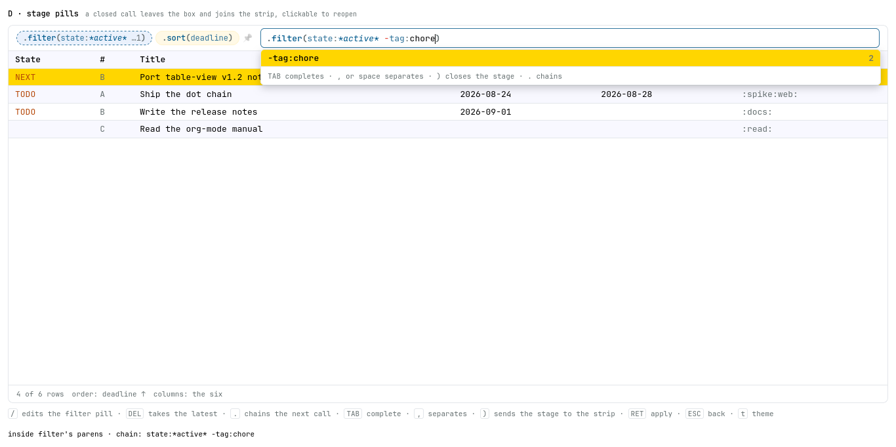

# Spike — five ways for “.” to open a query

**Date:** 2026-08-21 · **After:** the additive-filters work
(`docs/proposals/done/2026-08-20-additive-filters.md`), whose closing section
reads the language as one dataframe pipeline —
`df.filter(…).orderBy(…).select(…)` — and the two-door split the shell already
ships: `/` edits the narrowing half, `.` the whole expression, and both open the
same text field.

The ask, in the user's words:

> make `.` visually different from `/` in the inline search box. `.` should
> visually spawn a dot and autocomplete the three functions —
> `.(filter|sort|columns)` — and after completion look like a completed function
> in an IDE: `.filter(...)` where the parens' inside completes filter options,
> `.sort(...)` sort options, `.columns(...)` column names.

So the question is not what `.` DOES — it already opens the whole grammar — but
whether the whole grammar can be **read as a chain of calls** at the moment it is
typed, while the flat `?q=` string stays the one truth underneath. The chain is a
VIEW of that string; every tab here composes the same string and shows it applied.
Five looks, built to be argued with. **Open `index.html`** — they are tabs.

**D is the picked look.** It was argued at the screen and then amended four
times; what those rounds changed is under
[Argued and amended](#argued-and-amended), and every amendment is pinned in
`check.mjs`.

Everything here is throwaway. The fixture is invented; the palette, the docked
box, the chip voices and the dropdown are glance's own, lifted from
`Page/Style.hs` and `assets/table-view.js`, so the look is judged at the real
hues and the real metrics.

| file | what it draws |
| --- | --- |
| `index.html` | the tabbed shell; each variant runs in its own `<iframe>` |
| `a-control.html` | the control: today's `.` — the whole flat grammar in one field |
| `b-plain-chain.html` | the dot, the three calls, plain text between the parens |
| `c-ide-chain.html` | the editor look: coloured calls, a ghost argument list, per-stage completion |
| `d-stage-pills.html` | **the picked look** — a closed call joins the chip strip as a pill, `/` edits it, `DEL` takes it |
| `e-echo-line.html` | C's entry, plus the flat `?q=` echoed live underneath |
| `rig.js` | the fixture, the grammar, both doors, the completion engine, the docked box |
| `pane.css` | the box, the strip, the dropdown, the table, both palettes |
| `check.mjs` | the complaint, mechanised |
| `shots.mjs` | the five screenshots, headless |
| `bidi.mjs` | the fold-marks spike's Firefox driver, copied so this directory stands alone |
| `a-control.png` … `e-echo-line.png` | each tab at its own moment; A and D at their own doors |

Keys are the shell's own, plus what a chain needs: `.` opens the compose door
and chains the next call, `TAB` completes, `(` takes the call, `,` or a space
separates arguments, `)` closes the stage, `RET` applies, `ESC` steps back a
rung, `n`/`p` walk rows, `t` swaps the theme. `/` opens the filter door in A, B,
C and E — and in **D** it is the filter STAGE's edit key, where `DEL` is the
chain's own backspace. The footer prints the truth: which door, where the caret
is, and the flat string the chain has written so far.

## What each tab argues

| | `.` opens | inside the parens | where the chain lives | `/` | `DEL` |
| --- | --- | --- | --- | --- | --- |
| A control | the flat field | — (a dot is a character) | nowhere | the flat door | — |
| B plain chain | a dot and three calls | plain text, completed | the box | the flat door | — |
| C ide chain | a dot and three calls | coloured, ghosted, per-stage | the box | the flat door | — |
| **D stage pills** | a dot and three calls | as C | the chip strip | edits the filter stage | takes the latest stage |
| E echo line | a dot and three calls | as C | the box | the flat door | — |

- **A** is the baseline and it fails on purpose: `.` opens the same field `/`
  opens, one step wider. A dot in it is a character, and the dropdown lists
  `state:`, `scheduled:`, `substring:` and `sort:` in one flat run — the
  narrowing keys and a shaping key spelled alike, which is precisely the
  confusion the ask is about (`a-control.png`).
- **B** makes the smallest claim that is still a chain: a query has STAGES.
  Nothing is coloured, nothing is hidden, nothing is ghosted, so the only thing
  the tab can be argued with is the structure itself.
- **C** spends the ink: the call name in the reserved word's own hue, the
  punctuation dim, and inside the parens the key in the link hue, the value in
  the page's, a meta italic, and the two signs in the ok/bad pair. Empty parens
  carry a ghost argument list; a closed call collapses to its first argument and
  a count.
- **D — the picked look** — moves the finished chain OUT of the box: each closed
  call is a pill on the chip strip, in the strip's own hue law (frost narrows,
  the column band orders, the link hue shapes), and the box holds only the stage
  being written. The strip becomes the flat query grouped back into stages, in
  the order the stages were written. Click a pill — or press `/` for the filter
  one — to reopen its parens; the query it wrote stands until the rewrite
  commits, and lands back in the same place on the strip. `DEL` takes the latest
  badge whole.
- **E** keeps C's entry and adds the proof: the flat string, live, under the box
  — what stands quiet, what the chain is adding lit, and the `?q=` form beside
  it, `%2B` and all. The chain writes; the line proves, before `RET`.



*D with an order committed and `/` pressed: the filter badge is dashed in the
box's own accent because it is open in the box, its parens hold what it already
says with the caret at the end, and the offers are the ones that stage takes.*

## Argued and amended

The tabs were built, looked at, and then changed four times. Each round is a
decision the screen produced and the check now holds:

1. **D is the look.** The chain belongs where the chips already are: one badge
   per call rather than one chip per token, and the box holding only the live
   stage. Everything below is D's, and rides the shared paren-editing machinery,
   so C and E get it too — only `/` and `DEL` are D's alone.
2. **The comma joins the space as the argument separator.** A call's arguments
   are separated by commas everywhere else, and a reader typing
   `.filter(state:TODO, tag:web)` should not be told they meant something
   different. Per stage the comma composes to that stage's own flat separator —
   a space in `filter`, the arrow in `sort`, itself in `columns`.
3. **The accept went dry and final.** Taking a completion inside the parens
   inserts exactly what it says — no trailing space — closes the offers, and
   does not reopen them; the next offer waits for the next keystroke. The
   trailing space was the shipped box's habit, and in a chain it is wrong twice
   over: the separator is now a decision the reader makes (space or comma), and
   an argument list that re-offers itself the instant it is satisfied kept
   showing a top row that inserted nothing.
4. **`/` and `DEL` became the chain's own keys** in D. `/` stops being a second
   box: it reopens the standing `.filter(…)` for editing and the commit rewrites
   that stage in place, or spawns a fresh `.filter(|)` where none stands. `DEL`
   at the strip level is the chain's backspace — stage-sized, last in first out:
   one press takes the latest badge whole, whichever call it is, and pressing it
   again walks the chain backward. Inside an open paren edit both keys are
   ordinary text editing.

Round 4 costs the spike its own control. `/` was identical in all five tabs on
purpose, and `check.mjs` asserted it; D's departure is now DECLARED there
(`DEPARTS`) rather than dropped, so the four tabs that keep a flat door still owe
each other one and the run still says so.

## What the grammar resists

The places where the relational reading and the flat string disagree. They are
the argument, not the polish.

- **The chain's separator is a legal character in every argument.**
  `title:v1.2`, a URL in free text, `?order=` in a heading — a dot inside the
  parens has to TYPE, so `.` can only be the chain operator OUTSIDE them. Every
  chaining tab therefore costs one more key: `)` closes the stage and the next
  `.` chains. There is no reading that keeps `.` unambiguous everywhere.
- **The comma is a legal character too, and the disambiguation is positional.**
  A comma separates when a new TOKEN begins after it — whitespace, a sign, or a
  key-shaped word — and belongs to the value when one does not. So `tag:a,b` is
  one token and `tag:a,-tag:b` is two, which is the rule this spike ships.
  Its corners, all verified:
  - `title:a,b:c` composes to `title:a b:c`, because `b:c` is key-SHAPED even
    though `b` is not one of the twelve keys and the flat string will read it as
    free text. A reader who meant the value `a,b:c` has to quote it —
    `title:"a,b:c"` — which is the flat grammar's own and only escape.
  - free text is asymmetric: `milk,bread` stays one needle, `milk, bread` is two.
  - a bare comma at the end of a fragment (`state:TODO,`) is a separator, so the
    completion offers KEYS from that point — which is right when the reader
    meant a new token and wrong when they were about to type `b`.
- **The chain can display a stage the flat string cannot carry.**
  `.columns(owner name)` composes to `columns:owner name`, which the flat
  grammar splits into `columns:owner` and the free-text needle `name` — and
  quoting does not rescue it, since only a token STARTING with a quote is read
  whole. The comma-space in `.columns(State, Deadline)` is normalized away for
  the same reason. The view is not injective into the grammar, and the composer
  is where that has to be caught.
- **The chain is honest for `filter` and lies for `sort` and `columns`.**
  `df.filter(p).filter(q)` is `filter(p ∧ q)` — appending only intersects,
  which is the additive proposal's own conservativity law. But `.sort(a).sort(b)`
  in THIS grammar is `sort:a sort:b` ≡ `sort:a->b`, a chain EXTENSION, where
  `orderBy(a).orderBy(b)` in any dataframe replaces; `.columns(X).columns(Y)`
  concatenates where `select` replaces. Two `.filter(…)` pills would be correct
  and two `.sort(…)` pills would be a lie — D folds the stages, so the strip
  never shows either.
- **`+` has no home in the chain reading**, which the proposal already says of
  itself: a `+` is a per-axis UNION, so it rewrites its axis's expression rather
  than appending a stage — "the reason the chain form stops sufficing". In the
  box it is one character among the arguments, and nothing in the chain look
  says `state:TODO +state:DONE` is a different SHAPE of expression than
  `state:TODO -tag:chore`. C colours the sign, which is the most a flat argument
  list can do; the honest chain spelling would be `.orFilter(…)`, which is not
  the grammar and should not become it.
- **“+2 more” is taken.** An IDE collapses a long argument list with a count and
  spells it with a plus; this grammar has spent the sign, so the count rides an
  ellipsis (`…2`) instead.
- **Collapsing eats the sign.** `state:TODO +priority:[#B]` collapses to
  `state:TODO …1` — the widened axis is exactly what a reader most needs to see
  and exactly what the compact spelling hides. Either signed tokens survive the
  collapse or the stage does not collapse.
- **Empty parens are not the same as no stage.** `.sort()` here contributes
  nothing, so the default chain stands. But `sort:` in the flat grammar IS the
  empty chain — document order — a different answer. The composer has to pick
  one, and this rig's pick means document order can only be SPELLED, as
  `sort:*none*`.
- **A shaping token typed inside `.filter(…)` still orders the table.**
  Nothing offers it there, but `sort:title` typed by hand composes into the flat
  string and the flat string is the truth. The shipped narrowed door has a
  sentence for this — *"sort: autocomplete restricted, this key belongs to
  #'compose"* — and in a chain that sentence has no door to be spoken from: the
  refusal would have to become "that belongs in `.sort(…)`", said by the stage.
  The spike leaves it composing, and names it.
- **`DEL` is already spoken for.** `docs/query.md`: "`@` on a focused row drills
  into `ref:ID` behind a breadcrumb; `DEL` pops back." D's stage eraser and the
  crumb pop want the same key at the same moment — the table with nothing being
  typed. One of them has to move.
- **`/` and `.` stop being the same control.** Today they are one `<input>` and
  one `narrow` flag. A structured composer is a focusable box with a model, not
  a text field, so everything the box owns is answered twice: the two-step ESC,
  the dead Backspace over a summoned box, the strip's own `×`,
  `stripLastToken`. In D, `/` stops being a door at all, and
  `stripLastToken` — "take off the last unit of the query" — becomes
  stage-sized, which is exactly what `DEL` now does.

## The check

```sh
node check.mjs                     # every variant
node check.mjs c-ide-chain.html    # one
node shots.mjs                     # the five PNGs
```

Per variant: **BOOT** (the strip carries the query, the table serves what it
asks for), **DOT** (`.` spawns one dot and offers exactly `filter`/`sort`/
`columns`), **PARENS** (the taken call opens them and the caret lands INSIDE
them, after the contents — in DOM order and on the screen), **CHAIN** (`.` TAB
`state:TODO` `)` `.` `s` TAB `deadline` `)` composes exactly
`state:TODO sort:deadline`, and `RET` applies it: two rows, deadline order,
empties last), **COMMA** (twelve compose-equalities — the same arguments spelled
with a comma, a comma-space and the stage's own separator compose one string,
`tag:a,b` survives whole, a quoted comma survives, the signs still separate —
and then one drive through the keys, since a law nothing types is a law about
nothing), **DRY** (an accept lands `state:` with no trailing space and the offers
closed, the next keystroke wakes them, and a value accept lands `state:TODO` the
same way), **ESC** (three rungs — the offers, what is half-written, the box —
with the strip untouched), **SLASH** (the narrowed door still refuses
`sort:title` in the shell's own sentence and leaves it standing in the box),
**SETTLED** (a repaint that changes nothing changes nothing). Then one rung
across the run: `/`'s door signature — element, class, placeholder, offers — has
to be identical in every tab that still has one.

D swaps the two flat-door rungs for its own: **SLASH-STAGE** (`/` over a
standing filter pill reopens it with the caret at the end of its contents, and
the commit rewrites that badge in place — the pill count unchanged, the order
badge untouched), **SLASH-FRESH** (`/` with no filter stage standing spawns
exactly one empty `.filter()`), **DEL-STAGE** (a filter+sort+columns chain, then
three `DEL`s stripping columns, then sort, then filter, the composed string
shrinking in that order, and a fourth press taking nothing), **DEL-INSIDE**
(`DEL` inside an open paren edit eats no stage).

The control fails five rungs by construction, the way headline-bars' `flat` tab
does, so `a-control.html` declares DOT, PARENS, CHAIN, COMMA and DRY as misses:
the run is green and the misses are the argument. A declared miss that starts
PASSING is a failure too, and so is a rung D departs from that quietly comes
back.

## What shipping would need

**Renderer sites** (`assets/table-view.js`): `openFilter(how)` gains a third
mode, or a second control beside `input` — a chain is not an `<input>`, so
`mount`'s `summoned`/`dock` predicates, the `tv-typing` class and the
`filterWrap` layout all have to hold two shapes. `chipUp`/`typedQuery`/
`effectiveQuery` are where the chain's composed string joins the strip, and D
needs one more: replace a stage's tokens IN PLACE rather than append.
`parseQuery` + `queryKeys` already answer per stage; the `.tv-ac` list needs a
per-stage vocabulary and the `tv-ac-dim` rule for metas, both of which exist.
The two keydown ladders (~4153) are the delicate part, and the dry accept lands
right there — today's `finished = taken.full || ac.stage === "value"` is exactly
the branch that has to stop re-offering.

**Shell sites** (`frontend/glue/`): `raiseFilter`/`focusFilter`/`focusQuery` in
`50-settings.js` is where the two doors part, and under D's reading `focusFilter`
stops raising a box and starts naming a stage; `stash()`/`restore()` carries
`typedFilter()` across a remount and a chain has no `.value` to carry;
`refused()` in `00-core.js` names `.` as the other door in words — with a chain
it could OPEN the stage instead of naming the key. `DEL` is bound to the crumb
pop and would have to be re-decided.

**Pins that move:** `docs/query.md` gains "the chain is a view of the string"
and the comma's per-stage reading; `AGENTS.hs`'s query-language model is
untouched (the string is unchanged); `docs/invariants.md` gains the one this
spike is really about — *the chain composes the flat query and nothing else
composes it* — and its sharper twin, *a stage the flat string cannot carry must
not be composable*; `test/browser/cases.mjs` gains the DOT/PARENS/CHAIN/COMMA
rungs. The wire changes nothing: `?q=` already carries the string, and that is
the point.

**Open questions**, none of which the tabs settle:

- **Does the strip still hold token chips at all?** D says no — one badge per
  call. That makes the single-token gestures (the chip's own `×`, the
  coarse-pointer tap) stage-sized too, and a reader who wants one token off has
  to open the stage.
- **Where does the annihilation rule live?** Committing `-x` over a standing
  `+x` removes both — "a rule of the strip, never of the grammar". Inside
  `.filter(…)` there is no strip: the two sit beside each other in one argument
  list and nothing cancels. This rig keeps the rule on fresh commits and skips it
  on a stage REWRITE, where the stage states its whole contents — which is a
  defensible split and not an obvious one.
- **Does `.` seed from the standing query?** This rig starts empty and ADDS,
  which is `chipUp`'s own law today, while `/` in D opens the standing stage. The
  two doors therefore disagree about seeding, on purpose: one adds a call, the
  other edits one.
- **May a stage repeat?** `.filter(…).filter(…)` is sound; `.sort(…).sort(…)`
  is a chain extension wearing a replacement's clothes. Refusing the second is a
  grammar change; folding it is a display rule, and D folds.
- **The coarse-pointer path has no `.`, no `/` and no `DEL`** — the click that
  raises the filter box on a touch device is the only door there, and under D's
  reading it should raise the filter STAGE.

## What the rig mirrors, so the tabs are honest

The stage is the docked box as it ships: the chip strip and the summoned box
share one grid row (`tv-dock`/`tv-summon`), the chips wear the frost, column-band
and link-hue voices, the dropdown hangs under the whole of the box with counts on
the right and a note across the bottom, and a summoned box delivers on COMMIT
alone — the table under it does not animate while the reader is looking away.
The grammar under all of it is `docs/query.md`'s, not a mock: signs and their
axis law, alternatives, the five metas, prefix dates, the `:a:b:` tags cell,
`sort:` chains with empties last, `columns:` resolving against key and header
with `Title` always present, and the vacuity rule (a token naming no atom is
dropped, unsigned and added alike, while a lone `-` still empties the table).
That is why `rig.js` is three times the fold-marks rig: here the grammar IS the
stage, and a completion domain that was not the real one would make every tab
argue about the wrong thing.
