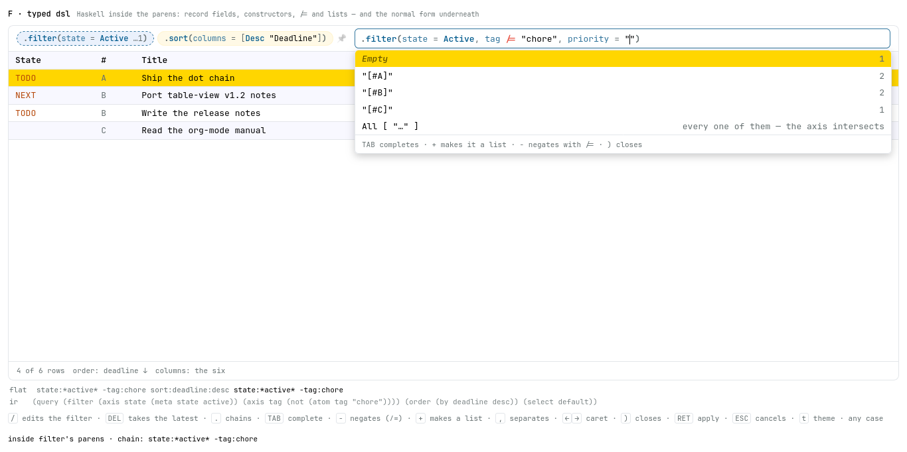

# Spike — six ways for “.” to open a query

**Date:** 2026-08-21 · **After:** the additive-filters work
(`docs/proposals/done/2026-08-20-additive-filters.md`), whose closing section
reads the language as one dataframe pipeline —
`df.filter(…).orderBy(…).select(…)` — and the two-door split the shell already
ships: `/` edits the narrowing half, `.` the whole expression, and both open the
same text field.

The ask, in the user's words:

> make `.` visually different from `/` in the inline search box. `.` should
> visually spawn a dot and autocomplete the three functions —
> `.(filter|sort|columns)` — and after completion look like a completed function
> in an IDE: `.filter(...)` where the parens' inside completes filter options,
> `.sort(...)` sort options, `.columns(...)` column names.

So the question is not what `.` DOES — it already opens the whole grammar — but
whether the whole grammar can be **read as a chain of calls** at the moment it is
typed, while the flat `?q=` string stays the one truth underneath. The chain is a
VIEW of that string; every tab here composes the same string and shows it applied.
Six looks, built to be argued with. **Open `index.html`** — they are tabs.

**F is the picked look.** It is D's machinery — badges on the chip strip, `/`
editing one, `DEL` taking one — with a **Haskell expression inside the parens**,
and a lisp normal form under the box proving the two readers agree. What the
rounds of argument changed is under [Argued and amended](#argued-and-amended),
and every amendment is pinned in `check.mjs`.

Everything here is throwaway. The fixture is invented; the palette, the docked
box, the chip voices and the dropdown are glance's own, lifted from
`Page/Style.hs` and `assets/table-view.js`, so the look is judged at the real
hues and the real metrics.

| file | what it draws |
| --- | --- |
| `index.html` | the tabbed shell; each variant runs in its own `<iframe>` |
| `a-control.html` | the control: today's `.` — the whole flat grammar in one field |
| `b-plain-chain.html` | the dot, the three calls, plain text between the parens |
| `c-ide-chain.html` | the editor look: coloured calls, a ghost argument list, per-stage completion |
| `d-stage-pills.html` | a closed call joins the chip strip as a badge; `/` edits one, `DEL` takes one |
| `e-echo-line.html` | C's entry, plus the flat `?q=` echoed live underneath |
| `f-typed-dsl.html` | **the picked look** — D's machinery, Haskell inside the parens, the normal form under it |
| `rig.js` | the fixture, the grammar, both doors, both readers, the normal form, the docked box |
| `pane.css` | the box, the strip, the dropdown, the table, both palettes |
| `check.mjs` | the complaint, mechanised |
| `shots.mjs` | the six screenshots, headless |
| `bidi.mjs` | the fold-marks spike's Firefox driver, copied so this directory stands alone |
| `a-control.png` … `f-typed-dsl.png` | each tab at its own moment |

Keys are the shell's own, plus what a chain needs: `.` chains the next call,
`TAB` completes, `(` takes the call, `,` separates arguments, `)` closes the
stage, `←`/`→` walk the caret, `RET` applies, `ESC` steps back a rung, `t` swaps
the theme. In A, B, C and E, `/` opens the flat filter door. In **D and F** it is
the filter STAGE's edit key, `DEL` is the chain's own backspace, and in F alone
`-` and `+` are the two sign helpers. `ESC` parts by DIALECT rather than by tab:
a rung on a ladder in the flat door and in D, and in **F** the cancel itself —
one press for the whole edit (round 14).

## What each tab argues

| | `.` opens | inside the parens | where the chain lives | `/` | `DEL` |
| --- | --- | --- | --- | --- | --- |
| A control | the flat field | — (a dot is a character) | nowhere | the flat door | — |
| B plain chain | a dot and three calls | plain text, completed | the box | the flat door | — |
| C ide chain | a dot and three calls | coloured, ghosted, per-stage | the box | the flat door | — |
| D stage pills | a dot and three calls | as C | the chip strip | edits the filter stage | takes the latest stage |
| E echo line | a dot and three calls | as C | the box | the flat door | — |
| **F typed dsl** | a dot and three calls | **Haskell** | the chip strip | edits the filter stage | takes the latest stage |

- **A** is the baseline and it fails on purpose: `.` opens the same field `/`
  opens, one step wider. A dot in it is a character, and the dropdown lists
  `state:`, `scheduled:`, `substring:` and `sort:` in one flat run — the
  narrowing keys and a shaping key spelled alike, which is precisely the
  confusion the ask is about (`a-control.png`).
- **B** makes the smallest claim that is still a chain: a query has STAGES.
- **C** spends the ink: the call name in the reserved word's own hue, the
  punctuation dim, the arguments coloured per part, a ghost argument list in
  empty parens, and a closed call collapsing to its first argument and a count.
- **D** moves the finished chain OUT of the box: each closed call is a badge on
  the chip strip, in the strip's own hue law, and the box holds only the stage
  being written. The strip becomes the flat query grouped back into stages.
- **E** keeps C's entry and adds the proof in words: the flat string, live,
  under the box — what stands quiet, what the chain is adding lit.
- **F — the picked look** — is D with the argument language changed. See below.



*F with an order committed and `/` pressed: the filter badge is dashed in the
box's own accent because it is open in the box, `tag /= "chore"` ligates its
inequality, a second field has just been opened onto its quoted slot, and the
offers over that slot lead with the constructor. Under the box, the flat string
and the normal form.*

## F, the typed surface

```haskell
.filter(state = Active, tag /= "chore", priority = ["A", "B"])
.sort(columns = [Desc "Deadline", "Title"])
.columns("State", "Deadline")
```

**The three signatures.** `.filter(…)` takes kwargs. `.sort(…)` takes ONE kwarg
whose list carries the chain in written order. `.columns(…)` takes POSITIONAL
names. Positionals and kwargs coexist the usual way, positionals first — a bare
literal in `.filter(…)` is free text, so `.filter("milk", state = Active)` is
`substring:milk state:*active*`.

**Column names are quoted strings everywhere**, in both shaping stages. A custom
column is any name at all — `columns:owner` reads the property drawer — so the
set is OPEN, and the closed/open law that put the tree's keywords on the string
side puts the columns there with them. Constructors stay the metas' alone.

**The direction is a constructor applied to the name** — `Desc "Deadline"`, the
closed word taking the open string, which is the same figure as `state = Active`
beside `state = "TODO"`. It is per SEGMENT, which is what the flat grammar needs
(`sort:state:desc->title` and `sort:state->title:desc` are different orders), and
it leaves the quotes meaning taken-as-written everywhere. `Asc` is spellable and
never emitted, matching the flat grammar's "nothing or `:asc`", so a round trip
prints what the reader typed. The rejected spelling is the flat suffix smuggled
into a literal (`"Deadline:desc"`); under this reading that string is a column
NAME with a colon in it, which is not one of the six — see the corners.

**Case carries nothing.** `active`, `Active` and `ACTIVE` are one name, and so
are `FILTER` and `filter`; a bare name is resolved by LOOKUP in the closed world
— the constructors, the wrappers, `not`/`raw`, and the stage's own fields —
never by its first letter. **Quoting is the one disambiguation left**: bare
means the closed world, quoted means an open value, and a bare name nothing
answers to is an error the surface marks rather than a string it invents. What
STANDS after an accept is the canonical spelling — constructors capitalised,
fields in the lower case the flat keys wear — because the accept is the
formatter's moment. The rewrite is case-only, so no offset moves.

- **Record syntax for the fields.** `state = Active`, spaces around the `=`.
  A field is a name the grammar already has — the twelve keys — so the surface
  can name nothing the flat string cannot.
- **Bare constructors for the closed roster.** `Active`, `Inactive`, `Empty`,
  `Archive` — `docs/query.md`'s starred family, one constructor each, plus
  `None` in `.sort(…)` and `Asc`/`Desc` on its columns. They are **one shared
  sum type, not one per field**: `*empty*` is legal on all six column keys and
  on `planned`, so per-field types would need qualified names (`State.Empty`,
  `Tag.Empty`, …) for a distinction the grammar does not make. The FIELD decides
  which constructors are legal — `state = Archive` is a type error, and the
  surface marks it — which is the Haskell reading, where a field's type is what
  restricts its constructors.
- **Double-quoted literals for the open values.** `state = "TODO"`, because the
  keywords are the TREE's, not the language's. **A quoted string is a literal,
  the flat grammar's own quoting law**: `tag = "-chore"` searches for a tag
  spelled `-chore` and is never a negation. That is `substring:"-x"`'s rule,
  said in Haskell.
- **Haskell lists for the alternatives.** `state = ["TODO", "DONE"]` composes to
  `state:TODO|DONE`.
- **`/=` for the negation**, the Prelude's own. `tag /= "chore"` is `-tag:chore`;
  `state /= ["TODO", "DONE"]` is `-state:TODO|DONE`, "neither" — the negation
  scopes the WHOLE token, alternatives included, which is the flat grammar's own
  De Morgan pin. `not (…)` is accepted as the wrapper for what an operator on a
  field cannot carry, and is what the `-` key spawns on empty ground.
- **Free text is `substring = "milk"`**, with a bare `"milk"` accepted as the
  same thing. The axis the proposal calls `text` is `substring:`'s and free
  text's shared one, and `substring` is the key that actually exists — a field
  called `text` would name something no flat string can spell. The bare string
  is free text said the way the flat grammar says it — the positional argument
  of `.filter(…)` — and both compose to `substring:milk`.
- **`raw "…"` is the escape hatch**, and it is the surface admitting it is not
  total. See the corners.

### The three decisions

1. **Negation is an operator, the sign is a key.** `-` inside the filter parens
   flips the kwarg under the caret between `=` and `/=`, and flips it back; on
   empty ground it spawns `not (|)`. Typing `/=` by hand does the same thing.
   The sign is never a character in this surface — there is nowhere for it to
   be one.
2. **The additive sign is a list helper.** `+` on a kwarg turns its value into a
   Haskell list with a fresh slot: `state = "TODO"` becomes `state = ["TODO", |]`,
   and a list already there gains another slot. Lists compose to the flat
   alternation, which on a bare axis is exactly what the flat `+` means —
   `k:v₁|v₂ ≡ k:v₁ +k:v₂`, the proposal's law 5, and the normal form proves it
   mechanically. What the key CANNOT reach is law 5's other half; see the
   corners.
3. **A lisp normal form is the proof.** Two parsers — the flat grammar's own and
   F's typed one — build TERMS independently and hand them to one builder, which
   writes the additive proposal's denotation as an s-expression: axes sorted by
   key, each axis `(P∪N ≠ ∅ ∧ base) ∨ wide`, with `and`/`or` flattened, sorted
   and deduped so associativity, commutativity and idempotence are quotiented
   away. Two spellings that MEAN the same thing print the same bytes.

```
state:*active* -tag:chore
.filter(state = Active, tag /= "chore")

  ⇓ both readers

(query (filter (axis state (meta state active))
               (axis tag (not (atom tag "chore"))))
       (order default) (select default))
```

The line is echoed live under F's box, **read from the typed reader while the
table is served by the flat one** — so a divergence between the two paths shows
on the screen as well as in the check.

## Argued and amended

The tabs were built, looked at, and changed. Each round is a decision the screen
produced and the check now holds:

1. **D over B/C/E.** The chain belongs where the chips already are: one badge per
   call rather than one chip per token, and the box holding only the live stage.
2. **The comma joins the space as the argument separator.** A call's arguments
   are separated by commas everywhere else. Per stage the comma composes to that
   stage's own flat separator — a space in `filter`, the arrow in `sort`, itself
   in `columns`.
3. **The accept went dry and final.** Taking a completion inside the parens
   inserts exactly what it says — no trailing space — closes the offers, and
   does not reopen them; the next keystroke is what asks again. (Round 11 finds
   the edge of this: it is true of a finished TERM, not of every accept.)
4. **`/` and `DEL` became the chain's own keys.** `/` reopens the standing
   `.filter(…)` and the commit rewrites that badge IN PLACE; `DEL` at the strip
   level is the chain's backspace, stage-sized and last in first out.
5. **F: the argument language went typed**, on D's machinery unchanged.
6. **…and then Haskell**, not Python: record syntax, constructors, `/=`, lists,
   quoted literals. The idiom is the user's call; what it cost is in the corners.
7. **The key and its equals come with an opened quoted slot.** Completing
   `state` — or typing its `=` — leaves `state = "|"` with the caret between the
   quotes, so the reader types the value and never the punctuation. The offers
   over that slot still lead with the constructors, and **accepting one swallows
   the quotes** (`state = Active`) where accepting a literal keeps them: a
   constructor is no string. Both stay dry.
8. **The stages gained signatures, and the columns went quoted.** `.sort(…)`
   takes a `columns` kwarg whose list is the chain; `.columns(…)` takes
   positional names; and every column name in both is a QUOTED STRING, because
   custom columns make the set open and the closed/open law is what decides
   which side of the quotes a value sits on. The opened-slot rule went with
   them: `.columns(` spawns its first positional slot with the call, a comma
   spawns the next, and the sort list's items are offered quoted. (Round 8 hung
   the direction off a `:desc` suffix inside the name; round 10 took it back.)
9. **The DSL went case-blind, and the accept became the formatter.** Any case
   parses; the canonical spelling is what stands afterwards. This is the round
   that moves the whole disambiguating burden onto the quotes — see the corners.
10. **The direction reconciled with the proposal, on the spike's own grounds.**
   Round 8 spelled it `"Deadline:desc"`; the proposal
   (`docs/proposals/proposed/2026-08-21-the-typed-dsl-behind-the-dot-door.md`,
   "`.sort(…)`, and the direction spelling") settled `Desc "Deadline"`, and it
   wins on the argument this README had already written against itself — the
   suffix is a second grammar hidden inside a literal, the one place the quotes
   would not have meant taken-as-written. The re-zipping objection that carried
   the suffix only ever touched the PARALLEL-KWARG shape (`desc = [...]`), which
   both documents reject; a constructor applied to its own string is per segment
   exactly as the suffix was. So `Asc`/`Desc` are back in the roster as the two
   direction constructors, the offers give each column once bare and once under
   `Desc`, and the suffix spelling is now an unknown column.
11. **The dry law's edge is the VALUE, never the position.** A reader hit it:
   RET over a key gave `.filter(state = "")` with the caret in the slot and no
   offers at all. Round 3's "an accept closes the offers" had been read as a
   fact about ACCEPTS, and it is a fact about finished TERMS — a key accept
   finishes nothing, it moves the reader to a new position, and a position's
   own offers stand at once. The rule is now the caret: an accept that leaves
   it INSIDE what it just wrote (`state = "|"`, `not (|)`, `columns = ["|"]`,
   `All ["|"]`) asks again; one that lands after a completed term is final.
   Both entry routes — the key accept and the equals typed by hand — are now
   pinned apart in `check.mjs`, because the regression had killed one and left
   the other standing.
12. **`/` adds a condition, and the comma is the gesture's own.** Reopening the
   standing filter badge used to land at the tail of the last argument
   (`tag /= "chore"|`), which is where a reader goes to EDIT one. `/` is not
   that: it is the add-a-condition key, so it now appends the comma itself and
   lands on a fresh argument (`tag /= "chore", |`) with that position's offers
   standing — round 11's law applied to a gesture rather than an accept. Two
   edges came with it: an EMPTY stage gets no comma, there being nothing to
   follow; and a fresh argument the reader never writes leaves no trace, the
   dangling comma going at the close so the badge returns to its previous
   spelling byte for byte. Editing an argument already written stays what it
   always was — a cursor movement.
13. **A slash in the typed surface is exact.** Once `/` acts mid-stage it needs
   a line, and the typed surface has one the flat dialect does not: every open
   value is quoted, so a slash INSIDE a string is a character
   (`title = "a/b"`) and everywhere else it is the gesture. D keeps the old
   rule — it quotes nothing by default, so the line is not available there.
14. **ESC cancels input, and that is the whole of what it does.** F had
   inherited D's graduated ladder — the offers, then what is half-written, then
   the box — and the reader's own rule takes it away: **one press abandons an
   open edit WHOLE**, whether or not the menu stands over it and whether or not
   anything was typed. The stage comes back spelled the way the edit found it,
   byte for byte; the comma a `/` summoned goes with the rest of what the edit
   wrote, wanting no rule of its own; and the box goes back to the strip it was
   summoned from. **The reader's escape is from the EDIT, never from the
   menu** — in a typed surface the offers are incidental to the input, standing
   over a position rather than being asked for, so cancelling the input takes
   them with it. "What the edit found" is what cost the work. The pre-edit
   spelling is remembered at edit-OPEN, because `/` writes into the stage before
   the reader does and because the typed text has to go too — `closeStage`'s
   dangle-strip is the nucleus and it is not enough on its own. A stage that was
   closed but not yet asked for lives in the BOX rather than in the chips, so
   the cancel is the only thing that can put it back; it puts back the spelling
   the edit found, not the one it was given. And a `/` pressed inside another
   stage's parens interrupts an edit still being WRITTEN, so the box comes back
   to that one open rather than leaving it at the chain level. **The rule is
   the DSL door's alone**: D keeps its ladder and the flat door keeps the
   shipped two-step, so the spike still shows both answers side by side and
   `check.mjs` holds each dialect to its own.

Rounds 4 and 5 cost the spike its own control. `/` was identical in all tabs on
purpose, and `check.mjs` asserted it; D's and F's departure is now DECLARED there
(`DEPARTS`) rather than dropped, so the four tabs that keep a flat door still owe
each other one and the run still says so.

## What the grammar resists

The places where the surface and the flat string disagree. They are the
argument, not the polish; every one is verified in `check.mjs` or by the
round-trip corpus.

- **Quoting now carries the whole disambiguation, and it is load-bearing.**
  With case gone, nothing else tells a closed name from an open value:
  `state = active` is the meta, `state = "active"` is a keyword spelled
  `active`, and `state = chore` is an ERROR rather than a search for `chore`.
  That is a good law — it is the flat grammar's own, where quoting is the only
  escape — but it means a reader who forgets the quotes gets a marked word
  instead of a query, where the flat box would simply have searched. The gain
  is that a typo can no longer silently become a free-text needle.
- **Column names had to leave the constructors.** `Deadline` looks exactly like
  a constructor and cannot be one: custom columns read the property drawer, so
  the set is open and no roster can close it. Quoting them puts them with the
  keywords, and it costs the reader two characters on every column name in
  every shaping stage — the price of the law being uniform.
- **The direction found a home, and the suffix became a bad name.** The
  constructor form keeps the quotes meaning taken-as-written everywhere, which
  the `:desc` suffix could not. The cost is that `["Deadline:desc"]` no longer
  means anything: read as written it names a column with a colon in it, and the
  sort chain takes the six column keys only. F MARKS it and composes nothing for
  that segment — the flat grammar refuses such a query outright (HTTP 400,
  naming the token), and a rig with no refusal path can only make the segment
  take effect nowhere and say so on the screen. **Never document order**: a
  stage whose segments all fail to resolve reads as an ABSENT stage, because
  document order is a meaning nobody asked for. (The rig drops where the server
  refuses — that tolerance is the rig's, and it is uniform across both readers.)
- **The kwargs surface is not total, and `raw "…"` is where it says so.** An
  axis carrying BOTH a base and a widening — `priority:[#A] +priority:[#B]` —
  has no kwargs spelling: one field takes one expression, where the flat form is
  a per-axis PAIR, `(P∪N ≠ ∅ ∧ base) ∨ wide`. This is law 5's parting case, the
  one the `+` key can never reach, and the one the proposal itself names as
  "the reason the chain form stops sufficing". F renders such an axis as
  `raw "priority:[#A] +priority:[#B]"` — the flat string quoted into the typed
  surface rather than mis-said in it — and the IR proves the two readings still
  agree.
- **A list had to choose OR, so the intersection needed a name.** `tag = ["web",
  "glance"]` is the alternation (`tag:web|glance`). Today's repeated
  `tag:web tag:glance` INTERSECTS, and record syntax cannot repeat a field, so
  the unchosen reading is spelled `tag = All ["web", "glance"]` — and `All`
  spreads over its ELEMENTS, not its atoms, so `All ["web", ["glance", "docs"]]`
  stays two tokens and keeps the inner alternation. (It did not, at first; the
  round-trip rung caught it.) `Any [...]` is the bare list's own name.
- **`not (…)` cannot carry an intersection.** `not (tag = All ["web","glance"])`
  is ¬(a ∧ b) = ¬a ∨ ¬b, and no conjunction of negated tokens says that. F names
  the refusal rather than composing something else.
- **`=` and `/=` are two different languages.** `=` is record syntax's binding;
  `/=` is the Prelude's inequality. The pair reads well — the argument list
  reads as a comprehension's guard list, where the commas are `&&` — but the
  fully consistent alternatives are `==`/`/=` throughout (comparison) or
  `=`/`not (…)` throughout (record plus wrapper). F accepts `not (…)` too, so
  the second is spellable; the mix is the picked one.
- **The enum roster is closed at the METAS and open at the keywords.** `Active`,
  `Inactive`, `Empty`, `Archive` are the language's; `"TODO"` is the tree's, out
  of its own `#+TODO:` line. So the constructors can only ever cover the starred
  family, and a per-tree keyword stays a quoted literal. A surface that promised
  `State.TODO` would be promising to know a tree it has not read.
- **An opened slot spends the space.** The reader types `state = TODO"` and gets
  `state = "TODO"`: the space typed after the `=` is the one the slot already
  inserted, so the first keystroke inside an empty slot is not a second one.
  The cost is that a value which genuinely OPENS with a space cannot be typed
  into a slot — it wants `raw`.
- **The chain's separator is a legal character in every argument.** `title:v1.2`,
  a URL in free text — a dot inside the parens has to TYPE, so `.` is the chain
  operator only OUTSIDE them. Every chaining tab costs one more key: `)` closes
  the stage and the next `.` chains.
- **The chain is honest for `filter` and lies for `sort` and `columns`.**
  `df.filter(p).filter(q)` is `filter(p ∧ q)`. But `.sort(a).sort(b)` in THIS
  grammar is `sort:a->b`, a chain EXTENSION where `orderBy` replaces, and
  `.columns(X).columns(Y)` concatenates where `select` replaces. D and F fold
  the shaping stages so the strip never shows two of either.
- **“+2 more” is taken.** An IDE collapses a long argument list with a count and
  spells it with a plus; this grammar has spent the sign, so the count rides an
  ellipsis (`…2`).
- **Collapsing eats the operator.** A closed badge shows its first argument and a
  count, so `state = Active, tag /= "chore"` reads `state = Active …1` — the
  negation is exactly what a reader most needs to see and exactly what the
  compact spelling hides.
- **Empty parens are not the same as no stage.** `.sort()` contributes nothing,
  so the default chain stands; `sort:` in the flat grammar IS the empty chain —
  document order. Document order can therefore only be SPELLED, as `.sort(None)`.
- **An accidental `ESC` costs the whole condition.** The rule is absolute, so a
  press meant for the dropdown takes the edit with it: a
  `not (tag = All ["web", "glance"])` typed character by character into an open
  filter is gone on one key, and this rig has no undo and proposes none. That is
  the rule's **accepted cost**, not a case to soften. A cancel that kept the
  typed text would be a commit under another name, and a ladder that makes the
  reader press twice to leave is exactly what the rule removes; what the surface
  owes in exchange is that the key never surprises — the same answer over an
  open menu, over typed text, and over a summon nothing was typed into. The
  cost is bounded by what an edit HOLDS, which is one stage: everything already
  committed to the strip is untouched, and a `/`-edit of a standing badge cannot
  lose more than what was typed since the `/`.
- **A stage closed but not yet asked for lives in the box.** `)` sends a badge
  to the strip, but the chips do not have it until `RET` — so where a `/`-edit
  of a COMMITTED badge can simply let go and let the chips speak, an edit of a
  pending one has to be spelled back by hand, and so does an edit the summon
  interrupted mid-parens. That is the whole reason the pre-edit spelling is
  remembered rather than recomputed, and it is the one rung where a wrong memory
  shows: in the `/`-summon routes the dangling comma cannot survive a cancel,
  because the stage carrying it does not.
- **`DEL` is already spoken for.** `docs/query.md`: "`@` … drills into `ref:ID`
  behind a breadcrumb; `DEL` pops back." The stage eraser and the crumb pop want
  the same key in the same state. One of them has to move.
- **`/` and `.` stop being the same control.** A structured composer is a
  focusable box with a model, not a text field, so the two-step ESC, the dead
  Backspace, the strip's `×` and `stripLastToken` are all answered twice — and
  under D/F, `stripLastToken` becomes stage-sized, which is what `DEL` now does.
  Under F the two-step ESC is answered with ONE press, so the shell's ladder and
  the typed door's cancel are two different keys wearing one name.

## The check

```sh
node check.mjs                     # every variant
node check.mjs f-typed-dsl.html    # one
node shots.mjs                     # the six PNGs
node shots.mjs f-typed-dsl.html    # one, when only that moment moved
```

Every variant: **BOOT**, **DOT** (`.` spawns one dot and offers exactly
`filter`/`sort`/`columns`), **PARENS** (the taken call opens them and the caret
lands INSIDE them — in DOM order and on the screen), **CHAIN** (a scripted
sequence composes exactly `state:TODO sort:deadline` and `RET` applies it: two
rows, deadline order, empties last), **COMMA** (a dozen compose-equalities in the
flat dialect, twenty-one in the typed one), **DRY** (an accept lands bare with
the offers closed, and the next keystroke wakes them), **ESC** (the ladder in
the dialect that owns it: three rungs in the flat door and in D — the offers,
what is half-written, the box, the strip untouched — and exactly ONE in F, where
the same press takes all three), **SETTLED**.
Tabs with a flat door also owe **SLASH** (the narrowed door still refuses
`sort:title` in the shell's own sentence) and a door **SIG** identical across
all of them. D and F swap those for **SLASH-STAGE** (the reopened badge, which in the typed
dialect ends `, ` with the offers standing and the field names leading),
**SLASH-FRESH** (an empty or absent stage opens with no comma, offers standing),
**SLASH-ABANDON** (a fresh argument never written leaves the badge byte for byte
as it was), **DEL-STAGE** and **DEL-INSIDE**.

F owes seven more:

- **ESC-ABANDON** — the reader who walks OUT of an edit, where SLASH-ABANDON is
  the one who closes an untouched one. Three routes in — a bare `/` summon, one
  with a condition typed into it, and one where the caret was walked back into
  an argument already written and that argument retyped — and out of each of
  them ONE press restores the whole picture: chips, box, rows, hint and the two
  lines under them, byte for byte, with the box closed. Each route first pins
  that the edit HAD something to lose — the dangling comma, the standing offers,
  the typed text — so the rung cannot pass by cancelling nothing.
- **ESC-RESTORE** — what the edit found goes back, in the two places the chips
  cannot speak for it. A stage closed but not yet ASKED FOR lives in the box, so
  the cancel is the only thing that can put it back, and what it puts back is
  the spelling the edit found rather than the one it was given; a second press,
  with no edit open, takes the box and the uncommitted stage with it. And an
  edit the summon INTERRUPTED — `/` is legal inside another stage's parens — is
  still being written, so the box returns to it open, with its caret and its
  offers where they stood.
- **SIGNS** — `-` flips `=` to `/=` and back, `+` turns the value into
  `["TODO", |]` with the caret in the slot, and the flat string each composes is
  the grammar's own.
- **SLOT** — the two entry routes, pinned apart. RET over the key yields
  `state = ""` with the caret between the quotes AND the offers standing, led by
  that field's own constructors (`Active`, `Inactive`, `Empty`) with the tree's
  quoted keywords under them; typing the `=` by hand opens the same slot with
  the same offers, led by `tag`'s own pair; the value accept is the one that is
  final — dry, closed, and a repaint does not resurrect it; taking a constructor
  swallows the slot's quotes where taking a literal keeps them; and typing past
  the closing quote steps over it.
- **QUOTED** — the shaping signatures. `.columns(` spawns its positional slot
  with the call and the offers complete INTO the quotes; a comma spawns the
  next slot; `.sort(` offers `columns = [""]` and then quoted names, each once
  bare and once under `Desc`; and the three signatures compose
  `columns:State,Deadline`, `sort:deadline:desc->title` and their kin. A bare
  word in `.columns(…)` composes NOTHING, and `["Deadline:desc"]` — a name with
  a colon in it — is marked, composes nothing, and does not fall back to
  document order.
- **CASE** — `NOT (TAG = "chore")` typed in any case stands as
  `not (tag = "chore")` once the stage closes and composes `-tag:chore`; a
  half-typed `sta` is not yet marked; `startzz` is; and `state = chore` marks,
  composes nothing, and is left exactly as written.
- **IR** — the corpus. Thirty-two paired spellings (flat against typed) must
  print the same bytes; seven flat queries rendered INTO the surface and read
  back must too — the `/`-edit's own path, `raw "…"` included; and six pairs
  whose semantics part must print IRs that part with them. **The rung has to
  bite both ways**: drop the sort-and-dedupe from the normal form and the
  order/idempotence pairs go red; conjoin the widening instead of disjoining it
  and law 5's agreement pair goes red; let `All` flatten and the intersection
  pairs go red; stop `raw` reaching the flat reader and the escape-hatch pairs
  go red; stop a constructor normalising to its meta and every meta pair goes
  red; make names case-sensitive again and the case pairs go red; stop the
  formatter and the canonical display goes red; let a bare unknown name become
  a value and the mark goes red; read the `:desc` suffix as a direction again,
  or stop the direction constructor applying to its string, or start emitting
  `Asc`, or let an unknown segment mean document order, and the sort rungs go
  red; close the offers on the key accept — the reported regression, put back on
  purpose — and both key routes go red, one at a time. **Twenty-five negative
  tests were run in all**, each on the rung that owns it, and the two slot
  routes were broken separately to prove the rung tells them apart. The gesture
  round added five more — land at the tail again, append the comma where nothing
  stands, let it survive the close, open the position with no offers, and drop
  the rewrite flag on a second `/` — and the last of those found a real bug
  before the rung did: a second `/` mid-edit turned the rewrite into an
  addition, so the badge's tokens would have landed twice. The cancel round
  added seven: keep the menu on the top rung and the ESC rung goes red along
  with all three walk-out routes; take the edit but leave the box standing and
  the same four go; remember the pre-edit spelling AFTER the gesture appends its
  comma, or put the typed text back in place of the remembered spelling, or
  forget to put the pending stage back at all, or leave the interrupted edit at
  the chain level, and ESC-RESTORE goes red on each; and drop the `S.look.dsl`
  gate so the cancel reaches D, and D's own ladder goes red on D's page. The
  restore mutants land on ESC-RESTORE and not on the `/`-summon routes, which is
  the corner itself: in those routes the comma cannot outlive the stage that
  carries it. **Thirty-seven in all.**

The control fails five rungs by construction, the way headline-bars' `flat` tab
does, so `a-control.html` declares DOT, PARENS, CHAIN, COMMA and DRY as misses:
the run is green and the misses are the argument. A declared miss that starts
PASSING is a failure too, and so is a departed rung that quietly comes back.

## What shipping would need

**Renderer sites** (`assets/table-view.js`): `openFilter(how)` gains a third
mode, or a second control beside `input` — a chain is not an `<input>`, so
`mount`'s `summoned`/`dock` predicates, the `tv-typing` class and the
`filterWrap` layout all have to hold two shapes. `chipUp`/`typedQuery`/
`effectiveQuery` are where the composed string joins the strip, and the badge
reading needs one more: replace a stage's tokens IN PLACE rather than append.
The `.tv-ac` list needs a per-stage vocabulary and the `tv-ac-dim` rule for the
constructors, both of which exist. The two keydown ladders (~4153) are the
delicate part, and the dry accept lands right there — today's
`finished = taken.full || ac.stage === "value"` is the branch that has to stop
re-offering.

**Shell sites** (`frontend/glue/`): `raiseFilter`/`focusFilter`/`focusQuery` in
`50-settings.js` is where the two doors part, and under D/F's reading
`focusFilter` stops raising a box and starts naming a stage; `stash()`/`restore()`
carries `typedFilter()` across a remount and a chain has no `.value` to carry;
`refused()` in `00-core.js` names `.` as the other door in words — with a typed
stage it could OPEN the stage instead. `DEL` is bound to the crumb pop and would
have to be re-decided.

**The typed surface needs a producer.** The constructor roster is the language's
and can be hard-coded; **the keyword AND column rosters are the TREE's** — `#+TODO:` in the
tree's own config — — `#+TODO:` for the keywords, the property drawers for the custom columns — so
both open rosters are a producer question the renderer already half-answers (it
enumerates observed values). A shipping F would want the producer to declare
which values are closed and which are open, which is one more field on the
offer, not a new mechanism — and under a case-blind surface that declaration is
what decides whether a bare word is a name or a marked error.

**Pins that move:** `docs/query.md` gains "the chain is a view of the string",
the comma's per-stage reading, and the typed surface's own table;
`AGENTS.hs`'s query-language model is untouched (the string is unchanged);
`docs/invariants.md` gains the one this spike is really about — *the surface
composes the flat query and nothing else composes it* — and its two sharper
twins: *a stage the flat string cannot carry must not be composable* and *the
two readers print one normal form*. `test/browser/cases.mjs` gains the
DOT/PARENS/CHAIN rungs; the IR belongs in `test/TestFilter.hs`, where the
denotation already lives. The wire changes nothing: `?q=` already carries the
string, and that is the point.

**Open questions**, none of which the tabs settle:

- **Does the strip still hold token chips at all?** D and F say no — one badge
  per call. That makes the single-token gestures (the chip's `×`, the
  coarse-pointer tap) stage-sized too.
- **Where does the annihilation rule live?** Committing `-x` over a standing `+x`
  removes both — "a rule of the strip, never of the grammar". Inside a filter
  stage there is no strip: the two sit in one argument list and nothing cancels.
  This rig keeps the rule on fresh commits and skips it on a stage REWRITE,
  where the stage states its whole contents.
- **Is `raw "…"` acceptable in a shipped surface?** It is honest and total, and
  it is also an admission that the pretty language has a hole shaped exactly
  like the one feature the last proposal added.
- **May a stage repeat?** `.filter(…).filter(…)` is sound; `.sort(…).sort(…)` is
  a chain extension wearing a replacement's clothes. Refusing it is a grammar
  change; folding it is a display rule, and D/F fold.
- **The coarse-pointer path has no `.`, no `/` and no `DEL`.**

## What the rig mirrors, so the tabs are honest

The stage is the docked box as it ships: the chip strip and the summoned box
share one grid row (`tv-dock`/`tv-summon`), the chips wear the frost, column-band
and link-hue voices, the dropdown hangs under the whole of the box with counts on
the right and a note across the bottom, and a summoned box delivers on COMMIT
alone. The grammar under all of it is `docs/query.md`'s, not a mock: signs and
their axis law, alternatives, the five metas, prefix dates, the `:a:b:` tags
cell, `sort:` chains with empties last, `columns:` resolving against key and
header with `Title` always present, quoting in the value position
(`substring:"-x"`), and the vacuity rule — a token naming no atom is dropped,
unsigned and added alike, while a lone `-` still empties the table. That is why
`rig.js` is five times the fold-marks rig: here the grammar IS the stage, twice
over, and a completion domain that was not the real one would make every tab
argue about the wrong thing.
