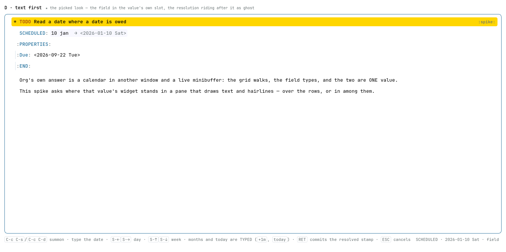
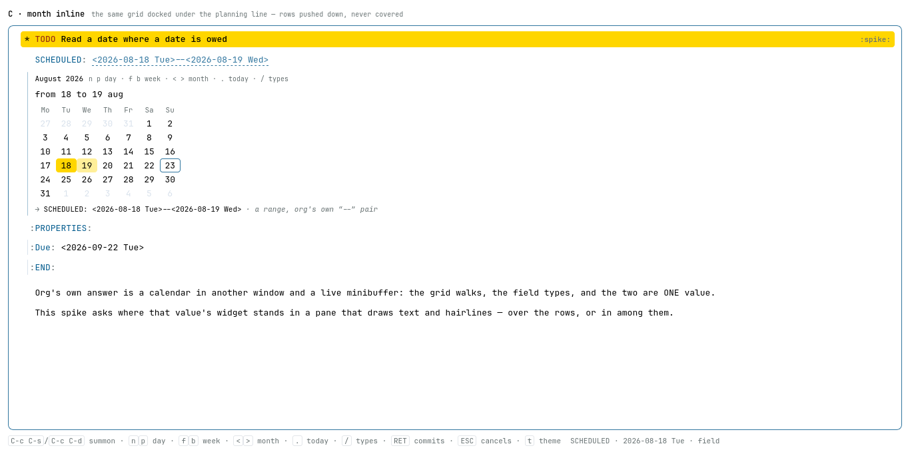
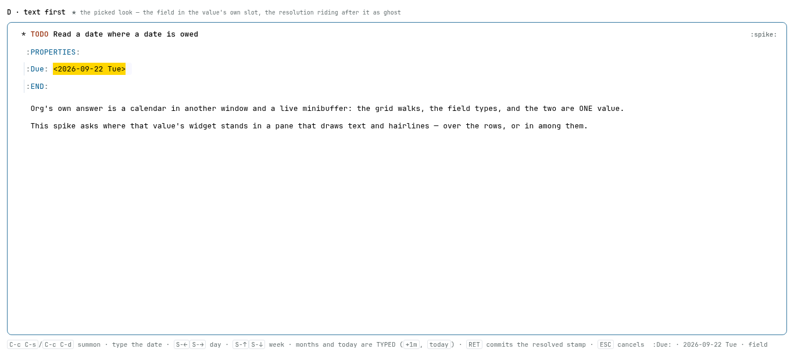

# Spike — five places for org-calendar's job to stand in the doc pane

**Date:** 2026-08-23 · **After:** the dot-chain-box spike, whose twenty rounds
settled the interaction laws this one inherits whole, and the English-dates
proposal ([`docs/proposals/proposed/2026-08-22-a-date-is-read-where-a-date-is-owed.md`](../../proposals/proposed/2026-08-22-a-date-is-read-where-a-date-is-owed.md)),
whose grammar is prototyped here because this *is* a date-owed context.

The ask, in the user's words:

> a datetime widget input — org-calendar's role in emacs (`C-c .` /
> `org-read-date`: pick SCHEDULED/DEADLINE or any date) — reusing the project's
> existing key bindings (rhymes) and the project's own visual widget style;
> several variants for review.

Today `C-c C-s` raises a text box with nothing in it and no idea what a date is
(`frontend/glue/30-capture.js:168`, `planRows`). The reader types, the box
shuts, and the server decides. **Open `index.html`** — the five tabs are five
answers to *where the widget stands*, and they are built to be argued with.

**D is the picked look**, and review changed what it is: the month grid went,
then the echo line went with the docked row, and what is left is a field
standing in the value's own slot with the resolution riding after it as ghost —
`SCHEDULED: 10 jan → <2026-01-10 Sat>`, one line, and a line the sheet already
had. It wears the pane's own edit dress, transcribed from `Page/Style.hs` rather
than approximated, which is the law round 4 settled: **D is the pair box's value
field plus a ghost span, and no new visual system.** What the rounds changed and
why is under [Argued and amended](#argued-and-amended); the shapes D passed
through stay in the record there. Every amendment is pinned in `check.mjs` — the
last one in PIXELS, under a second browser engine, because the model could not
see it.

Everything here is throwaway. The fixture is invented; the palette, the doc
pane, the planning line, the pair box's field dress and the offer list are
glance's own, lifted from `Page/Style.hs`, `Theme/Default.hs` and `Doc.elm` so
the look is judged at the real hues and the real metrics.

| file | what it draws |
| --- | --- |
| `index.html` | the tabbed shell; each variant runs in its own `<iframe>` |
| `a-control.html` | the control: today's blind `askText` prompt, raised over a veil |
| `b-month-popup.html` | org's month grid raised BESIDE the field — nothing moves, and it covers |
| `c-month-inline.html` | the same grid DOCKED under the planning line — rows pushed down |
| `d-text-first.html` | **the picked look** — the field in the value's own slot, the resolution riding after it as ghost |
| `e-day-strip.html` | a fortnight ONE ROW TALL, inline — the cheapest thing that still walks |
| `rig.js` | the sheet, the calendar, the grammar, the summons, the commit/cancel laws, and six deliberate faults |
| `pane.css` | the pane, the planning line, the pair box, the offers, the ghost, the widget's metrics — both palettes |
| `check.mjs` | the complaint, mechanised — and a run that proves each rung bites |
| `shots.mjs` | the five screenshots, headless |
| `bidi.mjs` | the fold-marks spike's Firefox driver, copied so this directory stands alone |
| `cdp.mjs` | a Chromium driver and a dependency-free PNG reader — the second engine, and the only one here that can SEE a selection |
| `a-control.png` … `e-day-strip.png` | each tab at the moment that shows what it is for |
| `d-selected.png` | the picked look at the moment the edit opens, shot in Chromium — the real-browser proof that the selection is SEEN |

## The key rhymes

Nothing here invents an interaction. Every key is taken from somewhere the
project or org already spends it, and the rhyme is stated so review can ask
whether it is real ([`docs/design-rhymes.md`](../../design-rhymes.md)).

| key | in the widget | the rhyme it is taken from | where that lives |
| --- | --- | --- | --- |
| `C-c C-s` / `C-c C-d` | summon, for SCHEDULED / DEADLINE | the app's own two, org's own spelling, over the row at point | `Keymap.hs:109`, `:111`; `30-capture.js:168` |
| `n` / `p` | a day | the movement vocabulary's first pair, emacs's next/previous — the reader's default walk on every surface glance draws | `Keymap.hs:34`; `design-rhymes.md` "Movement" |
| `f` / `b` | a week | the walk/climb pair: `b` as in BROADER, the grain one step up from a day | `Keymap.hs:39`; `design-rhymes.md` "Movement is two axes" |
| `<` / `>` | a month — **in the grid tabs only; retired in D** | org-calendar's own two, and glance's own far-jump pair (first/last row, again = a page) | `Keymap.hs:51`, `:53`; emacs `calendar-mode` |
| `.` | today — **in the grid tabs only; retired in D** | `org-read-date`'s own key for today | emacs `org-read-date`; **collides**, see below |
| `+1m` / `-1m` / `today` | the month grain and today, TYPED, where there is no calendar frame | org's own shift charset and the shipped planning words — already the grammar the field reads | `commands.md:56`, `:57`; `query.md:306` |
| `/` | opens the typed field, where the grid holds the keys | "`/` always narrows" — the shell's one door into a field | `Keymap.hs:62`; `design-rhymes.md` |
| `TAB` | hops field ↔ grid | "`RET` opens the thing at point in place … `TAB` hops" | `design-rhymes.md` "Editing is one overlay" |
| `S-←` `S-→` / `S-↑` `S-↓` | a day / a week, while a FIELD holds the keys | org-read-date's own minibuffer walk, for org's own reason | emacs `org-read-date` |
| typed text | refines: ISO, `today`, `*today*+30d`, `18 aug`, `from 18 to 19 aug` | the shipped planning grammar and the query grammar's date sections, plus the English-dates proposal | `commands.md:49`; `query.md:289`, `:306`; the proposal |
| `RET` | DRY over an offer, FINAL over a completed value | the pair box's `takeOffer`, and the dot-chain spike's rounds 3 / 11 / 15 | `20-sheet.js:554`; dot-chain README |
| `ESC` | cancels the input WHOLE — byte-identical restore | `keyboard-quit`, and the dot-chain spike's round 14 | `Keymap.hs:125`; dot-chain README round 14 |
| empty + `RET` | clears the entry | the shipped foot's own promise, kept verbatim | `Keymap.hs:138`; `30-capture.js:170` |

`t` swaps the theme in these rigs the way it does in every sibling spike. **In
the app `t` is `org-glance-overview:todo`** (`Keymap.hs:103`) — the rig's `t` is
a spike convention and no part of the proposal.

### Two collisions, named

**`.` means today here and `compose-query` there** (`Keymap.hs:65` — the whole
expression behind the dot door, which the dot-chain spike spent twenty rounds
on). It does not bite: the two never stand at once, because the table's keys are
not live behind a summoned widget, and because org spells today as `.` on both
sides of the fence — the muscle memory is org's either way. Worth writing down
so the next reader does not rediscover it as a bug.

**`n`/`p` for a day is the collision that DOES bite.** Emacs `calendar-mode`
binds `C-f`/`C-b` to a day and `C-n`/`C-p` to a week — the exact opposite — and
glance's own table binds `n`/`p` to ROWS, which in a seven-column grid are
weeks. So in B, C and D the asked-for rhyme fights both prior arts at once. In
**E it fights neither**, because the strip *is* one row of day cells and `n`/`p`
walking along it while `f`/`b` jump a row is the table's own reading, unbent.
That is not a small point about E; see the findings.

## What each tab argues

Two numbers, because a summon costs two different things. **Standing** is what
the widget adds to a sheet whose planning line is already there — the widget's
own footprint. **Bare** is what a summon costs a sheet with no planning line at
all, where the line itself has to appear: one doc line, which nothing can avoid.

| | where it stands | the rows beneath | standing | bare | who holds the keys |
| --- | --- | --- | --- | --- | --- |
| **A** control | raised over a veil | untouched, and unreadable | 0 | 0 | a blind field |
| **B** month popup | absolute, beside the field | keep their tops, **covered** (236px of them) | 0, at the cost of cover | 30px | the grid; `/` opens the field |
| **C** month inline | a row in the flow | pushed down **223px** | ~10.6 doc lines | 253px | the grid; `/` opens the field |
| **D** text first ★ | **in the value's own slot** | untouched — it adds no row | **0px** | **30px** — the line itself | the **field**, and only the field |
| **E** day strip | a row in the flow | pushed down **94px** | ~4.5 doc lines | 124px | the grid; `/` opens the field |

D's widget measures 18px — under one doc line — and it displaces nothing,
because it stands where the value already stood.

- **A** is the baseline and it fails on purpose. `C-c C-s` raises the shipped
  prompt: a title, a field, a foot, a veil. It reads today's grammar
  (`docs/commands.md:51`) and nothing more, so `18 aug` is refused — **after**
  the prompt has shut, with the typed text gone and nothing on screen left to
  fix it in. The sheet the date belongs to is behind the veil, dimmed; the
  planning line the value will land on cannot be seen while it is being typed.
  That is the whole of what `INLINE OVER POPUP` is a direction away from
  (`a-control.png`).
- **B** is org's classic answer wearing glance's inks, hanging exactly where the
  pair box's offers already hang (`Page/Style.hs:339`). Its claim is real —
  nothing in the document moves, so the reader's place is where they left it —
  and so is its cost: it covers the rows the date is about.
- **C** is B docked. Same grid, same keys, in the document's own flow with the
  drawer's own gutter bar, no box and no shadow: a docked surface that framed
  itself would be a popup that forgot to leave. It costs ten doc lines of sheet.
- **D — the picked look** — is `org-read-date`'s model with the frame taken
  away. The widget stands IN the value's own place, the field reads the live
  grammar, and the resolution rides after what was typed as ghost:
  `SCHEDULED: 10 jan → <2026-01-10 Sat>`. Nothing is restated — the row already
  said the keyword — and nothing is added to the sheet. See the rounds below.
- **E** is the grid unrolled: a fortnight, one row, the month at the edge. Less
  than half of C's vertical cost, and the only tab where the asked-for key rhyme
  is literally right. What it cannot do is show a month.



*D, the picked look, on the user's own example: the widget stands in the
planning line's SCHEDULED slot wearing the pane's own edit dress — the surface
ground an open edit carries (`Style.hs:322`), the document's own face, no focus
ring — `10 jan` is what was typed, and `→ <2026-01-10 Sat>` rides after it in
mute ink. The ghost is a span and never the field's value: the caret cannot
enter it, nothing selects it, and `RET` commits the resolution rather than the
six characters that drew it.*



*C, for the record: `from 18 to 19 aug` typed, the range washed across the
docked grid, today still ringed rather than washed, the planning line above
already showing what `RET` will write — and under the grid the resolved echo
carrying org's own `--` pair with the weekday computed at both ends. Ten doc
lines, against D's zero.*

## Argued and amended

The five tabs were built, looked at, and reviewed. Each round below is a
decision the screen produced, and the check now holds it.

### 1. D over the rest, and the grid goes

The verdict, in the user's words:

> the text and description should be enough; make it compact, as the dot-chain
> spike's F box.

So the month grid left D entirely. What was left was the shape the dot-chain
spike had already settled — a field, and one mute line under it carrying the
resolved stamp. The footprint fell from 201px to 51px, two doc lines.

**The `<` `>` `.` decision, with grounds.** The month grain and today had been
carried by three keys that `TAB` reached through the grid. With no grid they
have nowhere to go, and the answer is that **they retire with it**:

1. **They were never value keys.** In `org-read-date` they are calendar-FRAME
   commands — `<` and `>` are `org-calendar-scroll-month`, `.` is
   `org-calendar-goto-today` — and they move point in the calendar, which then
   writes back. Take the frame away and there is nothing for them to scroll and
   nowhere for them to go. Keeping them would mean *inventing* a meaning, not
   preserving one.
2. **Every grain they carried is already a WORD this field reads.** A month is
   `+1m` / `-1m` — org's own shift charset, already in the shipped planning
   grammar (`docs/commands.md:57`) and already in the query grammar
   (`docs/query.md:306`). Today is `today` or `*today*`
   (`docs/commands.md:56`, `docs/query.md:289`). In a field that is already
   focused, a month step is three characters.
3. **The shifted arrows survive because they are the exception**: they adjust
   the VALUE and need no frame to act on, which is exactly why org binds them
   in the minibuffer. They keep D's walk at two grains, and the third is typed.
4. **One family, not three.** A widget that is a field and a line should not
   carry a keymap. D's key surface is now the shifted arrows plus the grammar,
   and nothing else.

A bonus falls out: the `.`-versus-`compose-query` collision dissolves in D,
because D never takes `.` as a key at all.

### 2. Fully inline: the ghost, and no key/value duplication

The user sharpened it again:

> FULLY INLINE, the resolver as an OVERLAY on the input line itself. Their
> notation: `10 jan [-> <2026-01-10 Sat>]` — the resolved stamp rides as
> trailing ghost text right after what was typed, one line TOTAL, no separate
> echo line. And NO key/value duplication: the widget stands where the context
> already names the key (the planning line's own SCHEDULED slot, the pair box's
> value half), so the widget restates nothing — compact and strict.

So the echo line went too, and the widget stopped being a row of its own. It
now mounts in the **value's own slot** — the planning line's `SCHEDULED` slot,
the drawer pair's value half — and the resolution rides after what was typed as
mute ghost text. The row already names the key, so the widget names nothing.

**What the ghost says: three states and no fourth.** An empty field shows
nothing. A term still being WRITTEN shows nothing — `18 a` is a month halfway
typed, not a mistake, and a refusal flashed at every keystroke is a refusal
nobody reads. A term that RESOLVES shows `→ <stamp>`, weekday computed. A term
the grammar REFUSES shows the refusal's SHORT word in the refusal's own red.
This is the dry law's complete-term reading — the dot-chain spike's round 15 —
read for ink instead of for keys, and it needed one thing the grammar did not
have: a `writing` predicate (is this text a proper prefix of something the
grammar would accept?) and a `hard` flag on the refusals no further character
can rescue. `31 feb` is a prefix of `31 february`, which is the same wrong day,
so the calendar's refusals are hard and never read as half-typed.

**The ghost is a SPAN and never the field's value.** The caret cannot enter it,
nothing selects it, no keystroke edits it, and `RET` commits the resolution
rather than the characters that drew it. That is pinned twice: a `CARET` rung
that walks the caret past the end of what was typed and finds it clamped, and a
`?bug=caret` mutant that writes the resolution into the field and must be
caught.

**And the ghost falls silent when it has nothing to add** — where the resolution
IS what was typed, which is org's own bracketed spelling kept verbatim. Drawing
the same string twice on one line would be the duplication this round is
about.

### 3. The entry is selected; the commit is unadorned

A reading in which `RET` left the *committed* value standing wholly selected was
built and withdrawn. What the user meant was the other end of the edit:

> the FIRST RET (the one opening edit mode over an existing value) brings that
> text up WHOLLY SELECTED, so the reader overwrites by typing.

The rig already did this — the opening value comes up selected — but it was a
rig convenience with no rung on it, which is the same as not having it. **It is
now a law with a name and a test.** Opening `SCHEDULED` over a stamp that
already stands brings the whole spelled value up selected; one keystroke
replaces the whole of it rather than appending to it; `RET` with no keystroke
recommits the same value byte for byte, taking the default the way
`org-read-date` does; and the ghost stays outside the selection, being a span
and never the field's text. `?bug=opencaret` opens with the caret collapsed at
the end instead, and the `ENTRY` rung catches it.

Two notes the rung pins with it. **The ghost is silent at entry** — the value
that stands IS its own resolution, org's own spelling, so there is nothing to
add and the row reads as the plain org line it is. And **the commit is
unadorned**: `RET` writes the resolved stamp and closes, exactly as it did
before this round. The selection belongs to the entry alone.

### 4. Set, focused, and invisible — and the dress that prevents it

A reader opened the edit in a real browser and reported the opposite of what
every rung said:

> RET on the property row → edit opens → text NOT selected.

…and then, with the ground half-fixed:

> with the selection present, text background didn't change, only corners.

**The selection was set the whole time.** `selectionStart..selectionEnd` was
`0..16`, `document.activeElement` was the field, `document.hasFocus()` was true.
Every rung above reads the MODEL, and the model was right. What was wrong was
the PAINT, and the cause is a token the pane spends twice:

| | the token | where |
| --- | --- | --- |
| the cursor's row wash | `--g-sel` | `Style.hs:154` — `#mdoc.on .de.dat{background-color:var(--g-sel)}` |
| a field's text selection | `--g-sel` | `Style.hs:374` — `#dtin::selection,#dpair input::selection,…` |

D stands **inside** the row at point. So its text selection was painted in
exactly the colour already behind it. Measured in Chromium, on the `RET`-on-pair
door: **16 pixels of 2128 differed** between the selected frame and the
collapsed-caret one — the caret sliver, and nothing else. On the `C-c C-s` door
**1223 of 1376 differed**, because the planning line is not the row at point.
That difference is exactly why the report named the property row.

**The fix is the pane's own rule, not a patch, and it has two halves.** Every
shipped in-row edit carries its ground with it —
`#dtitle,#dpara,#dpair{background:var(--g-surface)}` (`Style.hs:322`) — which is
why no shipped edit has ever hit this. The widget carries it too, and the same
measurement reads **1945 of 2128**. But the shipped box also covers the row
**edge to edge** (`Style.hs:328`, the `left`/`right` inset), so while an edit is
open the cursor wash is simply not on screen. An edit standing *inside* the row
cannot cover it, so it **lifts** it — the same fact said the other way round:
the row is still at point, and what the row SHOWS is the edit. Without that
second half the value's `--g-sel` and the row's `--g-sel` still share a line and
the reader has to find the seam; `d-selected.png` is the proof of the pair, taken
in Chromium at the moment the edit opens.



*`RET` on the drawer's `:Due:` row, photographed at the moment the edit opens:
the key in its own ink, the value it is about to replace wholly selected in the
pane's own `--g-sel`, the row's cursor wash lifted so the two golds never meet.
Taken under Chromium because headless Firefox never gives the document focus and
so paints no selection at all.*

**Then the principle that makes it general**, in the user's words:

> THE WIDGET REUSES THE PANE'S OWN EDITING STYLE — in the real material doc, D
> is the existing edit-box dress grown a ghost, never a bespoke widget style.

So the field's dress is now **transcribed** from `Page/Style.hs` rather than
approximated, rule by rule with the source line beside each: the inherited doc
font and borderless box (`:356`), no focus ring and no focus border (`:372`),
the `::selection` rule (`:374`), the surface ground (`:322`). D's own bespoke
accent underline went with it — *no new visual system*. The `::selection` gap
closes by construction, because the rule comes with the family, and the final
measurement is **2574 of 2793** pixels, `#ffd600` × 2114 in light and `#373d4f`
× 2114 in dark.

**And the harness lesson, which is the larger one.** `check.mjs` drove headless
Firefox, where `document.hasFocus()` is **false and stays false** through
`window.focus()` — and no engine paints a text selection in an unfocused
document. Under that driver the field shows `0` selection pixels whether the
widget is right or wrong: *no* `::selection` spelling paints, not
`background-color`, not `input::selection`, not `::-moz-selection`. The driver
every other rung uses is blind to this entire class of fault by construction.
That is what `cdp.mjs` is for.

## What the rig holds, so the tabs are honest

Everything below is in `rig.js`, identical in all five tabs. What differs
between two tabs is a `look` object and a stylesheet.

**The grid and the field are ONE value.** Walking rewrites the field; typing
moves the grid. A widget where the calendar stood on today while the field said
nothing would be two widgets in a coat, and `RET` would have to pick one. **The
reason survives the frame:** D has no grid, and its field still opens on the
value the widget stands on, because the shifted arrows ADJUST a value and an
empty field has none to adjust.

**The opening value comes up WHOLLY SELECTED** (round 3), so `RET` on an
untouched widget takes the default the way `org-read-date` does, and the first
character typed replaces the whole of it rather than landing after it. A is the
exception: it is blind and opens empty, having neither a grid nor a walk to
agree with.

**The weekday is COMPUTED.** `<2026-08-18 Tue>` — never carried, because
`TsMoment` has no weekday field and recomputes on render (`AGENTS.hs:213`,
`:3415`). `check.mjs` computes it a second time by **Zeller's congruence**,
which shares no code with the page's `Date.getUTCDay`, so "computed" is a claim
a test holds rather than a comment.

**Except once.** Org's own spelling is kept **verbatim** when it reparses:
`<2026-08-05 Mon>` is written through unchanged though that day is a Wed
(`AGENTS.hs:3426` `verbatimDate Bracketed`; `test/TestQuery.hs:1791` pins it).
The one place the widget must not know better, and the check asserts it —
including asserting that the vector is still a wrong-weekday vector.

**One clock read, at mount** (`docs/invariants.md`, "One clock read per
request"). The check compares the page's day with node's and says *"a run that
crossed midnight, or two clocks"* rather than failing obscurely.

**The grammar.** ISO with a range-checked month and day; `today`, `*today*`,
`tomorrow`; org's shift charset with the sign read from **before the unit**, so
`2026-09-15-7d` is the week before rather than a broken date (`query.md:339`); a
bare shift is today-relative (`:333`); a half-typed shift narrows nothing and
says so instead of guessing (`:344`). On top, the proposal's English forms:
`18 aug` / `aug 18` / `18 August 2029`, case-folded totally, `from 18 to 19
august` with the left end inheriting what it elides, an inverted range refused,
the degenerate one collapsing to a single stamp, and `31 feb` refused by the
calendar. **A alone is told to leave the English half out**, because A is today.

**The offers.** They stand at fresh and UNFINISHED positions and nowhere else;
a finished term carries none and `RET` there applies (the dot-chain spike's
round 15). The walk always lands on a finished term, so the grid and the menu
are never both asking. The reader's own line leads the list, hinted `new`
(`design-rhymes.md`, "The typed value is always an offer"), and point stands on
nothing over an empty field (`20-sheet.js:540`). **The hint column is the offer
RESOLVED** — `18 august · 2026-08-18 Tue` — which is the one thing a date
vocabulary can do that a property vocabulary cannot.

**ESC cancels the input, and that is the whole of what it does.** One press
abandons the summon whole, whether or not the menu stands and whether or not
anything was typed, and the sheet comes back byte for byte — including the
planning line's own absence, where the summon had ghosted the keyword in. The
cancel puts back **the spelling the edit found**, not the one it was given.

**Six rows, always.** A month grid that grew and shrank with the month would
push the rows under a docked widget by a different amount at every `<`. The
geometry is the month's picture, never the month's length.

**The widget's own menu docks, wherever the widget stands.** The shipped
`#doffer` hangs absolutely because it hangs over the *document*; here it hangs
over the widget's own calendar, and a menu that covered the grid the reader is
walking would be this spike's own complaint one storey down. Making it in-flow
took one rule and removed the problem in every tab, B included.

## The check

```sh
node check.mjs                     # every variant, then the six faults
node check.mjs c-month-inline.html # one
node shots.mjs                     # the five PNGs
```

Per variant: **CLOCK** (one read, and the page and the test agree on the day),
**SUMMON** (`C-c C-s` opens on SCHEDULED, at today), **PREVIEW** (the stamp is
shown before the `RET`, on the planning line's value span or in the ghost,
whichever surface the variant says it on), **WALK** and **GEOM** (below),
**TYPED** (every form above, and the two refusals spoken *before* the commit),
**VERBATIM**, **ECHO** (what the reader can SEE, read off the drawn ghost or
echo rather than off the model, and following the field rather than trailing
it), **CARET** (the ghost is not the field's value; the caret walks to the end
of what was typed and stops), **QUIET** and **DRY** (offers over a half-typed
term and none over a finished one; `RET` over an offer takes it dry and writes
nothing, and the same key over the finished term applies), **WEEKDAY** (what
lands on the planning line, against Zeller), the second keyword landing beside
the first in org's order, **empty clears it**, **ENTRY** (the opened value comes
up wholly selected, a keystroke replaces it, `RET` with none recommits it byte
for byte), **PAIR** (the same widget on the drawer's date-shaped pair, opening
on the value it is replacing), and **ESC** twice — over a menu on an empty
entry, and over a standing value.

**WALK is two dialects, and both are asserted.** Where a GRID holds the keys the
letters walk and `< > .` are live. Where the FIELD holds them the walk is org's
own shifted arrows — and in D the check asserts the RETIREMENT too: `.` and `>`
are characters in the field, `today` and `+1m` carry what they carried, and
`TAB` has nowhere to hop and must not let focus out of an open widget.

**GEOM is what each placement claims.** The popup covers and moves nothing; the
dock pushes and covers nothing; the strip is one row; a month grid is 7 heads +
42 days; a gridless widget draws no calendar body and still says something; and
**the pane never scrolls sideways**. D's slot mount is pinned twice over: the
widget stands INSIDE a document row, it moves the rows beneath by **0px** over a
sheet whose planning line already stands, and it costs **one doc line** on a
bare sheet — the line it has to ghost in, and not one pixel more.

**A's misses are declared, not dropped:** `WALK`, `PREVIEW`, `DRY`, `QUIET`,
`GEOM`, `ECHO` — it has no calendar to walk, no preview, no offers, nothing in
the pane to measure and nothing that speaks. `CARET` runs where a ghost exists
to walk into, which is D; that narrowing is read off the variant rather than
listed.

### And then the paint, in a second engine

Every rung above reads the model, and round 4 was a fault the model could not
see. So `check.mjs` closes Firefox and opens **Chromium**, and the last pass
reads PIXELS: for every variant, in **both themes**, at **both doors**, it
screenshots the just-opened moment and the same moment under `?bug=opencaret`,
and requires the two to differ across the value and the palette's own `--g-sel`
to be present in the bytes.

Three things make it evidence rather than decoration:

- **It asserts the page is FOCUSED first.** No engine paints a text selection in
  an unfocused document, so a green paint rung on an unfocused page proves
  nothing. Headless Firefox never gets focus at all — which is why this pass
  cannot live in the driver the other rungs use.
- **It measures the VALUE's extent, not the field's box.** A field is as wide as
  its flex allows; a selection is as wide as its value. Read over the field's
  own box, a correct wash fails on every wide field. The box is measured with
  the field's own computed font.
- **A door that opens empty is declared, not failed.** A's blind prompt opens
  with nothing in it, so there is nothing to select and the pass says so.

```sh
ok   d-text-first.html · paint (chromium, both themes, both doors)
ok   a-control.html · paint (chromium, both themes, both doors)   (opens empty: light/plan, dark/plan)
     departs: the shipped prompt wears no ::selection rule …
```

**A departs on the wash, and the departure is the app's own.** Every other field
here wears the pane's edit dress, whose selection rule is `Style.hs:374`. The
shipped `askText` prompt is dressed at `Style.hs:391` and is named in **no
`::selection` list anywhere in the renderer** — so today's blind prompt paints
its selection in the browser's default rather than the pane's `--g-sel`. The
rung still demands a visible selection there; it cannot demand the pane's colour,
because the pane never gave it one. That is a finding about the app, and it is
A's role to have found it.

### Does it bite?

A rung that cannot fail was never testing anything, so `rig.js` carries three
deliberate faults behind `?bug=` and the run drives each at the rung that owes
it. A **pass** there is the failure, and it is reported as `BLUNT`.

| fault | shape | the rung that catches it |
| --- | --- | --- |
| `?bug=skip` | the day walk takes two days | WALK |
| `?bug=weekday` | the weekday is taken from the day before — a hand-kept weekday field | WEEKDAY |
| `?bug=stale` | the resolution is one step behind the field it speaks for — right until the first keystroke, wrong ever after | ECHO |
| `?bug=caret` | the ghost is written INTO the field, where the caret can walk into it and a keystroke can half-delete it | CARET |
| `?bug=opencaret` | the edit opens with the caret collapsed at the end, so a reader who types to overwrite appends | ENTRY |
| `?bug=blend` | the edit keeps no ground, so its selection is painted in the wash already behind it — round 4, exactly | PAINT |
| `?bug=escmenu` | ESC takes the menu and leaves the edit standing — the graduated ladder round 14 removed | ESC |

**Faults compose** — `?bug=blend,opencaret` turns on both — and the paint pin
needs that: to prove it catches `blend` it must hold `blend` CONSTANT and vary
only the caret, or it is comparing two different pages and learning nothing.

```
ok   a-control.html   (misses: WALK, PREVIEW, DRY, QUIET, GEOM, ECHO)
ok   b-month-popup.html
ok   c-month-inline.html
ok   d-text-first.html
ok   e-day-strip.html

bites WALK · a day-walk that skips
bites WEEKDAY · a weekday remembered rather than computed
bites ECHO · an echo one resolve behind the field it speaks for
bites CARET · a ghost written into the field, where the caret can walk into it
bites ENTRY · an edit that opens with the caret collapsed instead of the value selected
bites ESC · an ESC that takes the menu instead of the edit
ok   a-control.html · paint (chromium, both themes, both doors)   (opens empty: light/plan, dark/plan)
     departs: the shipped prompt wears no ::selection rule …
ok   b-month-popup.html · paint (chromium, both themes, both doors)
ok   c-month-inline.html · paint (chromium, both themes, both doors)
ok   d-text-first.html · paint (chromium, both themes, both doors)
ok   e-day-strip.html · paint (chromium, both themes, both doors)
bites PAINT · an edit whose selection is painted in the ground already behind it
```

## Findings

1. **The grid and the field are one value, or they are two widgets.** Every tab
   that has both had to make that identity before anything else worked: walking
   writes the field, typing moves the grid, and the opening value is selected so
   `RET` takes the default. It is org-read-date's model, it is the one thing
   that does not vary across the tabs, and that is exactly why it belongs in the
   rig rather than in any variant.

2. **The letter rhymes and a focused text field cannot share a surface — and
   that, not the calendar's shape, is what the five tabs actually split on.**
   Where the grid holds the keys (B, C, E) the letters are the walk and `/` is
   the door into typing, which is the shell's own arrangement. Where the field
   holds them (D, A) `n` types an `n`, and the walk falls back to org's own
   shifted arrows. There is no third answer: the choice is which of the two the
   widget leads with, and every other difference follows from it — including,
   in D, that the third grain has no chord at all and is typed.

3. **The asked-for key rhyme is right for the strip and fights the grid.** Emacs
   `calendar-mode` binds a day to `C-f`/`C-b` and a week to `C-n`/`C-p`; the
   glance table binds `n`/`p` to rows, which in a seven-column grid are weeks.
   Both prior arts say the opposite of `n`/`p` = day for B, C and D. In E, where
   the widget is literally one row of day cells, the rhyme *is* the table's own
   row-and-cells reading and nothing disagrees. If a grid ships, the honest
   options are to keep `n`/`p` = day everywhere and accept that emacs hands
   disagree once — or to ship the strip.

4. **The preview on the planning line does the popup's job for free.** In C, D
   and E the line above the widget already shows the stamp `RET` would write, in
   the caret's own accent, dashed. The document says what it is about to say,
   which is a thing only a docked widget can do — B's line is above its popup and
   works too, but A cannot: its sheet is behind a veil, and it is the only tab
   where the reader types a date without seeing where it lands.

5. **Refusals belong above the commit.** `31 feb`, `from 30 dec to 2 jan`,
   `today+30`: every one is a sentence in the echo while the typed text is still
   on screen. A's identical refusal arrives after the box has shut. That is the
   same argument `20-sheet.js:668` (`pairRefused`) already makes for the pair
   box — *"the box is shut before the model answers, so a wall it alone knew
   would leave a drawn row with nothing left to reach it"* — applied to dates.

6. **A menu inside a floating widget is a second floating layer, and docking it
   costs one CSS rule.** The offers first hung absolutely, the way the shipped
   `#doffer` does, and covered the top of the calendar in every tab. In-flow they
   push the grid down inside the widget and the problem is gone — including in
   B, where the widget itself still floats. The spike's own thesis, recursively.

7. **The verbatim bracket is the one place the widget must not know better,** and
   it is easy to lose: everything else in the pipeline recomputes the weekday, so
   a tidying pass that made the renderer uniform would silently start respelling
   `<2026-08-05 Mon>`. It is pinned here and in `test/TestQuery.hs:1791`.

8. **The vertical cost is the argument, and it is a number.** C pushes 223px
   and E 94px; B pushes nothing and covers 236px. **D pushes 0px** — it stands
   in the value's own slot, so there is nothing to push — and costs one doc line
   only where the planning line did not exist to begin with. Ten doc lines,
   four and a half, eleven covered, or none.

9. **Removing a frame does not remove what the frame carried; it moves it into
   the grammar.** D lost `<`, `>` and `.` with its calendar, and lost nothing:
   they were frame commands, and a month is `+1m` and today is `today` in a
   grammar the field already reads. The rule generalises — a key that only ever
   scrolled a surface has no meaning once the surface is gone, and looking for
   one is how a keymap grows.

10. **A widget standing inside a row must carry its own ground, because the pane
    spends one token on two things.** The cursor's row wash and a field's text
    selection are both `--g-sel`, so an edit that sits in the row at point
    selects its text in the colour already behind it: set, focused, and
    invisible. Every shipped edit escapes this only because it carries
    `--g-surface` with it (`Style.hs:322`) — which is the argument for the
    production law that closed round 4: **reuse the pane's editing dress
    wholesale rather than approximating it**, and the rules that prevent faults
    you have not thought of come along with the ones you have.

11. **The one field in this spike that does not wear the pane's dress is the
    shipped one.** `#pinput` — today's `askText` prompt, which is what `C-c C-s`
    raises now — appears in no `::selection` list in the whole renderer
    (`Style.hs:391` dresses it; nothing gives it the wash), so it selects in the
    browser's default colour while every in-pane field selects in `--g-sel`. The
    control found a gap in the thing it is the control for.

12. **A model-reading test cannot see a paint fault, and a headless driver may
    not be able to either.** Fifteen rungs passed while the screen showed
    nothing. Worse, the driver those rungs use *could not have caught it at any
    threshold*: headless Firefox never gives the document focus, and no engine
    paints a selection in an unfocused document — so the field reads zero
    selection pixels whether the widget is right or wrong. A second engine with
    focus emulation is not belt-and-braces here; it is the only instrument that
    can take the measurement at all.

13. **A ghost is only honest if it cannot be edited, and only readable if it
    knows when to keep quiet.** Two rungs and two mutants exist because both are
    easy to get wrong invisibly: a resolution written into the field looks
    identical until the caret walks into it, and a refusal shown at every
    keystroke turns `18 a` into an error message. The `writing` predicate — is
    this a proper prefix of something the grammar accepts? — is what buys the
    silence, and the `hard` flag on the calendar's own refusals is what keeps
    `31 feb` from hiding behind `31 february`.

**D is the pick**, and review made it the strictest of the five: a field in the
value's own slot with the resolution riding after it as ghost. It costs the
sheet nothing, restates nothing, previews everything, and carries every law the
other four carry. Its own cost is named and real — no month at a glance, and a
key surface of exactly one family — and it is the cost the verdict accepted.

**E remains the alternative** and the two compose: the strip under a ghosted
field is three lines total and answers "which Tuesdays are free" as well as
"18 aug". It is also the only tab where the asked-for key rhyme needs no
apology. **C stands in the record as argued-against on cost** — ten doc lines
against D's zero for the same answer — and **B as argued-against on principle**:
it buys a still document with a covered one, which the standing direction had
already decided against.

## What shipping would need

Nothing here is a proposal; this is what a proposal would have to answer.

- **D ships as the pair box's value field plus a ghost span — the editing style
  reused wholesale, and no new visual system.** This is the law, not a
  preference. The pane already has an edit dress: the inherited doc font and
  borderless box (`Style.hs:356`), no focus ring and no focus border (`:372`),
  the `--g-sel` text selection (`:374`), the `--g-surface` ground (`:322`), the
  pane's own accent edge while it holds the edit (`:134`). D adds ONE element to
  it — a mute, unselectable `<span>` after the field — and changes nothing else.
  `pane.css` transcribes those rules with their source lines beside them rather
  than approximating them, and the spike's dress is the PROOF OF FIT rather than
  a design of its own. Round 4 is the argument: the rule that made the selection
  legible (`:322`) was one nobody would have thought to write, and it came free
  with the family.
- **The slot the widget stands in.** D mounts in the planning line's value span
  and in the drawer pair's value half — places the shipped pane draws as text
  today (`Doc.elm:1592` `viewPlanning`; the pair row). Shipping it means the
  renderer has to be able to hand that span over to an editor and take it back,
  which is the same move `#dpair` already makes over a drawer row
  (`Style.hs:320`, `placeEdit`) — but `#dpair` is an overlay POSITIONED on the
  row, and D is a widget INSIDE it. The overlay route reproduces D's look
  without touching the renderer and is the cheaper first build; the in-flow
  route is what makes the ghost reflow with the line. **Either way the ground
  comes with it**, since `#dpair` already carries `--g-surface`.
- **A browser test that never focuses the document cannot check a selection.**
  `test/browser/drive.mjs` drives Chromium, so the app's own suite could take
  this measurement; nothing in it does today. If D ships, the rung is a
  screenshot of the just-opened edit against the same edit with the caret
  collapsed — cheap, and the only kind of test that can see a wash painted in
  the colour behind it.
- **Where the widget lives.** The summons are bound in the **table's** scope
  today (`Keymap.hs:109`, `:111`, `scope = "table"`) and act over the marked
  rows or the row at point. This spike stages them over a doc-pane sheet, which
  is a second surface the same command would have to serve — and where "the row
  at point" is the materialized headline rather than a table row. Either the
  binding gains a `modal` twin (`Keymap.hs` has the pattern: `@` is bound in
  both scopes with two handlers) or the doc pane raises the same widget through
  the existing table handler with a different target.
- **The command's date argument.** `set-planning`'s `date`
  (`20-sheet.js:1137` → `POST /command`) already takes the whole grammar and
  resolves it **once per request** (`docs/commands.md:51`). A widget that
  resolves client-side must send **the resolved stamp**, not the phrase — two
  resolutions against two clocks is exactly the midnight bug the one-clock-read
  invariant exists to prevent. The bracketed form is already accepted verbatim,
  so the wire shape needs nothing new: send `<2026-08-18 Tue>`.
- **The pair box's value slot.** The widget rides it here with the pair box's
  own dress (`Style.hs:356`, `:361`, `:362`). Shipping it needs the proposal's
  *date-shaped property* test — **a property whose value being replaced already
  reparses as a timestamp** (`readsAsTimestamp`, **`src-query/Glance/Query.hs:1040`**;
  the proposal's own `:970` has drifted) — so no registry of date-property names
  has to exist. The rig fakes that with a `:Due:` pair holding a stamp; the real
  one asks the value it is replacing.
- **The English-dates proposal's contexts.** This spike prototypes phase 1 of
  its grammar in exactly context **(a)**: the planning line, `set-planning`'s
  date argument, and a date-shaped property value. It does **not** touch (b) the
  bracket trigger in free text or (c) the whole-line rule — a widget is not a
  paragraph, and the parser that lands here would be the same one, called from a
  field that owes a date and nothing else.
- **The pane never scrolls sideways.** D's widget is a field and a ghost on one
  line, so this is about the tabs it would replace: the docked grid is 7 × 4ch
  plus the body indent — 30ch, inside any sheet the pane draws — and `check.mjs`
  reads `scrollWidth` against `clientWidth` in every tab. What D owes instead is
  a rule for a ghost that would run past the pane's right edge: today it is
  clipped by the pane's own `overflow-x:hidden`, and a shipped one should
  either wrap the resolution to the next line or shorten the field.
- **A one-key clear.** "Empty clears it" is the shipped promise and it survives:
  the opening value comes up wholly selected (round 3), so `DEL` then `RET`
  clears in two presses. A dedicated key would rhyme with *"planning clears"*
  under `design-rhymes.md`'s deletion family, but `DEL` in a field is the
  field's own erase and `d` is the flag key — neither is free. Two presses is
  the honest answer until someone shows the third.
- **`C-s` is the browser's own.** `Keymap.hs:106` already carries the caveat
  for `C-c C-t` — *"the org spelling, where the browser lets it through"* — and
  it applies here. The rig `preventDefault`s and it works in headless Firefox;
  a shipped keymap owes the same fallback the rest of the map has.
