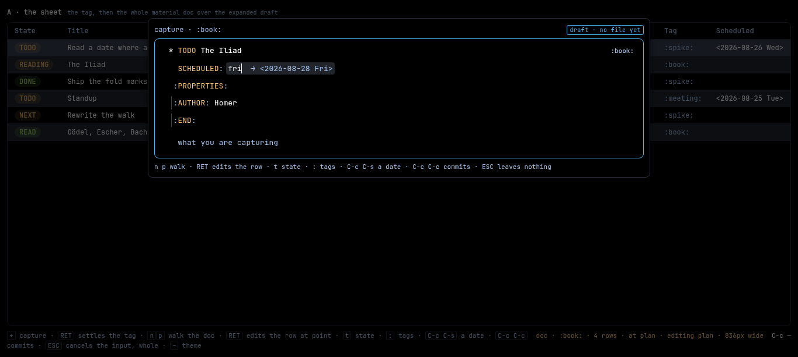
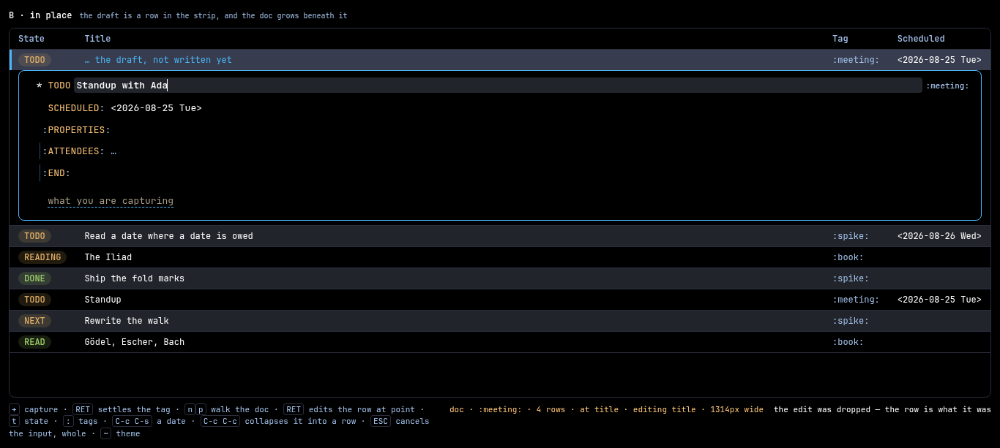
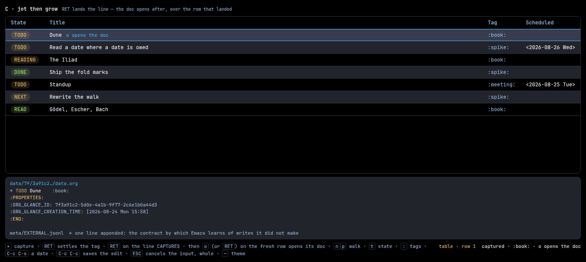
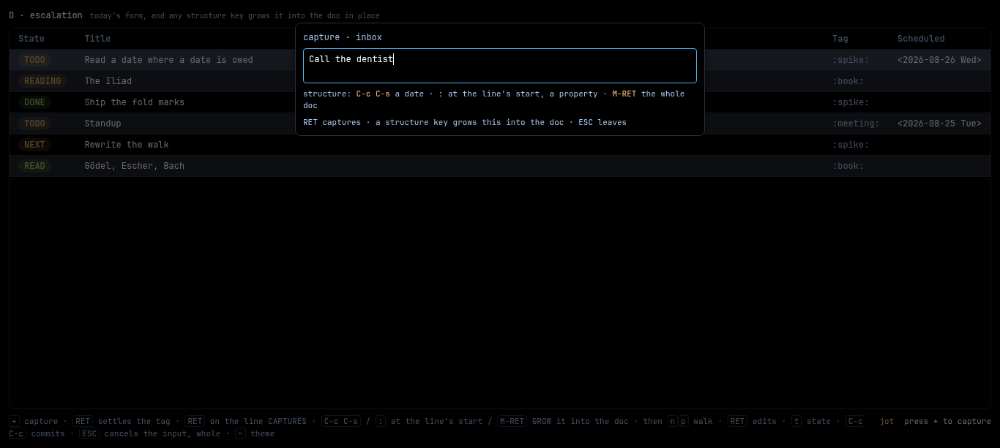
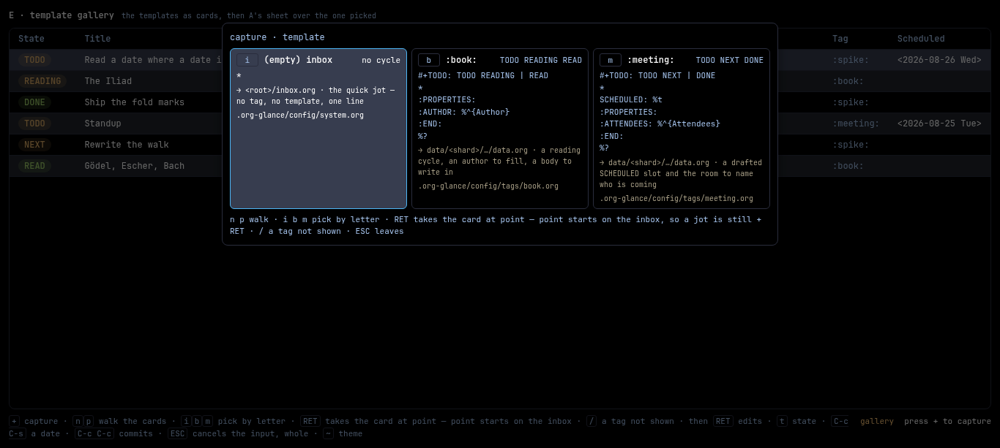

# Spike — five shapes for a capture that is the material doc

**Date:** 2026-08-24 · **For:**
[`docs/proposals/proposed/2026-08-24-the-capture-doc-is-the-material-doc.md`](../../proposals/proposed/2026-08-24-the-capture-doc-is-the-material-doc.md),
whose direction is accepted and whose SHAPE is not yet picked. **Against:**
today's form ([`docs/capture.md`](../../capture.md)) — a tag field, one field
per `%^{PROMPT}`, one line, `RET` submits. **Inherits:** the date-widget
spike's editing laws whole
([`docs/spikes/2026-08-23-date-widget/`](../2026-08-23-date-widget/README.md)),
because the date widget it picked is one of the editors this doc hands out.

The proposal settles WHAT: capture stops being a raw-text form and becomes the
material doc over a draft that does not exist yet, seeded from the tag's
template, committed whole on `C-c C-c`, and `ESC` leaves nothing. What it does
not settle is WHERE THAT DOC STANDS and HOW THE READER GETS TO IT — which is
what the five tabs are.

**Open `index.html`, click the pane, and press `+`.** Every tab is driven from
the keyboard and argued with the same three fake templates. (The click is a
`file://` tax: an iframe loaded from a file URL is an opaque origin, so the
shell cannot hand it the keyboard. Opening a variant's own page — `a-sheet.html`
and friends — needs no click.)

Everything here is throwaway. The fixture is invented; the palette, the doc
pane, the drawer, the pair box, the ghost, the row strip and the capture
popup's own box are glance's own, transcribed from `Web/Page/Style.hs`,
`Theme/Default.hs` and `assets/table-view.js` so the shapes are judged at the
real hues and the real metrics.

| file | what it draws |
| --- | --- |
| `index.html` | the tabbed shell; each variant runs in its own `<iframe>` |
| `a-sheet.html` | **A** — the tag, then the whole material doc over the expanded draft |
| `b-in-place.html` | **B** — the draft is a row IN the strip, and the doc grows beneath it |
| `c-jot-then-grow.html` | **C** — `RET` lands the line, and the doc opens after over the row that landed |
| `d-escalation.html` | **D** — today's form, and a structure key grows it into the doc in place |
| `e-gallery.html` | **E** — the templates as cards, then A's sheet |
| `rig.js` | the fake template registry, the draft model, the pane, every editor, the commit and cancel laws |
| `pane.css` | the pane, the drawer, the pair box, the ghost, the row strip, the shipped form's box — both palettes |
| `shots.mjs` | the five screenshots and the geometry the tables below quote, headless |
| `cdp.mjs` | the date-widget spike's Chromium driver, copied so this directory stands alone |
| `a-sheet.png` … `e-gallery.png` | each tab at the moment that shows what it is for |

```sh
xdg-open index.html      # or double-click it — no server, no build step
node shots.mjs           # the five PNGs, and the numbers this README quotes
```

## The three fake templates

The server's job, faked in `rig.js`, because the page never expands a template
and never holds template logic (the proposal's *Refused*). What the registry
answers is what a small GET beside `/properties` would answer: the draft,
**already expanded**, with `%^{…}` gone to empty slots, `%t` already stamped,
and a note of where `%?` stood.

| tag | its layer file | the skeleton | the draft that arrives |
| --- | --- | --- | --- |
| *(empty)* | `system.org` | `* ` | **one row**: a title, and nothing else. Point on the title. |
| `book` | `tags/book.org` | `#+TODO: TODO READING \| READ` + `* ` + an `:AUTHOR: %^{Author}` drawer + `%?` | title · the drawer with ONE EMPTY PAIR · a body. Point in the body. Cycle `TODO READING READ`. |
| `meeting` | `tags/meeting.org` | `#+TODO: TODO NEXT \| DONE` + `* ` + `SCHEDULED: %t` + an `:ATTENDEES: %^{Attendees}` drawer + `%?` | title · **a drafted SCHEDULED slot** · the drawer with one empty pair · a body. Point in the body. |

A tag with no layer yet falls back to the default template, which is what
`docs/capture.md:14` already promises: free text names a tag that does not
exist and the server's charset wall is the only judge.

**The default draft is `* ` and nothing else, so the default sheet is ONE ROW.**
That measurement is what most of this spike turns on: 41px, two doc lines. The
surface adds no rows; the template does.

## The key rhymes

Nothing here invents an interaction. Every key is taken from somewhere glance or
org already spends it, and the rhyme is stated so review can ask whether it is
real ([`docs/design-rhymes.md`](../../design-rhymes.md)).

| key | in the capture doc | the rhyme it is taken from | where that lives |
| --- | --- | --- | --- |
| `+` | opens the capture | the app's own, over the table | `Keymap.hs:91` |
| `RET` (tag field) | **dry then final**: takes the offer, then settles the tag | the shipped tag field, verbatim | `30-capture.js:96` |
| `n` `p` | walk the doc's rows | the movement vocabulary's first pair, the reader's default walk on every surface | `Keymap.hs:33`, `:34` |
| `RET` (on a row) | opens the row's own editor in place | "`RET` opens the thing at point in place" | `design-rhymes.md` |
| `t` | the state door, offering **the tag's own cycle** | `org-glance-overview:todo` over the row at point | `Keymap.hs:103` |
| `:` | the tags door | `org-agenda-set-tags` over the row at point | `Keymap.hs:107` |
| `C-c C-s` | the date widget over the SCHEDULED slot, ghosting the line in where there is none | the app's own two, in the doc pane's own scope | `Keymap.hs:123`; the date-widget spike |
| `C-c C-c` | commits the draft **whole** | `org-ctrl-c-ctrl-c`, and org-capture's own `org-capture-finalize` | `Keymap.hs:129`; emacs `org-capture-mode-map` |
| `ESC` | cancels the input, whole | `keyboard-quit`, bound in scope `any` | `Keymap.hs:147` |
| `M-RET` *(D only)* | asks for structure | org's own `org-insert-heading` | emacs `org-mode-map` |
| `o` *(C only)* | opens the fresh row's doc | **collides**, see below | `Keymap.hs:83` |

`~` swaps the theme in these rigs. It is a spike convention and no part of the
proposal.

### Three collisions, named

**`o` is already spoken for, and this one bites.** `Keymap.hs:83` binds it to
`org-glance-overview:open` — the row's links. C's asked-for affordance
(`o opens the doc`) would have to take it away from a command that is about the
row too, on the same surface, for a different meaning. **The honest binding is
`RET`**, which the table already spends on exactly this meaning
(`org-glance-overview:materialize`, `Keymap.hs:61` — open this row's doc). The
rig answers to both so the asked-for shape can be felt, and C's cue should say
`RET`.

**`C-c C-c` means one thing in the material doc and a bigger thing over a
draft.** `Keymap.hs:129` says *"commit the element being edited"*. Over a draft
it has to commit the whole capture, so the rig makes it take the open field
first and then commit — which is **org-capture's own reading**:
`org-capture-finalize` is bound to `C-c C-c` in the capture buffer and finalizes
from wherever point stands. The overload is org's, and it is worth writing down
rather than rediscovering.

**Org kills a capture with `C-c C-k`; glance kills it with `ESC`.** The standing
law here is `keyboard-quit` in scope `any` (`Keymap.hs:147`), so `ESC` is right
and needs no argument. `C-c C-k` could be added later as the org spelling, the
way `C-c C-t` sits beside `t` (`Keymap.hs:105`).

## The two laws every tab holds

These live in `rig.js` and do not vary between tabs, which is why they belong to
the rig rather than to any variant.

**ESC cancels the input it is in, whole, and a menu is never a rung of its
own.** With an editor open, one press abandons that editor and the row comes
back the way the edit found it; the draft stands. With no editor open, the input
IS the capture, and one press drops it — no file ever existed, so the
born-at-open memory is trivially empty and there is nothing to put back. This is
the date-widget spike's round 14 read one storey up.

**And on a BARE draft the edit *is* the capture.** A one-row draft — the default
template's `* ` — has nothing to close an edit into, so in its title field
`RET` commits the capture and `ESC` drops it. That keeps today's quick jot at
exactly the keys it costs today:

```
today   +  RET  ⟨the line⟩  RET
A       +  RET  ⟨the line⟩  RET       ← identical, because the draft is one row
```

Both halves are the same argument said twice, and they are the reason the
"protect the fast path" variants have less to protect than they look like they
do. Everywhere else `RET` closes the edit and hands the keys back to the walk,
and `C-c C-c` commits the draft whole.

## What each tab argues

Two numbers, measured by `shots.mjs` at a 1366×613 viewport. **Doc** is the
capture doc's own box where it stands. **Push** is how far the first real row of
the strip moved when the capture opened.

| | where the doc stands | doc, inbox | doc, book | doc, meeting | push | the jot's keys |
| --- | --- | --- | --- | --- | --- | --- |
| **A** the sheet | in the popup `+` already raises | 838×41 | 838×218 | 838×248 | **0px** (it covers) | `+ RET ⟨line⟩ RET` |
| **B** in place | in a row of the table itself | 1316×41 | 1316×218 | 1316×248 | **76 / 253 / 283px** | `+ RET ⟨line⟩ RET` |
| **C** jot then grow | nowhere at first; A's sheet afterwards | — | — | — | 0px | `+ RET ⟨line⟩ RET` |
| **D** escalation | the form's own box, grown | 838×41 | — | — | 0px | `+ RET ⟨line⟩ RET` |
| **E** gallery | A's, after a card | 838×41 | 838×218 | 838×248 | 0px | `+ RET ⟨line⟩ RET` |

**Every variant costs the quick jot the same four keys.** That is the first
finding and it removes the reason most of the hedging existed.

**The doc is the same doc in all five** — same rows, same editors, same laws.
What differs is the frame around it and the road to it.

---

## A — THE SHEET



*The book draft mid-edit: the title typed, the pair box's value already filled,
and `C-c C-s` standing on a SCHEDULED slot the summon ghosted in — `fri` typed,
`→ <2026-08-28 Fri>` riding after it as mute, unselectable ghost. The slot
carries `--g-surface` so its `--g-sel` text selection is legible inside a row
whose cursor wash is also `--g-sel` (the date spike's round 4), and the row
lifts its gold while the edit stands.*

**The shape.** `+` asks the tag — today's completing field, unchanged, an empty
tag the inbox. Then the whole material doc opens over the expanded draft, inside
the box `+` already raises (`30-capture.js:25`, `showPopup("capture", …)`). What
changed is what is inside that box: a document with the pane's own doors on
every row, in place of a tag field, three prompt fields and a line.

**Its laws.**

- The draft arrives expanded. The page renders it and never spells org.
- Point lands where `%?` stood, **with the editor already open** — a capture
  whose first keystroke is `RET` would be a form with extra steps.
- `n`/`p` walk; `RET` opens the row's own editor: the title's text field, the
  pair box on the drawer's empty prompt pair, the date widget's field-plus-ghost
  on the planning slot. `t` offers the tag's own cycle; `:` the tags.
- The drawer's `:PROPERTIES:` and `:END:` lines are drawn and are **not walk
  stops** — nothing on them is editable. (A rig convention; the shipped pane's
  own walk over drawer frame lines is not settled here.)
- `C-c C-c` commits the whole draft and prints the org that would land, with the
  server's own minting — the id, the creation stamp, the shard path, the ledger
  line — in mute, because the page spells none of it.
- An empty title refuses, in the shipped words: **`nothing to capture`**
  (`30-capture.js:120`).

**What it costs.** A surface as tall as the template. The book draft is 218px of
popup where the form was one line, and the popup box grows from 560px wide to
860px to hold a document at the doc pane's own metrics. It covers the strip
while it stands, which is the thing INLINE OVER POPUP is a direction away from.
And for a template whose `%?` is in the BODY it opens point away from the title
— see finding 3.

**What it refuses.** A second editor. Every door in the sheet is the door the
material doc already has, and the spike's dress is transcribed from
`Web/Page/Style.hs` rule by rule rather than approximated, which is the
production law the date-widget spike's round 4 settled: *reuse the pane's
editing dress wholesale, and the rules that prevent faults you have not thought
of come along with the ones you have.*

---

## B — IN PLACE



*No popup and no veil. The draft is a new top row wearing the cursor's ground
and an accent edge that says NOT YET WRITTEN, and the capture doc has grown
beneath its own row strip, in the table's own flow — so the six real rows are
pushed down rather than covered. The title edit covers its row edge to edge, the
way `#dpair`/`#dpara` do (`Style.hs:328`).*

**The shape.** The tag is asked in the popup, the popup shuts, and the draft
appears as a **row in the table** with the doc expanded inline beneath the row
strip. The capture doc grows where the row will live. `C-c C-c` collapses it
into a real row; `ESC` takes the row away with the draft, so the strip is
exactly the six rows it was.

**Its laws.** Every one of A's, plus: the draft row is the draft. It arrives
with the draft and leaves with it, and it is never a row anything could walk to
or act on.

**What it costs, and the trade-off is more interesting than expected.**

- *Cramped editing is the claim, and the measurement refuses it at this width.*
  B's doc is **1316px** against A's **838px** — B is WIDER, because it inherits
  the table's width while A is capped by the popup box. The direction flips
  below about 880px of viewport, and it flips again wherever the table is a
  split pane or the column set is wide enough to scroll sideways. So the honest
  statement is: **A's width is fixed and B's is the table's**, which is a
  liability exactly where the table is narrow.
- *The push is real and it is the bigger number.* 76px for the inbox jot, 253px
  for a book, 283px for a meeting. The reader's row moves under them at the
  moment they start typing.
- *The walk is seized.* While the doc stands, `n`/`p` belong to the doc, so the
  reader cannot move among the rows the draft is standing between. The
  continuity B buys is the eye's.
- *And the seam is a build cost with teeth.* The row strip is TableView's own
  DOM (`assets/table-view.js`); the doc pane is Elm (`Doc.elm`). B means
  mounting one inside a `<td>` of the other, with the doc pane's keymap live
  inside the table's scope. A mounts in a surface the app already raises.

**What it refuses.** The veil. That is its whole argument, and it is the
standing direction's own — the same one the date-widget spike settled one storey
down when a docked widget beat a raised one.

---

## C — JOT THEN GROW



*The line has LANDED — a real row, minted, with the receipt underneath showing
the blob path and the server's own drawer — and the transient word beside it
offering the doc.*

**The shape.** Today's flow, key for key: `+`, the tag, one line, `RET` lands
it. Nothing is staged, drafted or deferred. What is new is afterwards: the fresh
row carries a transient `o opens the doc`, and pressing it raises A's sheet over
that row, seeded from it, for enrichment.

**Its laws.**

- **One commit, and it is the `RET`.** The blob is minted, the shard path
  written, the ledger line appended. The doc that opens afterwards is a **normal
  edit** of a headline that exists, going out through the same door every other
  row edit goes out through: `C-c C-c` there SAVES AN EDIT, and `ESC` there
  leaves the landed row exactly as it landed. Anything else would need a draft
  that outlives the commit, which the proposal refuses outright.
- **The cue is transient; the door is not.** The word fades after six seconds
  and the key keeps working, because the key is the table's own.

**What it costs.** A second concept — *enrich later* — for a fast path that A
already gives for the same four keys (the bare-draft laws above). A key that
collides: `o` is `org-glance-overview:open` (`Keymap.hs:83`); the honest binding
is `RET` (`Keymap.hs:61`), which the rig also answers to. And an asymmetry the
reader has to hold: the same sheet means *capture* when it opens before the
commit and *edit* when it opens after, with `C-c C-c` and `ESC` quietly meaning
different things in each.

**What it refuses.** A staged capture. C is emphatic that `RET` is the write —
which is exactly what makes the doc afterwards ordinary, and exactly what makes
the variant hard to argue for once A's jot costs the same.

---

## D — ESCALATION



*Today's form with the line typed, and the structure keys named under the field
because nothing else on screen could say the form can become a document.*

**The shape.** It starts as today's small form: the tag, then one line, and
`RET` captures. **Any structure key pressed in the line hatches it**, carrying
what was typed across as the title:

| key | what it grows into | the rhyme |
| --- | --- | --- |
| `C-c C-s` | the doc, **and the date widget open on a ghosted SCHEDULED slot** — the key that asked for structure also lands you on it | the app's own schedule key (`Keymap.hs:123`) |
| `:` at the line's start | the doc, with the pair box already up over an empty pair | org's own way of starting a drawer line |
| `M-RET` | the whole doc, the line coming with it as the title | org's own `org-insert-heading` |

**Its laws.** The carry is the law: a line thrown away at the moult is a line the
reader types twice, so what was in the field IS the draft's title. The form is
the doc's larval stage, and the moult is one-way — there is no shrinking back.

**What it costs — discoverability, and it is the real thing.** Nothing about a
one-line text box says it can become a document. The rig does what a shipped one
would have to do — the form names its own structure keys under the field, in the
foot's own ink — and that is mitigation rather than a cure: a reader who never
reads the foot never learns the doc exists. D's honest claim is a narrow one: it
costs the FAST PATH nothing. Whether anyone finds the slow one is a second
question, and the foot is the whole of the answer. It also makes the
material doc a **special path** into capture rather than the editor capture uses,
which is the exact inversion of the proposal's law (*one editor*).

**What it refuses.** Any change to the fast path. That is the whole of its
appeal, and it is also the cheapest of the five to build, because part 3 of the
shipped form survives untouched and the doc is reached through a door rather
than by replacement.

---

## E — TEMPLATE GALLERY



*The three templates as cards: the tag, the cycle it brings, the skeleton it
expands from — `%^{Author}` and `%t` still unexpanded, because this is the
template and not the draft — and where the blob lands.*

**The shape.** `+` shows the TEMPLATES rather than asking for a tag. A letter
picks (`i` `b` `m`), `n`/`p` walk, `/` opens a tag field for a tag no card shows
(`/` always narrows, `Keymap.hs:62`), and then it is A: the picked template's
draft opens in the pane.

**Its laws.** **Point opens on the inbox card**, so `RET` straight away is the
inbox and the quick jot still costs `+ RET`. The cards say what a completing
field cannot: a tag field answers *which word*, a gallery answers *what will
this BE* — the cycle, the shape, the destination. Each card also names its own
layer file, which is the file the settings sheet edits (`docs/capture.md`,
"Templates"); a completing field has nowhere to put that.

**What it costs.** A screen. Three cards is a nice list; forty is a grid nobody
reads, and what makes it survive scale — ordering plus letter-picking — is a
completing field with pictures, at which point the honest question is whether
the pictures were worth the surface. It also puts the destination question one
frame further from the keyboard for the reader who already knows the answer.

**What it refuses.** Nothing about the doc. **E is orthogonal**: it replaces the
FIRST STEP and leaves the sheet untouched, so it can be added to A or B later
without changing either. That is worth saying plainly: E is an option on top of
A, and the two compose.

---

## Findings

1. **The quick jot survives every shape, and it costs four keys in all of
   them.** With the bare-draft laws — on a one-row draft the title edit IS the
   capture, so `RET` there commits and `ESC` there drops — A's inbox path is
   `+ RET ⟨line⟩ RET`, which is today's path character for character. The
   variants that exist to protect the fast path (C, D) are protecting something
   that was not under threat, and the two small laws that remove the threat cost
   ten lines.

2. **The sheet costs what the TEMPLATE costs, and nothing of its own.** Over
   `* ` the doc is 41px and one row. Over `book` it is 218px and five elements,
   because `book` has five elements. Any argument that "the doc is heavy for a
   quick capture" is an argument about a template that was never used for quick
   captures.

3. **A template whose `%?` is in the body opens point away from the title — and
   the title is the one field a capture cannot commit without.** Both `book` and
   `meeting` do exactly this, and the result is that a reader who types
   immediately fills the BODY and then meets `nothing to capture`
   (`30-capture.js:120`) at `C-c C-c`, two `p` presses away from the fix. Today's
   form cannot have this problem, because its one line IS the title. Three
   answers exist and the proposal should pick one: (a) point falls on an empty
   title whatever `%?` says, (b) templates are expected to spell `* %?` the way
   org's own commonly do, or (c) the refusal moves point to the title itself —
   which the rig does, and which is a patch rather than a fix.

4. **B is A with the frame removed, and the measurement contradicts the expected
   trade-off.** Same doc, same rows, same editors, same laws — the diff between
   the two tabs is one `look` field. B's doc is 478px WIDER than A's at a normal
   window, because B inherits the table's width and A is capped by the popup's.
   The cost B actually pays is the push (76–283px of the strip moving under the
   reader), the seized walk, and a renderer seam: a doc pane inside a `<td>` of
   a table that another module owns.

5. **`C-c C-c` over a draft has to mean more than `Keymap.hs:129` says, and org
   already agreed.** *"Commit the element being edited"* becomes *commit the
   element being edited and then the whole capture*, which is precisely
   `org-capture-finalize`. Worth pinning in the proposal, because the natural
   reading — a second `C-c C-c` for the draft — would be a graduated ladder in a
   place org does not have one.

6. **A capture doc has a state nothing else in the pane has: not-yet-written.**
   Every tab needed a way to say it — A's `draft · no file yet` badge, B's
   accent edge on a row that is a draft, the seeds in mute ink where the
   template left slots empty. It is the only surface where `ESC` means the bytes
   never existed, and it should look like it. The seeds double as the answer to
   "what goes here", which is the job `%^{PROMPT}` used to do with a label.

7. **The prompts really do dissolve, and the drawer is where you notice.** An
   `%^{Author}` that was a labelled form field is now a drawer pair with an
   empty value half and the pair box over it — and the pair box can rename the
   KEY, add a second property, or leave the value blank, none of which the form
   could do. What is lost is the label: the form said *Author*, and the drawer
   says `:AUTHOR:` and a mute `…`. That is a fair trade and it is a trade.

8. **`o` is spoken for, and the collision is the kind that bites.** Both
   meanings are about the row, on the same surface, one keystroke apart
   (`Keymap.hs:83` versus `Keymap.hs:61`). Unlike the date spike's `.`
   collision, the two DO stand at once. `RET` is free and already means it.

9. **The date widget arrived in the capture doc for nothing.** `C-c C-s` over a
   draft ghosts a planning line in, opens the shipped field-plus-ghost in the
   value's own slot, and resolves as it types — and none of that is capture
   code. It is the strongest evidence the proposal's *one editor* law is worth
   what it claims: the draft got a feature by being a doc.

## The recommendation

**Ship A**, with the two bare-draft laws written into the proposal, and treat
**E as an option on top of it** rather than an alternative to it.

The reasons, in order of weight:

1. **A is the proposal read literally, and the only objection to it is now
   measured at zero.** The quick jot costs the same four keys it costs today
   (finding 1) and the default sheet is one row (finding 2). There is nothing
   left for C or D to buy.
2. **A mounts in a surface the app already raises.** `+` already opens a popup;
   A puts a document in it. No new renderer seam, no keymap living in another
   module's DOM.
3. **C and D each add a concept to dodge a cost that no longer exists.** C adds
   *enrich later*, an asymmetry in what `C-c C-c` and `ESC` mean, and a key that
   collides. D adds a hidden escalation and makes the material doc a special
   path into capture — the exact inversion of the law the proposal is named for.
4. **E composes.** It is a different first step and changes nothing about the
   sheet, so it can wait until the tag vocabulary is big enough to want it. When
   it does, the cards are the natural home for the layer file's name.

**And B is the one to argue with.** It is the same doc in a better place by the
project's own standing direction (INLINE OVER POPUP). Its real cost turned out
to be three other things: the push, the seized walk, and the seam between the
table's DOM and the pane's. The width the brief expected to hurt goes the other
way at any normal window. If the
direction outranks the build cost, B is the pick and nothing about the doc
changes: the two tabs differ by one field in a `look` object, which is the
strongest argument that this choice can be deferred without deferring the
proposal.

## What shipping would need

Nothing here is a proposal; this is what the proposal would have to answer.

- **The two bare-draft laws, spelled out.** *On a draft whose only element is
  the title, `RET` in the title field commits the capture and `ESC` drops it.*
  Both need a rung: the inbox jot is four keys, and the same four keys abandon
  it.
- **Where point lands.** Finding 3 is a real hole. `%?` in the body plus an
  empty title is a shape the reader meets on the second capture, not the
  hundredth.
- **`C-c C-c`'s reading over a draft** (finding 5), and whether `C-c C-k` joins
  `ESC` as the org spelling of the kill.
- **The not-yet-written look** (finding 6): a badge, an edge, or something else,
  but the pane has to say it, because it is the one place `ESC` is destructive
  and free at the same time.
- **The draft's read door.** The proposal already names it — a small GET beside
  `/properties`, answering a headline shape with no file behind it. The rig's
  registry is exactly that answer's shape, and the one thing it shows that the
  proposal does not spell is that the answer must carry **the tag's cycle**
  too, or the state door has nothing to offer.
- **What the commit sends.** The rig's receipt is the shape: title, planning,
  properties, body, tag from the page; id, creation stamp, shard path and ledger
  line from the server. A date resolved on the page must send **the resolved
  stamp** and never the phrase, for the same one-clock-read reason the date
  spike ends on.
- **A check.** This spike has none — `shots.mjs` takes pictures and measures
  boxes, and that is all. A shipped version owes rungs for: the bare draft's
  `RET` and `ESC`; `ESC` over an open editor leaving the draft standing and the
  row byte-identical; the empty-title refusal; the draft that leaves no row
  behind (B's own); and the commit's cargo against the org that lands. The
  date-widget spike's `check.mjs` is the model, and its lesson applies here
  too — a model-reading test cannot see a paint fault, and the ground an in-row
  edit carries is a paint fault.
