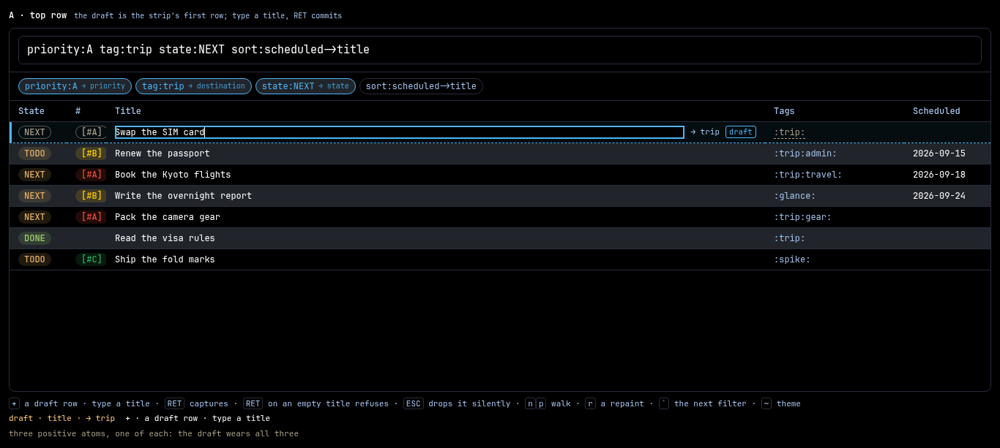
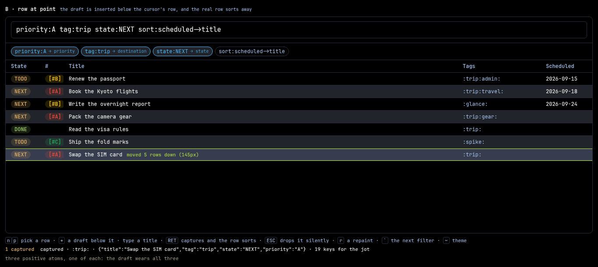
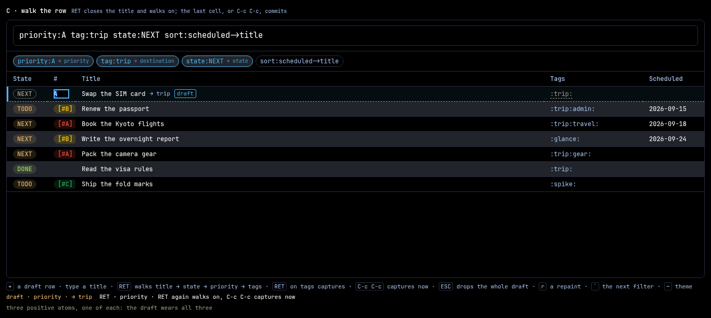
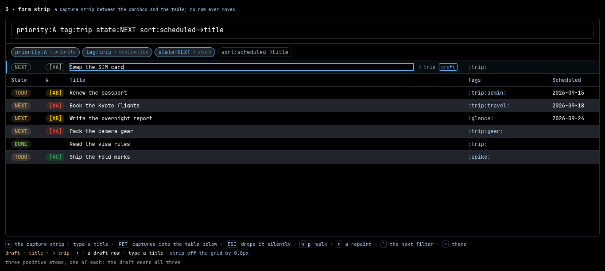
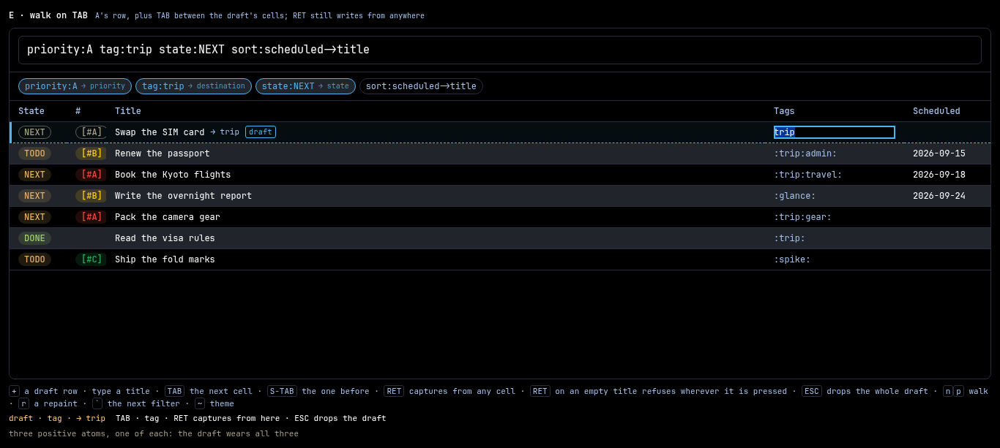

# Spike — capture in the table, five shapes for a draft row

**Date:** 2026-09-12 · **For:** the user's direction of the same day — capture
loses its popup and happens INSIDE the main table. **Against:** the shipped
flow ([`docs/capture.md`](../../capture.md)) — `+` raises a tag field
(`30-capture.js:24`), the settled tag raises the material-doc sheet over a
served draft (`20-sheet.js:2182`), `C-c C-c` commits it (`:1623`).
**Ancestor:** [`spikes/2026-08-24-capture-doc/`](../2026-08-24-capture-doc/README.md)'s
**B — in place**, which put the draft in the row strip and grew a whole
document beneath it. This spike keeps B's row and drops B's document.

## The direction, and what it drops

`+` adds a **draft row to the table** and opens its title cell for editing. The
defaults come from the standing filter: `priority:A` in the omnibox makes the
row's priority A, `tag:x` tags it `x`, `state:NEXT` states it NEXT. Only
POSITIVE atoms count — `-tag:x` contributes nothing. The reader supplies the
title and nothing else. An empty title on commit warns and the draft goes;
`ESC` drops it silently.

Against the 08-24 ancestor this drops three things and says so:

- **the doc pane.** No `%^{PROMPT}` pairs, no drawer, no body, no `%?` landing,
  no date widget over a ghosted planning line. A capture is a ROW.
- **templates.** Ignored for now. The tag's `#+TODO:` cycle, its skeleton and
  its `:PROPERTIES:` seed nothing here.
- **the tag field.** The destination is read off the filter instead of asked
  for. Finding 6 is the bill for that.

**This supersedes the direction of
[`docs/proposals/proposed/2026-08-24-the-capture-doc-is-the-material-doc.md`](../../proposals/proposed/2026-08-24-the-capture-doc-is-the-material-doc.md)
for the capture FORM, and leaves the capture COMMAND alone.** The proposal's
own framing already draws that line ("This proposal replaces the capture FORM,
not the capture COMMAND"), and the command on the other side of it is untouched:
`/command {"name":"capture","args":{…}}` answering `{ok, file, digest, id}`
(`Commands.hs:160`, `:369`–`:473`), no tag landing in `inbox.org` and a tag
landing in a blob under that tag's layer.

**Open `index.html`, click the pane, and press `+`.** Every tab is driven from
the keyboard against the same six-row fixture and the same four filters. (The
click is a `file://` tax: an iframe loaded from a file URL is an opaque origin,
so the shell cannot hand it the keyboard. Opening a variant's own page —
`a-top-row.html` and friends — needs no click.)

Everything here is throwaway. The fixture is invented; the palette, the row
strip, the in-cell editor, the omnibox and its chip strip, the pill wash and the
ghost ink are glance's own, transcribed from `Theme/Default.hs`,
`assets/table-view.js` and `assets/page.css` so the shapes are judged at the
real hues and the real metrics.

| file | what it draws |
| --- | --- |
| `index.html` | the tabbed shell; each variant runs in its own `<iframe>` |
| `a-top-row.html` | **A** — the draft is the strip's first row; `RET` commits |
| `b-row-at-point.html` | **B** — the draft is inserted below the row at point |
| `c-walk-the-row.html` | **C** — `RET` walks title → state → priority → tags |
| `d-form-strip.html` | **D** — a capture strip above the table, on a surface of its own |
| `e-walk-on-tab.html` | **E** — A's row, plus `TAB`/`S-TAB` between the draft's cells |
| `rig.js` | the fixture, the filter and its tokeniser, the seeding rule, the draft row, the commit and dismiss laws, the sort, the measurements |
| `pane.css` | the palette, the row strip, the in-cell editor, the omnibox, the ghost and draft dress — both themes |
| `shots.mjs` | the six PNGs, every number below, and a 59-rung check of every key |
| `cdp.mjs` | the 08-24 spike's Chromium driver, copied so this directory stands alone |
| `a-top-row.png` … `e-walk-on-tab.png`, `refusal.png` | each tab at the moment that shows what it is for, and the refusal |

```sh
xdg-open index.html      # or double-click it — no server, no build step
node shots.mjs           # the PNGs, the numbers, and the check
```

## The fixture, the filter, and what the filter lends

Six rows, in the applied order `sort:scheduled->title` — the dated rows
earliest first, the undated behind them, title breaking the tie. **A capture
leaves SCHEDULED empty**, so a fresh row always sorts into the undated tail
whatever row it was typed beside. That one fact is most of what B argues about.

`` ` `` cycles four filters, each pinning one clause of the seeding rule. The
rows do not re-filter under them: what the spike asks about is the DRAFT a
filter lends to. The chip strip marks every token with what it lent.

The rule is the shipped one, transcribed from `30-capture.js:48`–`:89` with its
own names. A token lends a fact when it is **pinned**: positive, and naming one
concrete value — a `+` widening, a `|` alternation and a `*active*` meta each
describe a SET of rows instead. Scalars must be
**named once** — two `state:` atoms describe a union and lend nothing. Tags are
the exception the shipped code already makes: **every** positive `tag:` counts,
the first naming the destination and the rest riding as the draft's own tags.

| the applied filter | State | # | Tags | destination |
| --- | --- | --- | --- | --- |
| `priority:A tag:trip state:NEXT` | `NEXT` | `[#A]` | `:trip:` | `→ trip` |
| `tag:trip tag:gear priority:B` | — | `[#B]` | `:trip:gear:` | `→ trip` |
| `state:NEXT -tag:work` | `NEXT` | — | — | `→ inbox` |
| `state:NEXT\|TODO title:visa` | — | — | — | `→ inbox` |

Measured off the drawn row by `shots.mjs`, which is the only place the answer
is worth reading: what the reader sees is what the capture will send.

**The destination is said IN THE ROW**, as a small `→ trip` / `→ inbox` beside
the title, which is the same statement `captureWhere` makes in the sheet's file
line today (`20-sheet.js:2217`). It costs the title cell 98px of the 876px it
has at a 1366px window — the hint and the `draft` badge together — leaving the
input 778px.

## The key rhymes

Nothing here invents an interaction. Every key is taken from somewhere glance or
org already spends it, and the rhyme is stated so review can ask whether it is
real ([`docs/design-rhymes.md`](../../design-rhymes.md)).

| key | in the draft row | the rhyme it is taken from | where that lives |
| --- | --- | --- | --- |
| `+` | adds the draft row | the app's own capture key, in the table's scope | `Keymap.hs:82` |
| `RET` (title) | commits the capture | the 08-24 spike's **bare-draft law**, already shipped in words: *"a headline · RET captures it · ESC leaves"* | `20-sheet.js:2196` |
| `RET` (a cell) | closes the cell and moves on | `openCellEditor`'s own `Enter` | `table-view.js:3918` |
| `ESC` | drops the draft, whole and silent | `keyboard-quit`, scope `any`; and `openCellEditor`'s own `Escape` | `Keymap.hs:141`, `table-view.js:3919` |
| `C-c C-c` *(C only)* | commits from whatever cell point is in | `org-ctrl-c-ctrl-c`, and org-capture's own `org-capture-finalize` | `Keymap.hs:125` |
| `n` `p` | walk the rows, and never onto a draft | the movement vocabulary's first pair | `Keymap.hs:40`, `:41` |
| `TAB` *(E only)* | the draft's next cell, wrapping | the pair box's own `TAB`, which walks to the next field | `20-sheet.js:1802`, `tabRung` at `:389` |
| `S-TAB` *(E only)* | the cell before, wrapping | the settings sheet walks its panels back on `S-TAB` | `50-settings.js:55` |
| `TAB` *(every other tab)* | **commits**, the same as `RET` | the in-cell editor's own reading | `table-view.js:3918` |

`r` (a repaint) and `` ` `` (the next filter) and `~` (the theme) are rig
conventions and no part of the direction. `r` stands in for the next
`/headlines` answer arriving (`00-core.js:243`, `paint`).

`+` was `Keymap.hs:91` when the 08-24 spike quoted it; the binding is the same
one and the file has drifted eight lines since.

### One collision, named

**`TAB` already means `commit this cell`, and E takes it away inside a draft.**
`openCellEditor` binds `Enter` and `Tab` to the same handler — *`if (e.key ===
"Enter" || e.key === "Tab") { e.preventDefault(); commitCellEditor(); }`*
(`table-view.js:3918`). On a real row's cell that reading has to stand: a
reader tabbing through a row's cells is writing each one. E narrows it to
**inside a draft only**, where there is nothing to commit per cell — the whole
draft commits at once or never — so the key is free to be what org-table
already spends it on: *next field*. The other four tabs keep the shipped
reading, and `shots.mjs` drives it in each of them, so the two meanings can be
felt one tab apart.

The rhyme E leans on is the stronger of the two available. `20-sheet.js:1802`
walks a pair box's fields on `TAB` and `50-settings.js:55` walks the settings
panels forward and back — both are glance's own, and both are FORMS. org-table's
`TAB` is a TABLE's, which is what a draft row is.

## The three laws every tab holds

They live in `rig.js` and vary between no two tabs, which is why they belong to
the rig.

**The title is the only thing the reader must supply.** State, priority and
tags arrive from the filter; SCHEDULED arrives empty and the date widget stays
its own door (`Keymap.hs:100`). `RET` writes.

**An empty title refuses in the shipped words — `nothing to capture`
(`20-sheet.js:1628`) — and the draft goes with the refusal.** A row that cannot
commit is a row the reader should not have to dismiss twice. The refusal turns
the row's accent edge and its dashed rule red (`#E74C3C`) and stands for a
second and a half.

**`ESC` drops the draft and says nothing.** No file was written, so nothing is
put back, and the row count is the six it was.

## What each tab argues

Measured at a 1366×613 viewport; the row is 29px. **Pushed** is how far the
rows that were already there moved when the draft opened. **Jot** is the keys
from `+` to the write, for a 17-character line — so 19 is the line plus `+`
plus `RET`, and the floor. **Travel** is how far the committed row moved to
reach the place `sort:scheduled->title` puts it.

| | where the draft stands | pushed | jot | travel |
| --- | --- | --- | --- | --- |
| **A** top row | the strip's first row | every row, 29px | **19** | 6 rows / 174px, **on the next paint** |
| **B** row at point | below the row at point | the rows below point, 29px | **19** | 5 rows / 145px, **at the write** |
| **C** walk the row | the strip's first row | every row, 29px | **22**, or 20 with `C-c C-c` | 6 rows / 174px, on the next paint |
| **D** form strip | its own strip above the table | the whole table, 29px | **19** | none — it lands at row 7 of 7 and nothing moved for it |
| **E** walk on TAB | the strip's first row | every row, 29px | **19** | 6 rows / 174px, **on the next paint** |

**Four of the five cost the jot the same 19 keys.** That is the first finding
and it settles most of the argument.

---

## A — TOP ROW



*The draft at the head with the line half typed: `NEXT` and `[#A]` and `:trip:`
in ghost ink under a dashed rule because the filter put them there, `→ trip`
saying where the blob lands, the `draft` badge saying no file exists yet, and
the accent edge down the row's leading cell. The six real rows below it, pushed
down by exactly one row.*

**The shape.** `+` splices the draft in at index 0 and opens the title cell with
the table's own in-cell editor (`.tv-cell-edit`, `table-view.js:1233`). Type,
`RET`, done. Point stays on the row that landed.

**Its laws.** The three above, plus: **the head is a place nothing else wants.**
Wherever the cursor was, the draft lands where the eye already is on a table
read top-down, it never depends on the cursor, and the six rows keep their order
among themselves.

**What it costs.** *The sort is deferred, and A is the variant that has to say
so out loud.* The applied view is `sort:scheduled->title` and a capture has no
date, so the head is exactly where the fresh row does not belong. A client
cannot re-order a `sort:` view by itself — the order is the server's — so A
leaves the row where it put it until the next `/headlines` answers
(`00-core.js:243`). Press `r`: **the row travels 6 rows, 174px, after the
write**, and the cursor goes with it, because `arriving` already re-lands point
on a fresh row (`20-sheet.js:1638`, spent at `:2100`). The motion is the same
motion B pays; A pays it later and with the cause off screen.

**What it refuses.** Everything after the title. A is the whole direction read
literally and nothing else.

---

## B — ROW AT POINT



*After the write, which is the only moment B's argument is visible. The row was
typed below `Renew the passport`; it now sits at the foot of the strip wearing
the landed edge and its own receipt — `moved 5 rows down (145px)`.*

**The shape.** A's row, one place over: the draft is inserted BELOW the row at
point, which is org's own `org-insert-heading-after` read into a table. The new
thing goes where the reader is. `settle` is immediate, so the commit asks for
the server's order at once.

**Its laws.** A's, plus: the position is the reader's while they are typing.

**The sort problem, argued.** It is A's problem too, and B is the variant
honest enough to pay it in front of the reader:

- The undated tail is where every capture goes, so **the row's typed position is
  a place for TYPING and never a place the row keeps**. "Below the row at point"
  reads as a promise about where the row will LIVE, and there is no such
  promise to make.
- The distance is measured and it is large: **5 rows, 145px**, in a
  seven-row fixture. In a two-hundred-row view the row leaves the screen.
- Point follows it, so the cursor teleports too. That is correct — the reader
  wants to be on what they just made — and it is a second motion on top of the
  first.
- A's number is bigger (6 rows, 174px) because A types further from the tail.
  So the variant that inserts nearer the row's eventual home travels less, and
  both of them travel.

**What it costs beyond that.** The rows below point move under the reader at the
moment they start typing (29px), while the rows above hold still — a half-push,
which reads worse than A's whole one. And `+` now means two different placements
depending on where the cursor was, so the draft is somewhere the reader has to
look for.

**What it refuses.** A deferred surprise. Everything B does happens while the
reader is looking at it.

---

## C — WALK THE ROW



*Mid-walk: the title typed and closed, point on the priority cell with `A`
selected in the editor, the state cell still a ghost because nothing was typed
into it, and the row still a draft.*

**The shape.** A's placement. `RET` on the title closes it and takes point to
the next editable cell — **title → state → priority → tags** — each open in
turn, `RET` on the last one writing. `C-c C-c` writes from anywhere; `ESC`
anywhere drops the whole draft, never one cell of it.

**Its laws.** A's, plus: one editor stands at a time and the editor IS the
capture, so `ESC` in a cell is `ESC` on the draft. SCHEDULED is not on the walk:
planning has its own door and a spike is a poor place to re-argue it.

**What it costs, measured.** The bare jot is **22 keys against A's 19** — three
`RET`s through cells the filter already filled correctly. `C-c C-c` straight off
the title brings it to 20, which is A's 19 plus a chord, and requires the reader
to know that the walk can be skipped.

**And the refinement it sells is already on the shelf.** After A's write the row
is a real row, and the table's own doors are open on it: `RET` opens a cell's
editor (`table-view.js:3923`), `t` sets the state (`Keymap.hs:94`), `:` the tags
(`Keymap.hs:98`), `S-<up>`/`S-<down>` the priority (`Keymap.hs:90`, `:92`).
Refining after the write costs the same keys as refining before it and needs no
mode.

**What it refuses.** A write the reader has not looked over. That is the whole
of its appeal, and finding 3 is why it does not survive it.

---

## D — FORM STRIP



*The strip standing between the chip row and the table: the same cells, the same
seeds, the same hint and badge — and the six rows beneath it exactly where they
were, in the order they were in.*

**The shape.** The draft is not a table row. It is a one-row surface of the
shell's own between the omnibox and the strip, the way `#ghead` carries the git
control (`page.css:1387`) so a table re-mount never touches it. It commits into
the table below.

**Its laws.** A's, plus: nothing in the table moves for the draft, and nothing
in the table moves for the write either — the row was never in the strip, so it
lands at whatever place the server's order gives it (row 7 of 7 here) with no
travel to report.

**The argument for.** It is the only variant with no motion at all. No push
under the reader's cursor, no post-commit flight, no position that was a promise.
The table's `n`/`p` could even stay live while the strip stands, since the strip
owns its own keys.

**The argument against, and it is three things.**

- **It is a second surface**, which is the thing the direction moved away from.
  A popup that is 29px tall and glued to the table is a smaller popup.
- **It has to impersonate a row.** The cells only read as a row if they sit on
  the table's column grid, so the strip's widths are MIRRORED from the table's
  measured header on every draw. The rig does it and prints the residue: **off
  the grid by 0.0px** — achievable, and it is a measurement loop between two
  DOM trees that a column resize, a font swap or a sideways scroll each break.
- **It sits above the header.** Look at the picture: the strip's cells line up
  with column names printed BELOW them. Moving it under the header puts a
  shell-owned surface inside the table's own scroller, which is the seam the
  strip existed to avoid.

**What it refuses.** Any claim on a row position, which is exactly what makes
its no-motion claim true.

---

## E — WALK ON TAB



*Three `TAB`s in, at the walk's far end: the title standing as a real value in
plain ink, `NEXT` and `[#A]` still the ghosts the filter seeded because nothing
was typed over them, and the tags cell open with `trip` selected. `RET` from
here writes — there is no fourth key to find.*

**The shape.** A's placement, A's seeding, A's laws, and one key added. `TAB`
takes the OPEN EDITOR to the draft's next editable cell and `S-TAB` to the one
before, wrapping at both ends: title → state → priority → tags → title. `RET`
keeps its single meaning and writes from whatever cell point stands in. `ESC`
anywhere drops the whole draft. An empty title refuses **whichever cell `RET`
was pressed in**, because the wall is on the TITLE rather than on the cell — the
check drives that from the priority cell.

**Its laws.** A's three, plus: **a movement key does the moving, so the commit
key never has to mean two things.** That is the whole design, and it is what
separates E from C.

**What it costs.** *One collision, and it is above.* `TAB` commits in an open
table cell today (`table-view.js:3918`), and E changes that reading inside a
draft. The narrowing is defensible — a draft has no per-cell write to commit —
and it is still one key meaning two things one row apart.

*And a second surface for the same facts.* Refining `state` in the draft and
refining it on the landed row are two different keys (`TAB` to the cell here,
`t` there), so the reader learns the cells twice.

**What it refuses.** Any cost to the reader who never walks. Measured: **19
keys**, identical to A's, because the walk is opt-in and the write key never
moved.

**E against A, since E is A plus TAB.** The measurements are identical in every
column of the table above — same placement, same push, same 19 keys, same
174px of travel on the next paint — because E differs from A by one `look`
field (`tab: true`) and nothing else. So the question is only whether the added
key earns its collision, and finding 9 is the answer.

## Findings

1. **The jot costs 19 keys in four of the five shapes, and the line itself is
   17 of them.** `+`, the line, `RET`. Today's popup path costs `+`, `RET`, the
   line, `RET` — one more, for the tag field. **In-table capture is the first
   capture shape that is cheaper than the one it replaces**, and it is cheaper
   by removing the question the tag field asked.

2. **The insert position is a promise no variant can keep, and the number is
   large.** `sort:` is the server's and a capture has no date, so the fresh row
   belongs in the undated tail whatever row it was typed beside: A's travels 6
   rows / 174px, B's 5 rows / 145px, and only D's — which never claimed a
   position — travels nothing. Every shape that puts the draft AT a place is
   choosing a place to TYPE, and the choice should be argued on typing.

3. **C's walk sells refinement the table already sells after the write, for the
   same keys.** `RET` on a cell, `t`, `:`, `S-<up>`/`S-<down>` are all live on a
   real row and cost nothing to reach. The three extra `RET`s buy the reader
   only the chance to refine BEFORE the bytes land, and a capture is the one
   write in the app that is cheapest to correct afterwards.

4. **The draft row is not walkable, and it is free.** `openCellEditor` already
   calls `e.stopPropagation()` on every key the open input sees
   (`table-view.js:3917`), so `n` in an open title types an `n`. The check
   drives exactly this on all five tabs. The corollary is a law rather than an
   accident: **a draft must always have an open editor**, or `n`/`p` acquire a
   meaning over a row that has no id, no span and no file.

5. **The seeded cells are indistinguishable from their neighbours' values, so
   the not-yet-written look carries the whole statement.** Under
   `priority:A tag:trip state:NEXT` the draft's `NEXT`, `[#A]` and `:trip:` are
   literally what the row below it wears — the filter pinned them both. Three
   channels say it and all three are needed: the accent edge on the leading
   cell, the `draft` badge, and ghost ink under a dashed rule on every cell the
   reader did not type. Colour alone would fail
   (`docs/proposals/proposed/2026-08-17-hue-is-never-the-only-channel.md`).

6. **Dropping the tag field drops the reader's veto on the destination.** Today
   `+` SEEDS the tag field from the filter and lets the reader back out of it in
   one keystroke (`30-capture.js:18`–`:28`, *"a suggestion the reader may back
   out of"*). In-table capture states the destination as `→ trip` and offers no
   key to change it. That is the one capability this direction removes, and it
   removes it from the one decision that is irreversible: `→ trip` mints a blob
   under that tag's layer, `→ inbox` appends to `inbox.org` (`Commands.hs:369`).

7. **The state the filter lends can be a state the destination refuses.**
   `stated` (`Commands.hs:452`) walls a capture's keyword to the cycle its tag
   scope allows. A filter pinning `state:NEXT` over a tag whose layer has no
   `NEXT` seeds a row that 400s after the title is typed. The draft has to check
   the tag's cycle when it seeds, or the refusal has to land in the row.

8. **A deferred sort is the same motion with the cause taken away.** A's row
   sits at the head looking settled and then travels 174px on a paint the reader
   did not ask for — a WAL tick, a poll, a filter change. B's travels 145px
   immediately, next to the key that caused it. Neither is free; one is
   explicable.

9. **E answers the question C asked, and answers it for free — which leaves the
   question itself the only thing still worth arguing.** Both variants exist to
   let the reader refine the seeded cells before the write. C spends `RET` on it
   and charges the jot three keys (22 against 19); E spends `TAB` and charges
   **nothing**, because the walk is opt-in and the write key never moved. Every
   number in the measurement table is identical between A and E. So the walking
   variant is settled — **it is E's `TAB` and never C's `RET`** — and whether
   any walk is wanted is still finding 3's question, which answers no: the
   table already refines a landed row with `RET`, `t`, `:` and
   `S-<up>`/`S-<down>` for the same keys and no second vocabulary. E's bill is
   one narrowed key (`TAB` commits in a cell, walks in a draft) and one set of
   cells the reader has to learn twice.

## The recommendation

**Ship A's placement with B's settle: the draft is the strip's first row, and
the commit asks for the server's order at once.** They are one field apart in
`rig.js` (`{ at: "top", settle: "now" }`), which is the strongest evidence that
the choice is small enough to make now.

The reasons, in order of weight:

1. **The jot's cost is the floor and A holds it.** 19 keys, two over the line
   itself, cheaper than today (finding 1). C's 22 buys refinement the table
   already sells for the same keys after the write (finding 3), and every key
   the capture path spends is spent on the app's most frequent write.
2. **The head is the right place to TYPE, because no place is the right place to
   LIVE** (finding 2). It is fixed, so the reader knows where to look; it never
   depends on where the cursor happened to be; and the six rows below it keep
   their order among themselves. B's "below the row at point" is a truthful org
   rhyme that makes a promise the sort cannot keep.
3. **Pay the sort at the write** (finding 8). B is right about this and it is
   the half of B worth keeping. The machinery exists: `arriving`
   (`20-sheet.js:1638`) already re-lands point on the fresh row after a refetch,
   so the row moves and the cursor follows with no new concept.
4. **E is A plus one opt-in key, and the variant it displaces is C**
   (finding 9). Behaviourally E contains A: identical placement, identical
   push, identical 19 keys, identical 174px of travel, one `look` field apart.
   What it adds is a walk that finding 3 says is unnecessary, paid for with
   `TAB`'s second meaning. Ship A; if a walk is ever wanted over a draft — and
   the in-draft editing question will come up again the moment the destination
   veto (finding 6) needs a cell — take E's `TAB` off the shelf and leave C's
   `RET` on it.
5. **D's no-motion claim is real, and it costs a second surface and a
   measurement loop between two DOM trees.** Keep it on the shelf: if a
   shipped A turns out to move the reader's eye too much, D is the answer and
   it needs nothing from A to be built. And D is the natural home for a capture
   raised from a view with no table at all.

**And finding 6 is the thing to argue with, ahead of the shape.** Every variant here
loses the reader's veto over the destination. Either the tags cell is editable
before the commit — **E's `TAB` to exactly that one cell**, which is a much
smaller claim than either walking variant makes — or a key re-opens today's tag
field over the draft row. That decision is independent of A, B, C, D and E, and
it should be made. E is the cheapest place to put the answer.

## What shipping would need

Nothing here is a proposal; this is what the proposal would have to answer.

- **A phantom row in `view.rows`, or a row in the DOM alone.** The producer owns
  `rows` and hands them to `table.setRows` (`00-core.js:244`), so a draft
  spliced into that array gets the strip's dress, the column widths and
  `editCell(id, col)` (`table-view.js:3923`) for free — and leaks a fake id into
  the mark set, `targets()`, and every `/command` that takes ids. A DOM-only
  `<tr>` leaks nothing and is destroyed by the next `renderRows`. **The phantom
  is the right one**, with a reserved id the mark set and the command door both
  refuse, plus a TableView flag for a row the cursor cannot land on.
- **`paint()` racing the draft.** `00-core.js:243` calls `setRows` on every
  `/headlines` answer — a WAL tick, a poll, a filter change, a sibling write.
  A draft in `view.rows` is erased by the next one. The producer must re-splice
  the draft on every paint; suppressing the paint instead leaves a stale table
  standing under a live draft, which is worse.
- **The `capture` args off the filter atoms — already written.**
  `inherited(tag)` (`30-capture.js:72`) computes exactly this list from
  `TableView.parseQuery` over the applied query, and `pinned` / `soleValue` /
  `filteredTags` are the rule this spike transcribed. The change is that
  `filteredTags()[0]` becomes the destination with no field to veto it
  (finding 6), and `showDraft`'s server round trip (`GET /capture`) is no longer
  needed for a form with no template in it.
- **The bare-draft law, stated for a row.** The 08-24 spike's law said it for a
  one-element doc; here it is the only law there is: *in a draft row's title
  cell, `RET` commits the capture and `ESC` drops it.* The shipped sheet already
  says those words (`20-sheet.js:2196`) and they can be said in the row.
- **The refusal's home.** `nothing to capture` is a sheet message today
  (`20-sheet.js:1628`); in the row it needs a place, a dwell, and a decision
  about whether it removes the row (this spike says yes) or leaves it standing.
- **Where the destination is said, and whether it can be changed** (finding 6).
  `→ trip` costs 98px of the title cell at a 1366px window.
- **The state wall** (finding 7): the tag's cycle has to be known at seed time,
  or `Commands.hs:452` refuses after the reader has typed.
- **The checks.** A browser case under `test/browser/` per law, since every one
  of them is a paint fault a model-reading test cannot see: `+` splices a draft
  row and opens its title; `RET` writes and leaves the row count one higher;
  `RET` on an empty title says `nothing to capture` and leaves the count
  unchanged; `ESC` leaves the count unchanged and writes nothing; a `/headlines`
  answer arriving while a draft stands leaves the draft standing; `n`/`p` in an
  open title type rather than walk. If E's `TAB` ships too: `TAB` walks inside
  a draft, `S-TAB` back, both wrapping, and `TAB` in a LANDED row's cell editor
  still commits — the narrowing is the whole claim and it is the rung that
  catches a regression in it. Plus a logic suite over the seeding rule for
  the four filters in the table above — that one is pure and belongs beside
  `parseQuery`'s own tests. A fixture under `test/browser/tree/` carrying a tag
  layer, so `→ trip` and `→ inbox` are both reachable.

`shots.mjs` runs 59 rungs of exactly those keys against these five pages and all
of them are green, which is evidence that the laws are consistent and no
evidence at all that they are right in the shipped app.
