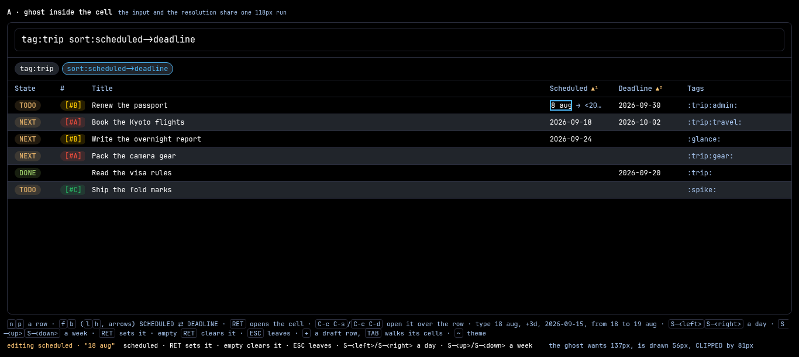
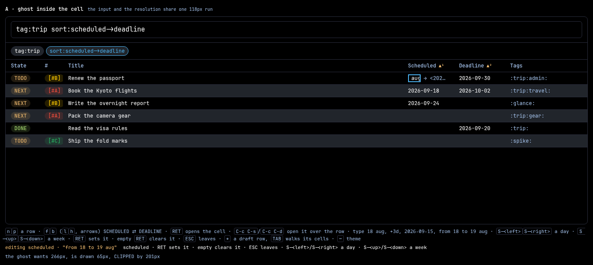
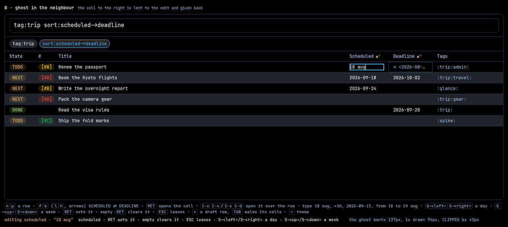
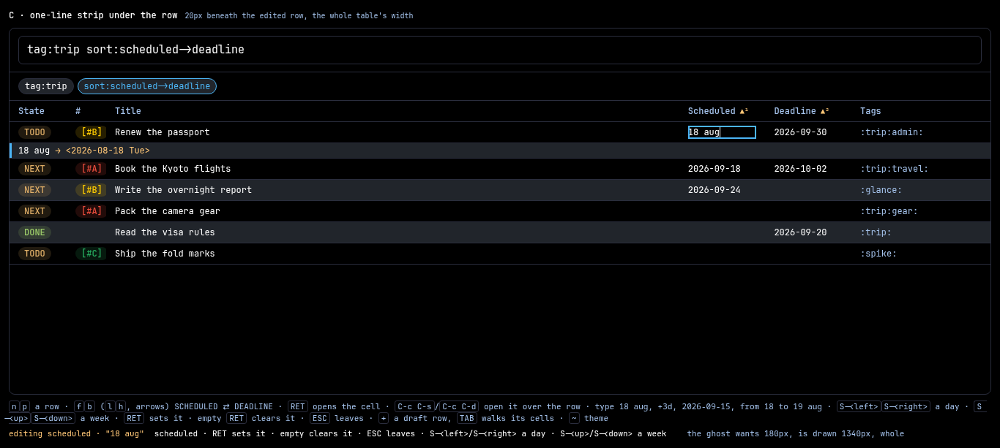
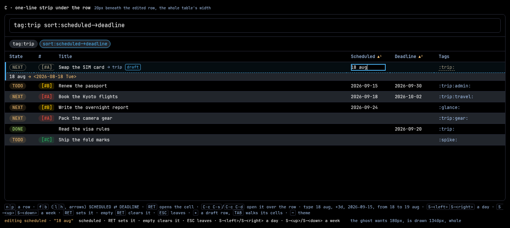

# Spike — the date widget moves into a table cell, three places for the ghost

> **Addendum, 2026-09-12 (review).** **C shipped, then lost.** The strip under
> the row was built and driven, and seen live it had no OFFERS: the completion
> menu is `#dwoffer`, a box the pane owns, and the design refused a 118px cell
> one. So the cell was the pane's widget minus its completion — one widget with
> a hole in it, which is two widgets. What replaced it is the pane's own
> `#ddate` box laid over the cell as an OVERLAY, which wins the measurement
> argument below on the same terms C did (an overlay negotiates against no
> column measure) and keeps the offers. The three rigs still stand as the
> measurement; what this spike got wrong is treating a placement as the only
> question, when the widget's completeness was the one that decided it. See the
> proposal's *Departures*.


**Date:** 2026-09-12 · **After:**
[`spikes/2026-08-23-date-widget/`](../2026-08-23-date-widget/README.md), whose
twenty rounds settled the widget's editing laws and whose **D** is the picked
look — a field standing in the value's own slot with the resolution riding after
it as ghost — and
[`spikes/2026-09-12-capture-in-table/`](../2026-09-12-capture-in-table/README.md),
whose draft row is now shipped (`frontend/glue/35-draft.js`) and whose rig, table
transcription and palette this one carries over. **The proposal this spike is the
open question of** is
[`docs/proposals/done/2026-09-12-the-date-widget-lives-in-the-cell.md`](../../docs/proposals/done/2026-09-12-the-date-widget-lives-in-the-cell.md),
which settles everything except where the ghost is drawn.

The ask, in the user's words:

> the date widget now moves INTO the table's SCHEDULED and DEADLINE cells (for
> real rows on RET over the cell, and for the draft row as TAB walk stops). The
> typed phrase (`18 aug`, `+3d`, `next fri`) needs its ghost preview and refusal
> somewhere, and a date cell is ~118px.

**A date cell is 118px and the ghost is 137px.** That is the finding, it is the
first thing measured, and every variant below is an answer to it. The 08-23
spike's D cost the sheet nothing because it stood in a slot as wide as the value
it replaced; a table column is sized to the ten characters `isoStamp` writes, and
the org stamp the wire carries is six characters longer than that before the
` → ` is counted.

**Open `index.html`, click the pane, and press `RET`.** Every tab is driven from
the keyboard against the same six-row fixture, the same grammar and the same
laws; what differs between two tabs is one `look` field.

Everything here is throwaway. The fixture is invented; the palette, the row
strip, the in-cell editor, the column measure, the ghost ink and the draft row's
dress are glance's own, transcribed from `Theme/Default.hs`,
`assets/table-view.js` and `assets/page.css`. **The grammar is not transcribed —
it is ported whole** into `dates.js`, because a rig that reimplemented the
parser would be measuring its own reimplementation.

*Where the grammar lives moved under this spike's feet.* The port was taken out
of `frontend/glue/20-sheet.js`; while the spike was being written, the same
branch lifted that block whole into **`frontend/glue/15-dates.js`** — *"A BARE
FRAGMENT of the one script scope, so the doc pane and the table's own cells read
one phrase and the harness's pinned clock reassigns one `dateNow`"* — which is
the seam this spike's recommendation was about to ask for. Every line reference
below names `15-dates.js`, and `dates.js` here is that file's block with an
export bolted on.

| file | what it draws |
| --- | --- |
| `index.html` | the tabbed shell; each variant runs in its own `<iframe>` |
| `a-ghost-in-cell.html` | **A** — the ghost right-aligned INSIDE the cell being typed into |
| `b-ghost-in-neighbour.html` | **B** — the ghost in the cell next door, which is lent and given back |
| `c-strip-under-row.html` | **C** — a 20px strip under the edited row, the table's whole width |
| `dates.js` | the parser, ported whole from the glue — `readsDate` (`15-dates.js:223`), `englishDate` (`:171`), `shippedDate` (`:112`), `dateWriting` (`:260`), `dateGhost` (`:313`), `dateStep`/`dateStepped` (`:325`) and everything those stand on |
| `rig.js` | the fixture, the column measure, the widget's laws, the draft row, the measurements |
| `pane.css` | the palette, the row strip, the in-cell editor, the ghost and the strip — both themes |
| `shots.mjs` | the six PNGs, every number below, and a 90-rung check of every key per variant |
| `cdp.mjs` | the capture-in-table spike's Chromium driver, copied so this directory stands alone |
| `a-ghost-in-cell.png` … `c-strip-under-row.png`, `a-long-phrase.png`, `refusal.png`, `draft.png` | each tab at the moment that shows what it is for |

```sh
xdg-open index.html      # or double-click it — no server, no build step
node shots.mjs           # the PNGs, the numbers, and the check
```

`?day=2026-09-12` pins the clock, so a screenshot taken tomorrow is the same
screenshot; with no `?day=` the reader's own day stands. One clock read per
mount is the rig's own law (`docs/invariants.md`) and the check asserts the page
took it.

## The cell, measured first

The column measure is the renderer's own (`colWidths`, `table-view.js:2988`;
`applyWidths`, `:3050`): a sized column is `calc(Nch + GROUNDpx)`, N the widest
CELL in characters and GROUND the cell padding both sides (`CELL_PAD = 24`,
`:1054`). A date cell draws `isoStamp` — `2026-09-15`, **ten** characters
(`Glance/Query.hs:1342`) — and a column in the sort chain carries its header's
mark besides (`▲¹`, two glyphs and a space, `:3004`). So a sorted date column is
`calc(13ch + 24px)`.

The applied query here is `tag:trip sort:scheduled->deadline`, chosen for the
width it produces: **both** date columns are in the chain, so both measure the
same and the comparison is clean.

| | measured at 1366×613 |
| --- | --- |
| a date column | **118px**, of which **94px** is text |
| `2026-08-18` — what the column was SIZED for | 72px |
| `18 aug` | 43px |
| `from 18 to 19 aug` | 122px |
| `<2026-08-18 Tue>` — what the wire carries | 115px |
| ` → <2026-08-18 Tue>` — the ghost, as `dateGhost` spells it | **137px** |
| ` → <2026-08-18 Tue>--<2026-08-19 Wed>` — the ghost over a range | **266px** |

**The ghost alone is 43px wider than the cell's whole text run, before a
character of the phrase is typed.** And it speaks at entry — see finding 2 — so
the widget draws its widest thing at the moment it opens.

## The key rhymes

Nothing here invents an interaction. Every key is taken from somewhere glance or
org already spends it, and the rhyme is stated so review can ask whether it is
real ([`docs/design-rhymes.md`](../../design-rhymes.md)).

| key | in the date cell | the rhyme it is taken from | where that lives |
| --- | --- | --- | --- |
| `RET` over the cell | opens the widget on the cell's own value | `editCell`'s own door, which `RET` already spends on a cell from the sheet's table row | `table-view.js:4084`; `20-sheet.js:192` |
| `C-c C-s` / `C-c C-d` | opens SCHEDULED / DEADLINE over the row at point | the app's own two, org's own spelling, already bound in the table's scope | `Keymap.hs:100`, `:102` |
| the opening value, WHOLLY SELECTED | one keystroke replaces it; `RET` with none recommits it | the 08-23 spike's round 3, and `openCellEditor`'s own `input.select()` | 08-23 README round 3; `table-view.js:4061` |
| `S-<left>` `S-<right>` | a day | org-read-date's own minibuffer walk, ported as `dateStep` | emacs `org-read-date`; `20-sheet.js:1021` |
| `S-<up>` `S-<down>` | a week | the same pair, the other grain | emacs `org-read-date`; `20-sheet.js:1021` |
| typed text | ISO, `today`, `+3d`, `18 aug`, `from 18 to 19 aug`, org's own `<…>` | the shipped planning grammar and the query grammar's date sections | `commands.md:68`; `query.md:317`, `:343` |
| `RET` | commits the RESOLVED stamp | the 08-23 spike's whole commit law | 08-23 README, "What shipping would need" |
| `ESC` | cancels the input whole, byte-identical restore | `keyboard-quit`; and `openCellEditor`'s own `Escape` | `Keymap.hs:141`; `table-view.js:4071` |
| empty + `RET` | clears the entry | the shipped foot's own promise, kept verbatim | `Keymap.hs:157`; `20-sheet.js:1006` |
| `TAB` (a landed row's cell) | commits, as it does today | the in-cell editor's own reading | `table-view.js:4070` |
| `TAB` / `S-TAB` (a draft) | the next / previous cell of the draft | the shipped draft's own walk, one stop wider | `35-draft.js:141`, `:174` |
| `+` | a draft row | the app's own capture key | `Keymap.hs:82`; `35-draft.js:90` |
| `n` `p` / `f` `b` (`l` `h`, arrows) | a row / a cell within it | the movement vocabulary's two axes; `l`/`h`/arrows always alias `f`/`b` | `Keymap.hs:40`; `design-rhymes.md` |

`~` swaps the theme in these rigs the way it does in every sibling spike, and is
no part of the proposal.

### Two things the rig will not pretend

**`next fri` is not a date.** The ask names it as a typed phrase and the shipped
grammar has no weekday words at all — `englishDate` reads `day month [year]` and
`from … to …`, and nothing else (`15-dates.js:171`). The rig refuses it, in the
refusal's own red, and the check drives that on all three tabs. A spike that
quietly grew the parser would be arguing for a widget the app cannot build; if
weekday words are wanted, they are the English-dates proposal's phase 2 and a
corpus vector, and they are owed by the SERVER'S reader as much as the pane's.

**The cell cursor does not exist.** `RET` opening a cell needs a cell to open,
and the shipped table's cursor is a ROW. The rig adds a cell cursor within the
row (`f`/`b`, `l`/`h`, arrows across SCHEDULED ⇄ DEADLINE) so `RET` has a
referent; it is one of the three seams the recommendation names.

## A — GHOST INSIDE THE CELL



*`18 aug` typed into `Renew the passport`'s SCHEDULED cell. The input has
shrunk to its 4-character floor and shows `8 aug`; the ghost has 56px of the
137px it wants and shows `→ <20…`. Nothing outside the cell moved, and nothing
outside the cell can be read either.*

**The shape.** The cell becomes a flex row: the table's own in-cell editor
(`.tv-cell-edit`, `table-view.js:1255`) at `flex:1 1 auto` with a `4ch` floor,
and the ghost at `flex:0 1 auto`, right-aligned, clipping with an ellipsis. It
is the 08-23 spike's D read literally into a table — the widget stands in the
value's own slot and the resolution rides after it.

**Its laws.** The rig's, below, and nothing of its own.

**What it costs, measured.**

| the phrase | the ghost | the phrase, in the cell |
| --- | --- | --- |
| *(untyped — `2026-09-15`)* | cut by 81px | whole |
| `18 aug` | cut by **81px** of 137 | whole |
| `18 august` | cut by 81px | whole |
| `2026-08-18` | cut by 81px | whole |
| `18 august 2027` | cut by 81px | **scrolled out of sight** |
| `from 18 to 19 aug` | cut by **201px** of 266 | scrolled out of sight |
| `from 18 to 19 august 2027` | cut by 201px | scrolled out of sight |



*A on `from 18 to 19 aug`: three characters of the phrase (`aug`) and four of the
answer (`<202…`). The footer prints `the ghost wants 266px, is drawn 65px,
CLIPPED by 201px`.*

**What it refuses.** Any claim on a pixel outside the cell — which is the whole
of its appeal, and the whole of why it cannot work at 118px.

---

## B — GHOST IN THE NEIGHBOUR



*The same phrase, the input now holding the whole 118px cell, and the DEADLINE
cell lent to the edit: its own `2026-09-30` has stepped aside and `→ <2026-08-…`
draws in its place, inside a hairline accent frame that says the cell is on
loan. It comes back on `RET` or `ESC`, and the check asserts both.*

**The shape.** The ghost draws in the cell to the RIGHT of the one being edited.
Editing SCHEDULED lends DEADLINE; editing DEADLINE lends the cell after it,
which in `viewColumns`' own order is Tags (`Query.hs:2492`). The lender's value
is drawn dimmed while the ghost is silent and replaced while it speaks.

**Its laws.** The rig's, plus: a lent cell is given back byte for byte, whether
the edit commits or cancels.

**What it costs, measured.**

- **The neighbour of a date column is another date column**, so the room barely
  changes: DEADLINE is the same **118px**, and the ghost is still cut by
  **43px** on a short phrase and **172px** on a range.
- **The rule is conditional where A's and C's are not.** Editing DEADLINE lends
  Tags at **190px** — the only run wide enough here, and the one that makes B
  look like it works. A view whose DEADLINE is the last column has no cell after
  it and must fall back to the LEFT neighbour, which is the cell the reader may
  be about to edit next. So "the neighbour" names three different cells
  depending on the view's columns.
- **A cell showing someone else's answer is lying about its own row** for the
  edit's duration. `2026-09-30` is a fact and it is not on screen while the
  reader decides what to put beside it.

**What it refuses.** Motion. Nothing in the table moves for B, which it shares
with A and does not share with C.

---

## C — ONE-LINE STRIP UNDER THE ROW



*`18 aug → <2026-08-18 Tue>` on a 20px line beneath the row it is about, in the
pane's own surface ground with the accent edge down its leading cell. The input
is still in the cell, holding the phrase; the strip holds the phrase AND the
answer, uncut, in 1340px. The five rows below have moved down by 21px.*

**The shape.** A `<tr>` with one `colspan`ed cell, spliced under the edited row
and destroyed when the edit closes. The reader still types in the cell; the
strip is where what they typed becomes readable.

**Its laws.** The rig's, plus: the strip opens with the edit and closes with it,
and the rows come back to the pixel.

**What it costs, measured.**

| | |
| --- | --- |
| the strip | **21px** — a 20px line plus the table's own 1px rule |
| the rows below the edit | **+21px** while it stands |
| the edited row, and everything above it | **0px** |
| after `ESC` | **0px** off where they began, every row |
| a row | 29px, so the strip is 0.72 of one |
| the ghost, at every phrase in the table above | **whole** |
| `from 18 to 19 aug → <2026-08-18 Tue>--<2026-08-19 Wed>` | whole, in a 1340px run |

**What it refuses.** The claim that a date can be edited inside 94px. It is the
only tab that stops trying.

## What the rig holds, so the tabs are honest

They live in `rig.js` and vary between no two tabs.

**The grammar is the app's, ported and not rewritten.** `dates.js` carries
`readsDate`, `englishDate`, `shippedDate`, `dateWriting`, `dateGhost`,
`dateStep`, `dateStepped` and `verbatimDate` with their bodies verbatim, dedented
and no more. Every reading below is therefore the shipped reading.

**`RET` over the cell opens on the cell's own value, wholly selected.** The
value it opens on is `isoStamp`'s `2026-09-15`, which the grammar reads back
unchanged. One keystroke replaces the whole of it; `RET` with none recommits it.

**The ghost says three things and no fourth.** Nothing over an empty field;
nothing over a term still being WRITTEN (`18 a` is a month halfway typed);
` → <stamp>` over one that resolves, weekday computed; ` ✗ not a date` over one
the grammar refuses. That is `dateGhost`'s own reading and the check drives all
four.

**The ghost is a SPAN and never the field's value.** The caret walks to the end
of what was typed and stops; `RET` commits the resolution rather than the
characters that drew it. Pinned by a rung that walks the caret eight times past
the end of `18 aug` and finds it clamped at 6.

**Two spellings, one value.** `RET` writes the RESOLVED stamp to the wire —
`set-planning {"keyword":"SCHEDULED","date":"<2026-08-18 Tue>"}` — and the CELL
then draws `isoStamp`'s `2026-08-18`, which is what every other row in the
column wears. The footer prints the wire at every commit.

**The refusal is above the shut, and the cell stays open.** `18 auk` shows `✗`
while it is still being typed, and `RET` refuses with the phrase still in the
field and the cell still open — the same argument `pairRefused`
(`20-sheet.js:1079`) already makes for the pair box, applied to a table cell.

**Org's own spelling is kept verbatim.** `<2026-08-05 Mon>` adds no ghost and
goes to the wire unchanged, though that day is a Wed (`AGENTS.hs:3656`;
`test/TestQuery.hs:1908` pins it). The check asserts both halves.

**`ESC` cancels the input whole.** The cell comes back with the spelling the
edit FOUND, not the one it was given.

**One clock read at mount.** The ghost, the step and the commit all read the
same day.

**The open cell takes its own keys.** `n` in an open cell types an `n`
(`openCellEditor`'s `e.stopPropagation()`, `table-view.js:4064`), driven on all
three tabs.

## The draft row, in the winner



*`+` spliced a draft at the head; the title reads `Swap the SIM card → trip` with
the `draft` badge; `NEXT`, `[#A]` and `:trip:` are the ghosts the filter seeded;
three `TAB`s carried the editor to SCHEDULED, `18 aug` is typed into it, and the
strip beneath carries `18 aug → <2026-08-18 Tue>`. `RET` from here captures.*

The shipped ring is `["title","state","priority","tag"]` with the reason beside
it — *"A date is not among them, a row carrying no planning line"*
(`35-draft.js:136`). This spike puts the two dates on it, in the header's own
order, which is `draftWalk`'s own law (`:141`).

**`RET` over a draft's date cell resolves the phrase AND captures**, in one
press. A draft's date has no write of its own — the capture carries the planning
line — so there is no second commit for `RET` to mean. The wire the check reads
back:

```
capture {"title":"Swap the SIM card","tag":"trip","state":"NEXT",
         "priority":"A","planning":[["SCHEDULED","<2026-08-18 Tue>"]]}
```

**A phrase that does not read refuses in place, exactly as an empty title does.**
The wall is on the phrase, the draft stands, and every cell already set survives
— which is the law the capture-in-table spike settled for the title and it
generalises without amendment. The check drives both walls: a bad phrase from
the date cell, and an empty title from the date cell (point goes back to the
title, note and all).

## Findings

1. **A table column is sized for what it DRAWS, and a date widget needs room for
   what it SENDS.** The column is `calc(13ch + 24px)` because `isoStamp` writes
   ten characters; the ghost is 137px because org's stamp is sixteen and the
   ` → ` is three more. The 43px gap is not a layout mistake to be tuned away —
   it is the distance between the table's spelling and the wire's, and it exists
   at every font size and every window width.

2. **The ghost speaks at entry in a table, and stays silent at entry in the
   sheet — and nobody would have predicted that.** `dateGhost` falls quiet where
   the resolution IS what was typed. In the doc pane the opening value is the
   planning line's own `<2026-09-15 Tue>`, so the ghost has nothing to add (the
   08-23 spike's round 3 says exactly this). A table cell holds `2026-09-15`,
   which is a different spelling of the same day, so the ghost says
   `→ <2026-09-15 Tue>` the instant the cell opens. **The widget therefore draws
   its widest thing before a key is pressed**, and A is already cut by 81px on
   an untouched cell. This was a failing rung before it was a finding; it is
   pinned as `ENTRY-GHOST` on all three tabs.

3. **A's floor and the ghost's want cannot both be satisfied, and the arithmetic
   says so before the pixels do.** 94px of text run, a 4-character floor under
   the input so the reader can see what they are typing, and 137px of answer.
   Anything that fits is a spelling the ghost does not have.

4. **B buys one cell's width and spends it on a conditional rule.** The
   neighbour of a date column is another date column — the same 118px, the ghost
   still cut by 43px. B only looks like it works when the neighbour happens to
   be Tags at 190px, which is where DEADLINE's ghost lands here and which a view
   with different columns does not provide. A placement that is right in one
   column order and wrong in another is a placement that has to be explained
   every time the view changes.

5. **The one placement with room is the one that stops using the row's
   horizontal space.** C's strip is 1340px because a table row is 1340px wide;
   the cell is 94px because a column is as wide as its widest cell. Every
   horizontal answer is bidding against the column measure and every one of them
   loses.

6. **C's cost is 21px of motion, once, reversible, and only downward.** The
   edited row and everything above it hold still; the rows below move by exactly
   the strip's height; `ESC` puts them back to the pixel. Against the 08-23
   spike's docked variants — C at 223px and E at 94px — this is under a row.
   That spike's D got to 0px by standing in a slot as wide as the value; the
   table has no such slot, so 0px is not on the menu here and 21px is the
   cheapest thing that is.

7. **The PHRASE outgrows the cell too, and that is a second job all three
   variants owe.** `18 august 2027` and everything longer scrolls out of the
   94px input in A, B and C alike — the field is the same field in all three.
   The strip echoes the phrase as well as the answer, so C is the one tab where
   the reader can still see what they typed. Two questions, and one placement
   answers both.

8. **The shipped grammar has no weekday words, and the ask assumed it did.**
   `next fri` is refused by `englishDate`, and the rig refuses it rather than
   growing a reading the server's own resolver lacks. The two readers are pinned
   to one corpus (`test/fixtures/english-dates.json`, driven from `TestQuery` for
   the wall and `TestServe` for the ghost), so a weekday word is a change to
   BOTH halves and a corpus vector, and no part of a placement decision.

9. **`RET` in a draft's date cell has one meaning because a draft's date has no
   write of its own.** The capture carries the planning line, so resolve-and-
   capture is one press. That is the same narrowing the capture-in-table spike
   made to `TAB` — a key is free to mean one thing inside a draft precisely
   because the per-cell write does not exist there — and it arrives without
   argument this time.

10. **The empty-title wall and the bad-phrase wall are the same wall, and the
    law generalises without amendment.** *A refusal keeps the draft standing*
    (`35-draft.js:250`) was settled for a missing title; a phrase that does not
    read is the same shape — something the reader can fix, standing where they
    can fix it, with every cell they had set still there. The check drives both
    from the date cell.

11. **The table had already paid the 08-23 spike's round-4 bill.** An edit
    standing inside the row at point selects its text in `--g-sel`, which is the
    very token the cursor's row wash is painted in — set, focused, and
    invisible. `.tv-cell-edit` carries `background:var(--tv-bg)`
    (`table-view.js:1255`), so the fault cannot occur here. It is worth writing
    down that the surface this widget is moving ONTO is the one surface that had
    already solved the problem the widget's last spike discovered.

12. **`RET` needs a cell cursor and the table has a row cursor.** Every variant
    above assumes the reader can put point on SCHEDULED rather than on the row.
    `editCell(id, col)` exists and is reached today by a double-click or by the
    sheet's own table row (`20-sheet.js:192`); nothing in the table's keymap
    walks columns. That is a seam, it is independent of all three placements,
    and it has to be built before any of them can be.

## The recommendation

**Ship C: a one-line strip under the edited row, carrying the phrase and its
resolution.** It is the only placement that can draw the answer, it is the only
one that can still show a long phrase, and its whole cost is 21px of downward
motion that `ESC` returns to the pixel.

The reasons, in order of weight:

1. **A and B cannot draw the answer, and that is arithmetic rather than
   taste** (findings 1, 3, 4). 94px of text run against a 137px ghost; A shows
   56px of it and B shows 94px, and on a range they show 65px and 94px of 266.
   A widget whose preview is an ellipsis is a widget with no preview, and the
   preview is what the 08-23 spike spent twenty rounds establishing is the
   point.
2. **The motion is smaller than the alternatives it is being compared to, and it
   is reversible** (finding 6). 21px, downward only, once per edit, restored to
   the pixel on close. The 08-23 spike's docked answers cost 223px and 94px; its
   0px answer relied on a slot this surface does not have.
3. **C does a second job the other two leave undone** (finding 7). The phrase
   scrolls out of a 94px input in every variant, C included — and C is the only
   one where the reader can read it back. `from 18 to 19 aug` is a phrase the
   shipped grammar accepts and no date cell can hold.
4. **It is one `<tr>`, spliced and destroyed**, with no negotiation against the
   column measure, no conditional on which columns the view draws, and no cell
   made to show another cell's answer. B's rule needs three cases and a fallback
   (finding 4); C's needs none.
5. **The draft row wants the same strip, and gets it for nothing.** The draft's
   date cell is the same 118px cell with the same ghost; the picture above is C
   unmodified with a draft row in it. A placement that needed a second reading
   inside a draft would be a second thing to learn.

**A stays on the shelf as the thing to build if the ghost is ever shortened.**
If a shipped ghost drops the arrow and the brackets — `2026-08-18 Tue`, 100px —
A comes within 6px of fitting and the argument reopens. That is a decision about
the GHOST'S SPELLING and it should be made on its own, not smuggled in as a
layout fix: the arrow says *resolves to* and the brackets say *active*, and both
are org's.

**B is argued against on the conditional** rather than on the pixels. Its 43px
cut is smaller than A's 81px and its idea — *the row has slack somewhere, use
it* — is right. The generalisation B is groping at is finding 5's other half:
**the TITLE column is the fill column and always has room**, so a ghost drawn at
the right edge of the title cell would have hundreds of pixels and move nothing.
It was not built here because it puts the answer three columns away from the
question; it is the variant to build if C's 21px turns out to bother anyone.

## What shipping would need

Nothing here is a proposal; this is what the proposal would have to answer.

- **Editable date columns for real rows.** `editCell` refuses unless the row is
  a producer's own or the column declares `editable`
  (`table-view.js:4085`, `columnEditable` at `:4025`), and **no column declares
  it** — so today only the draft's cells open. Either `viewColumns`
  (`Query.hs:2492`) grows an `editable` flag on `scheduled` and `deadline` and it
  rides `columnsFor` to the client, or the glue opts those two in at mount. The
  comment at `:4078` is the constraint to respect: a per-column flag opens a dead
  editor on every row of that column, so whatever opts in owes a write.
- **A cell cursor, and `RET` bound to it** (finding 12). The table's cursor is a
  row; `editCell(id, col)` needs a column. `C-c C-s` / `C-c C-d` already name
  the column and need no cursor at all (`Keymap.hs:100`, `:102`), which makes
  them the cheaper first door — **ship those two before `RET` over the cell**,
  and the cell cursor becomes an independent question.
- **A ghost slot the producer can fill per keystroke.** `onCellKey` is already
  the seam — the producer is asked first on every key an open cell sees
  (`table-view.js:4068`), which is where `35-draft.js:153` binds the draft's
  walk — so the KEYS need nothing new. What is missing is a PLACE: the widget
  owns the rows, and C's strip is a `<tr>` inside the widget's own `<tbody>`.
  Either TableView grows a *note row under the edited row* that a producer can
  write and clear, or the producer draws it and the widget agrees not to destroy
  it on the next `renderRows`. The first is smaller and it is the one the draft
  row's own history argues for: a phantom in the widget's hands beat a
  DOM-only row for exactly this reason (capture-in-table, *"What shipping would
  need"*).
- **`paint()` racing the open edit.** `00-core.js:251` calls `setRows` on every
  `/headlines` answer — a WAL tick, a poll, a filter change, a sibling write. The
  draft already survives it, and the comment above the call says why: *"`setRows`
  replaces the STORE's rows alone: a draft is the producer's own row and stands
  through the paint, editor and caret included"* (`:246`). **A strip is not a
  producer's row and inherits none of that.** Whoever owns it owes the same
  promise, or a tick mid-phrase erases the preview and leaves the open cell
  talking to nobody.
- **The parser in a shared glue part — already landed, and here is what holds
  it there.** `frontend/glue/15-dates.js` is the move, taken while this spike was
  being written, and it is right: two surfaces owe a date and two readers over
  one grammar is the drift the corpus pin exists to stop. **The pin constrains
  the SHAPE of the part:** `test/fixtures/shell-harness.js:1151` reaches
  `readsDate` and `dateGhost` by a direct `eval` of the page's script and relies
  on their being *declarations*, so a part that wrapped them in a closure or an
  ES module would break the drift pin silently — and break it green, since the
  harness would simply stop finding them. `15-dates.js` keeps them at the
  fragment's top level, which is the property to guard; `test/TestServe.hs:5322`
  is what would notice.
- **`set-planning` for a real row; `capture`'s `planning` for a draft.**
  `set-planning` takes `{keyword, date}` and the date is *"already rendered"*
  (`Commands.hs:115`, `:173`), resolved once per request — so send the resolved
  stamp, never the phrase, or two clocks decide one date (the 08-23 spike's own
  conclusion, and `docs/invariants.md`'s one-clock-read rule). `capture` already
  accepts `planning: [["SCHEDULED","<2026-08-18 Tue>"]]`
  (`agPlanning`, `Commands.hs:71`; `cargoPairs`, `:557`; the wall is
  `plannedEntry`, `:434`), so the draft case needs **no new command** — only
  `draftArgs` (`35-draft.js:207`) filling the key it currently omits and
  `DRAFT_CELLS` (`:136`) gaining the two columns, with the comment that says a
  date is not among them rewritten.
- **The English-dates drift pins.** `test/fixtures/english-dates.json` is one
  file driven by both resolvers; a vector added for the table is owed an answer
  by the server's wall too. **`next fri` is not in it** (finding 8): weekday
  words are the proposal's phase 2 and a change to both readers, and they are no
  part of this placement decision.
- **The checks.** A browser case under `test/browser/` per law, since every one
  is a paint fault a model-reading test cannot see: `RET` over a date cell opens
  on the cell's own value, wholly selected; the strip opens under the row and
  the rows below move by its height; `ESC` closes it and the rows return; the
  ghost is silent over a half-typed phrase and speaks over a finished one; `RET`
  over `18 auk` refuses with the cell still open and nothing written; `RET` over
  `18 aug` writes `<2026-08-18 Tue>` to the wire and `2026-08-18` to the cell;
  `S-<right>` steps the resolved day; a `/headlines` answer arriving mid-edit
  leaves the strip standing. Plus the draft's two: `TAB` from the tags cell
  reaches SCHEDULED, and a capture carries its planning line. A fixture under
  `test/browser/tree/` with both date columns populated and one row holding
  neither, so the empty case and the lent case are both reachable.
- **What the strip says when the phrase is empty.** The rig draws the summon's
  own foot there — *`scheduled · type a date · RET sets it · empty clears it ·
  ESC leaves`* — which is the sentence `summonPlan` already says in the sheet
  (`20-sheet.js:993`). Shipping it means deciding whether the strip is the
  widget's echo or the app's message line, and those are different owners.

`shots.mjs` runs 90 rungs of exactly these keys against these three pages and
all of them are green, which is evidence that the laws are consistent and no
evidence at all that they are right in the shipped app.
