# Spike — the date widget as an OVERLAY over a table cell: where, and what shape

**Date:** 2026-09-12 · **After:**
[`spikes/2026-08-23-date-widget/`](../2026-08-23-date-widget/README.md), whose
twenty rounds settled the widget's editing laws, and
[`spikes/2026-09-12-date-cell/`](../2026-09-12-date-cell/README.md), which asked
where the GHOST goes when the widget moves into a 118px cell and answered **C —
a strip under the row**. C shipped and was then lost on review, for two reasons
this spike takes as its premises: **a strip carries no offers**, and **a line
under the row is the wrong place for a box that is about the cell**.

## The idea

**The cell's date editor must be CONSISTENT WITH THE MATERIAL DOCUMENT, and the
way to be consistent with it is to BE it.** `#ddate` is one box — the markup of
`src-web/Glance/Web/Page.hs:46`, the hues and metrics of `assets/page.css:752`,
the field, the ghost, the offers and the keys of `frontend/glue/20-sheet.js`. A
table cell does not get a date editor *like* the pane's; it gets the pane's,
anchored to a different rect.

So the question this spike asks is narrow on purpose:

> The date widget opens as an OVERLAY anchored to a table's SCHEDULED/DEADLINE
> cell (~125px wide, right side of a 1366px table, rows 30px). **Where, and what
> shape?**

and the only things the table is allowed to add are

1. **the anchor rect**,
2. **a flip above at the bottom edge**, and
3. **a width floor of the cell**.

Everything else — the box's dress, its face, its ghost, its offer list, its
walk, its wall, its shut — is the pane's and is not up for discussion here.
*"Same box, same look, same keys as the pane"* outweighs every measurement
below; the measurements exist to choose between placements that all satisfy it,
and to say what the two placements that do not satisfy it would cost.

**This is why tab 0 is the pane.** The reference is on screen, one click away
from every candidate, so the question "is this still the document's widget?" can
be asked by looking rather than by remembering.

### The tree moved under this spike, and it moved toward A

While this was being written, the working tree grew exactly this feature. `RET`
over a date column now calls `openDateBox({ rect: () => table.cellRect(id, at),
… })` (`frontend/glue/36-date-cell.js:26`), `table.cellRect` is the widget's own
new door (`assets/table-view.js:4103`), `placeEdit` grew an `under` branch
(`frontend/glue/20-sheet.js:520`) and `#ddate` grew `position:fixed` and a
`.cell` dress (`assets/page.css:752`, `:762`). **That `under` branch is variant
A, line for line.** So A is this spike's CONTROL rather than its proposal, and
the spike's job is to say what the tree already chose costs, what it is missing,
and whether B beats it.

**And it moved twice while the spike ran.** The first reading of the tree found
the strip's own seam — `onCellInput: cellNote` handed to a renderer that no
longer implements it, and `editableKeys: DATE_KEYS` opening a plain in-cell
editor; the second found both gone, with the mount's comment rewritten to say
why: *"A DATE is edited in the document's own widget laid over the cell rather
than in one, so no standing row's cell opens an editor at all"*
(`00-core.js:208`). **Every line number below is the tree of 2026-09-12**, and
the direction of travel is the thing to read rather than the digits.

| file | what it draws |
| --- | --- |
| `index.html` | the tabbed shell; each variant runs in its own `<iframe>` |
| `0-pane-as-shipped.html` | **0** — the box over the planning line, `placeEdit`'s `tight` branch |
| `a-below-the-cell.html` | **A** — the box under the cell, the tree's own `under` branch, plus the flip |
| `b-over-the-cell.html` | **B** — the box OVER the cell, the ghost running on over the neighbour |
| `c-card-below.html` | **C** — a card, offers as chips *(argued against)* |
| `d-beside-the-cell.html` | **D** — a popover to the LEFT of the cell *(argued against)* |
| `rig.js` | the two surfaces, the widget's own code transcribed, the five placements, the measurements |
| `dates.js` | the grammar, ported whole — plus `dateOffers` (`20-sheet.js:916`), which the date-cell spike did not need |
| `pane.css` | the palette and the table dress carried from the date-cell spike; the widget's own rules transcribed from `assets/page.css` |
| `shots.mjs` | 30 PNGs, every number below, and 160 rungs — 32 per tab |
| `cdp.mjs` | the date-cell spike's Chromium driver, copied so this directory stands alone, plus `resize` |
| `0-rest.png` … `d-900.png` | six moments per tab |

```sh
xdg-open index.html      # or double-click it — no server, no build step
node shots.mjs           # the PNGs, the numbers, and the check
```

`?day=2026-09-12` pins the clock, so a screenshot taken tomorrow is the same
screenshot. One clock read per open is the app's own law (`docs/invariants.md`;
`openDateBox`'s `today: dateNow()`, `20-sheet.js:1028`) and a rung on every tab
asserts the page took it.

## The cell, and the box, measured first

The column measure is the renderer's own (`colWidths`, `table-view.js:2988`):
a sized column is `calc(Nch + GROUNDpx)`, N the widest CELL in characters and
GROUND the cell padding both sides (`CELL_PAD = 24`, `:1062`). A date cell draws
`isoStamp` — `2026-09-15`, ten characters (`src-query/Glance/Query.hs:1342`) — and a column
in the sort chain carries its header's mark besides, so a sorted date column is
`calc(13ch + 24px)`.

The applied query is `tag:trip sort:scheduled->deadline`, so **both** date
columns are in the chain and both measure the same.

**These numbers are the date-cell spike's, taken at the app's own face rather
than at that spike's.** That one measured a 12px table and got 118px; a mounted
table is `13px/1.5` (`.tv-root`, `table-view.js:1166`) and the document is
`13px/21px`, so everything here is ~8% wider and the two spikes' numbers are the
same numbers at two sizes.

| | measured at 1366×700 |
| --- | --- |
| a date column | **125px**, of which **101px** is text |
| ` → <2026-08-18 Tue>` — the ghost over one day | **148px** |
| ` → <2026-08-18 Tue>--<2026-08-19 Wed>` — over a range | **289px** |
| `18 september` — the widest word the offers hold | 94px |
| the offers' own floor — `min-width:12em` (`page.css:818`) | **132px** |
| the box at rest, on `2026-09-15` wholly selected | **248px** |

**A box that stood INSIDE the cell would be 188px short before a key was
pressed**, and the offers' own floor alone is 7px wider than the column. The
date-cell spike proved this at 118px; it is restated here because it is the
reason every variant below is an OVERLAY and none of them is an in-cell layout.

**And the widget draws its widest thing the instant it opens.** The box opens on
the cell's `2026-09-15`, which resolves, so the ghost speaks at entry — 248px of
box over a 125px cell before a keystroke. In the pane the same open is silent,
because the planning line already holds `<2026-09-15 Tue>` and the ghost has
nothing to add. That is `dateGhost`'s own reading (`15-dates.js:313`), it is the
date-cell spike's finding 2, and it is pinned on all five tabs.

## The key rhymes

Nothing here invents an interaction; this spike invents no key at all. Every one
is the pane's, and the rhyme is stated so review can ask whether it is real
([`docs/design-rhymes.md`](../../docs/design-rhymes.md)).

| key | in the box | the rhyme it is taken from | where that lives |
| --- | --- | --- | --- |
| `RET` over the cell | opens the box on the cell's own value | `dateCellAt`, the table's column-sensitive `RET` | `36-date-cell.js:43` |
| `C-c C-s` / `C-c C-d` | opens SCHEDULED / DEADLINE over the row at point | the app's own two, org's own spelling | `Keymap.hs:100`, `:102`; `planKey`, `36-date-cell.js:49` |
| the opening value, WHOLLY SELECTED | one keystroke replaces it; `RET` with none recommits it | `selectWhole`, and the 08-23 spike's round 3 | `00-core.js:160`; 08-23 README |
| `<down>` `<up>` | walk the offers | `walkStep` over `wmenu`, the pane's own | `20-sheet.js:1425` |
| `TAB` | takes the offer that stands | `dateTab` — the offer first, then the surface's ring | `20-sheet.js:1078` |
| `S-<left>` `S-<right>` / `S-<up>` `S-<down>` | a day / a week | org-read-date's minibuffer walk, ported as `dateStepInto` | `15-dates.js:341`; `dateAdjust`, `20-sheet.js:1106` |
| typed text | ISO, `today`, `+3d`, `18 aug`, `from 18 to 19 aug`, org's own `<…>` | the shipped planning grammar | `commands.md:68`; `query.md:317` |
| `RET` | the wall, then the open's own commit — THE PHRASE TRAVELS | `dateKey` / `datePassed`; the server resolves | `20-sheet.js:1070`; `30-palette.js:56` |
| `ESC` | cancels the input whole, byte-identical restore | `cancelDateBox`; `keyboard-quit` | `20-sheet.js:1085`; `Keymap.hs:141` |
| empty + `RET` | clears the entry | the shipped foot's own promise | `Keymap.hs:157`; `DATE_FOOT`, `15-dates.js:363` |
| `n` `p` / `f` `b` (`l` `h`, arrows) | a row / a cell within it | the movement vocabulary's two axes | `Keymap.hs:40`; `design-rhymes.md` |

`~` swaps the theme in these rigs the way it does in every sibling spike, and is
no part of the proposal.

**The cell cursor is no longer a seam.** The date-cell spike's finding 12 — *"`RET`
needs a cell cursor and the table has a row cursor"* — is closed: the table's
selection carries a column (`getSelection().col`, and `f`/`b` walk it), which
`36-date-cell.js:43` reads. One of that spike's three open questions answered
itself between the two spikes.

## 0 — THE PANE, AS SHIPPED

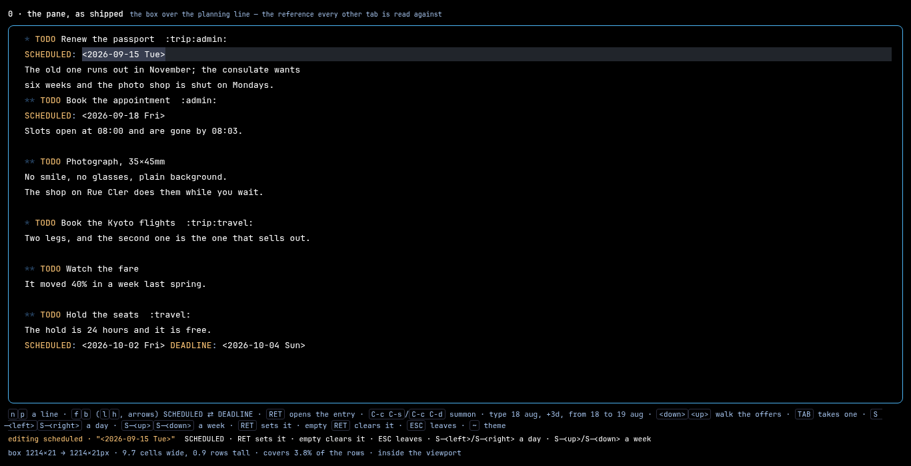

*`RET` on the SCHEDULED entry of `Renew the passport`. The box covers the
value's slot and runs to the end of the line's block — which on a two-entry
planning line means DEADLINE is under it. The field holds `<2026-09-15 Tue>`
wholly selected, and the ghost says nothing, because there is nothing to add.*

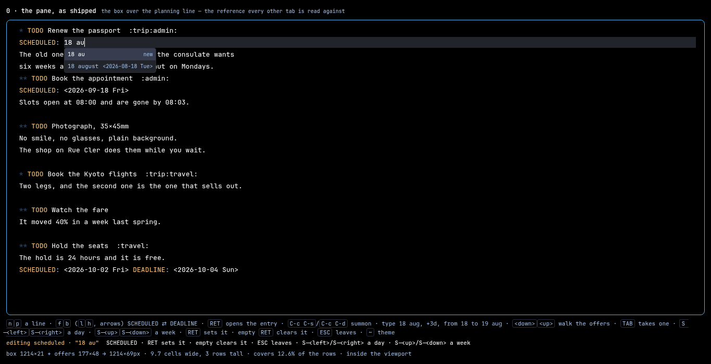

*`18 au` typed. The offers hang under the field and cover the two body lines
beneath — the pane already pays this, at 1214px wide.*

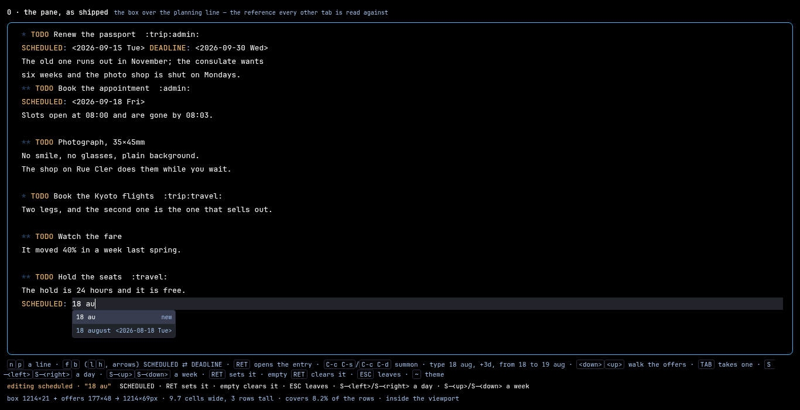

*The document's last planning line. The box hangs downward as it always does,
because a pane has room under it — which is exactly the assumption a table's
last row breaks.*

**The shape.** `placeEdit`'s `tight` branch (`20-sheet.js:546`): the ROW vouches
for the vertical, because an empty slot's rect has no height
(`docs/bugs/fixed/2026-08-25-the-title-box-sits-on-the-baseline-when-the-title-is-empty.md`);
the box runs from the value's own left edge to the right edge of the `.dp` block
(`Doc.elm:1867`). The pane lifts its own row wash while the box stands — two
golds, one token (`page.css:803`).

**What it costs, measured.**

| | |
| --- | --- |
| the box at rest | **1214×21px** — **9.7 date cells wide** |
| with the offers open | 1214×69px, **3 lines tall** |
| the share of the drawn lines it hides | **12.6%** |
| the entry beside it | **covered** — DEADLINE is under the box for the edit's duration |
| a range's ghost | whole, 289px in 1214 |
| `18 september` | whole; the menu is 197px |
| the bottom of the pane | **it does not flip.** 77px hangs under a line with 171px below it, so it never had to |
| at 900px | 748×69 — **the box narrows with the pane** |

**What this tab is for.** Three things no candidate can now claim as a novelty,
because the shipped widget already does them: **it covers a neighbouring value**
(DEADLINE, right there in the first picture); **its offers cover two lines of
content**; and **it has no flip**, because a document pane is tall and a
planning line is rarely its last line. A table's last row is its last row every
time somebody scrolls, which is the one genuinely new problem the table brings.

---

## A — THE PANE'S BOX BELOW THE CELL

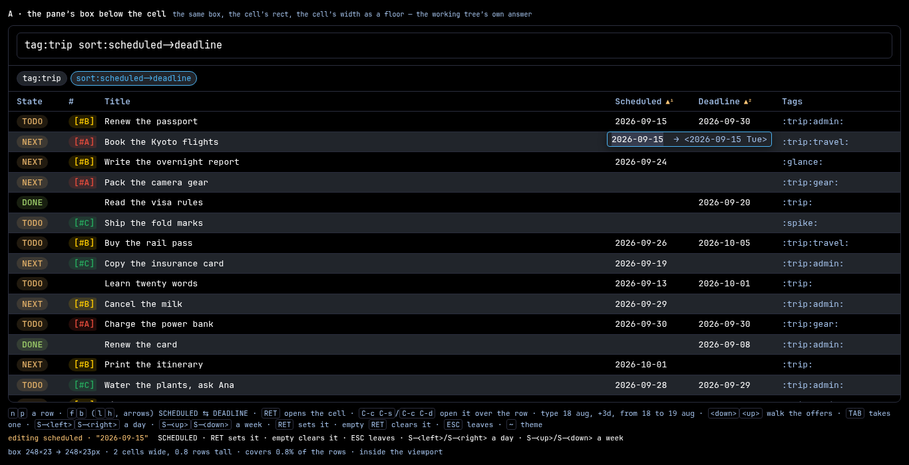

*`RET` over `Renew the passport`'s SCHEDULED cell. The box hangs directly under
it, left edges flush, 248px against the cell's 125px — the ghost is already
speaking. The cell's own value is still readable above the box; the row below's
is not.*

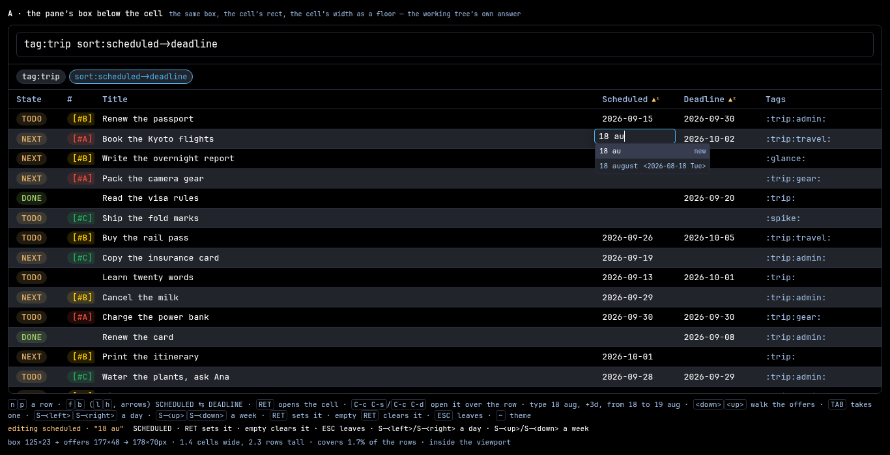

*`18 au`: the box shrinks to 178px, the pane's own offer list hangs under it at
197px, `18 au` hinted `new` above `18 august` hinted `<2026-08-18 Tue>`.*

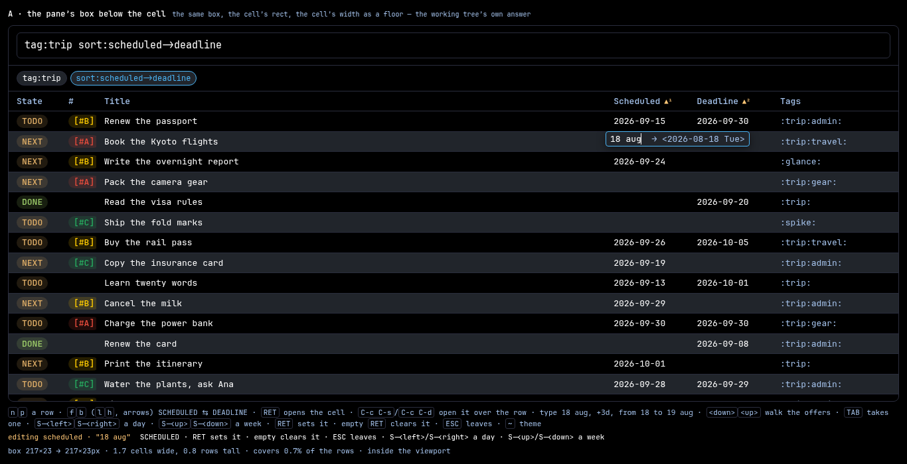 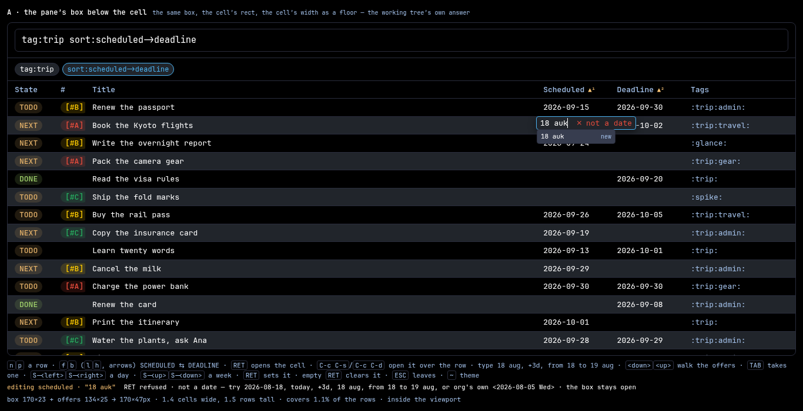

*`18 aug`, and `18 auk` after `RET` — the refusal in `--g-bad`, the box still
standing, nothing written.*

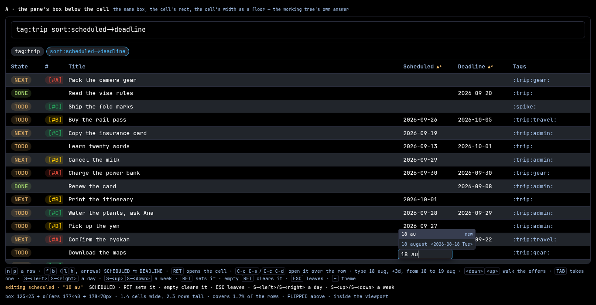

*The last row. The box has turned over: offers on top, box under them, the
anchor cell below both.*

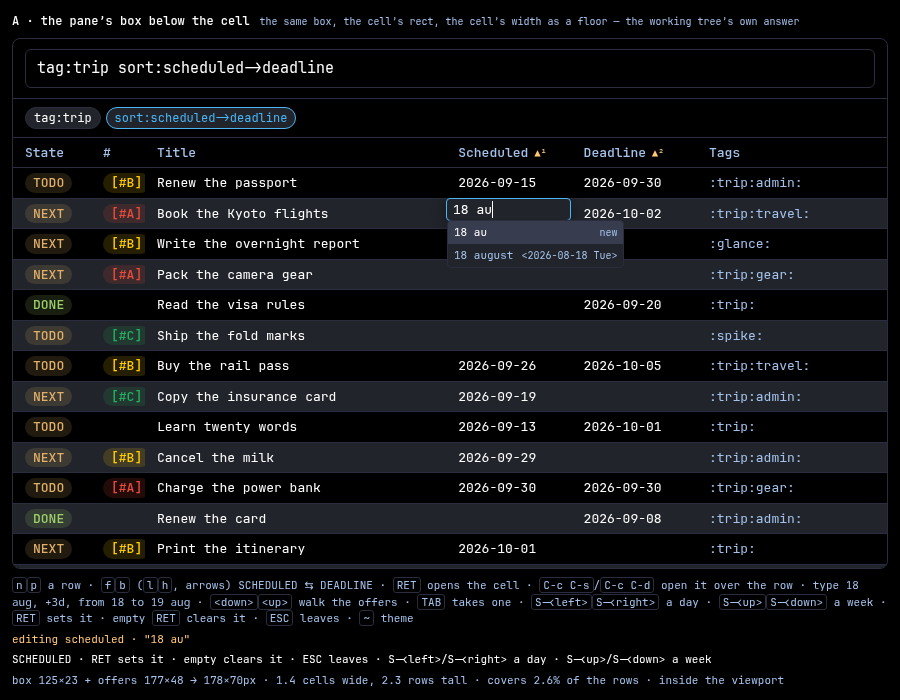

*900px. The table's title column shrank; the box did not, and it is still flush
with the cell it is about.*

**The shape.** `placeEdit`'s `under` branch, verbatim:

> *A CELL'S BOX HANGS UNDER THE CELL, left-aligned and no narrower than it, so
> the value it is about stays on screen above it. It shrink-wraps its own field,
> and the near edge gives way where the far one would run off.*
> — `20-sheet.js:517`

`top` is the cell's bottom, `min-width` the cell's width, `width` unset, and
`left` clamped into the viewport with an 8px margin.

**Its laws.** The widget's, and not one of its own.

**What it costs, measured.**

| | |
| --- | --- |
| the box at rest | **248×23px** — 1.4 cells wide when typing, 2.0 at rest |
| with the offers open | 178×70px, **2.3 rows tall** |
| the share of the drawn rows it hides | **1.7%** |
| the row's own title | **clear** |
| what it does cover | **the NEXT row's date cell**, and part of the row after |
| a range's ghost | **whole** — the box grows to 443px, 3.5 cells |
| `18 september` | whole; the menu is 197px, floored at `12em` = 132px |
| the bottom row | wants **79px** under a row with **75px** left; **flips**, and without the flip runs 5px off |
| at 900px | unchanged at 178×70, tracking the cell to x=446 |

**What it refuses.** Covering the value it is about. That is its one structural
claim and it is a real one: at every other placement below, the cell is either
under the box or off to the side of it.

---

## B — IN PLACE OVER THE CELL

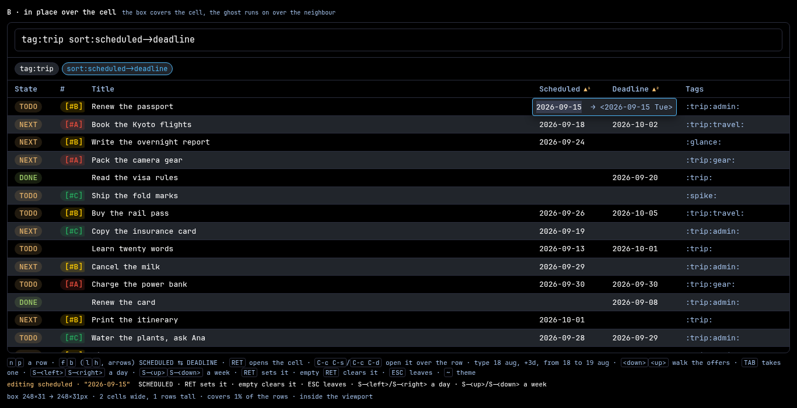

*The box covers the SCHEDULED cell exactly — same top, same left, same height —
and the ghost keeps running right, over DEADLINE, as a floating tail. The cell
is gone; the row is not.*

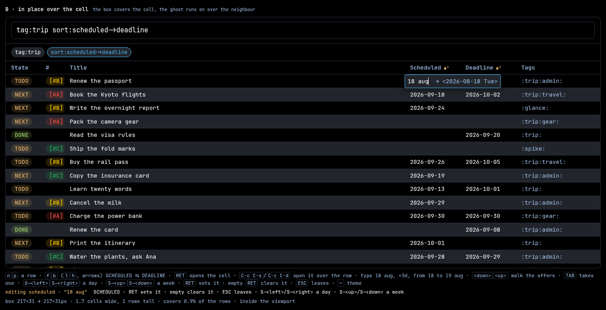

*`18 aug → <2026-08-18 Tue>`: 217px of box standing in a 125px cell, the tail
lying over the neighbour's `2026-09-30`.*

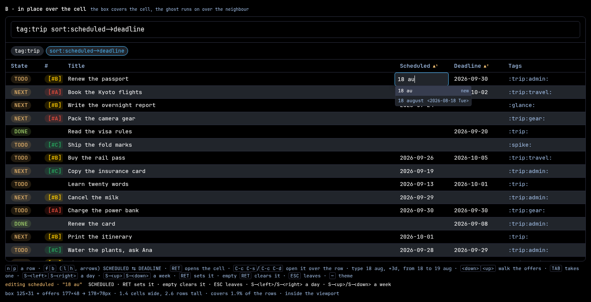 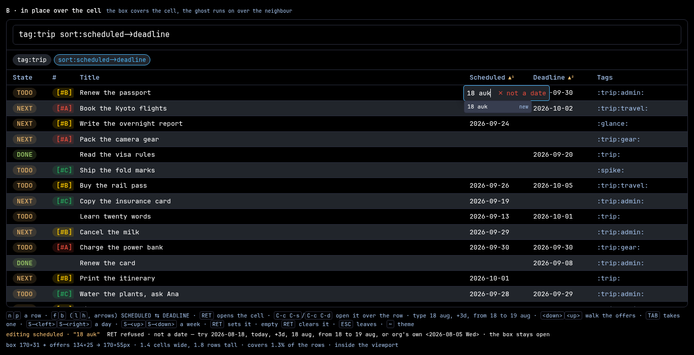

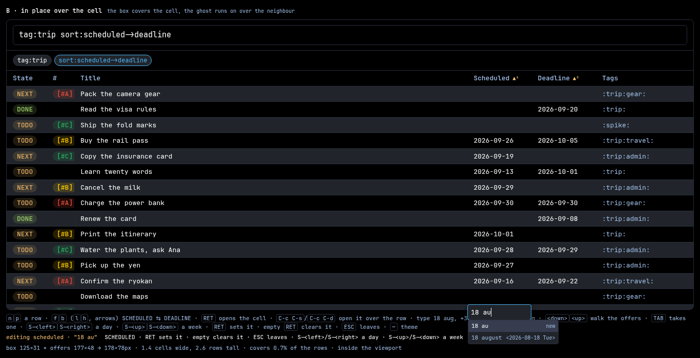 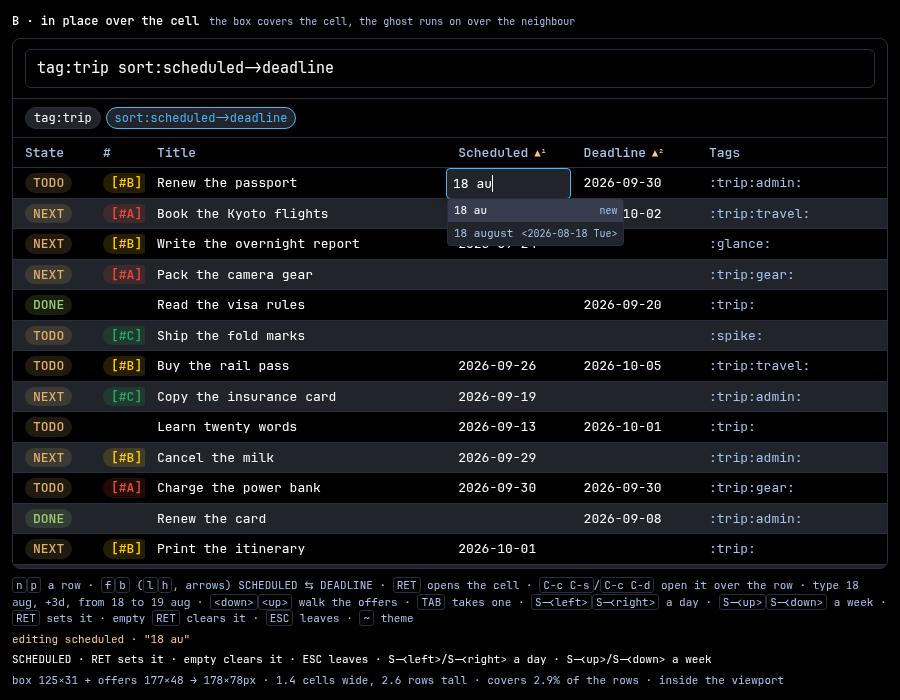

*The last row, where B's box needs no flip at all because it IS the row; and
900px, where it tracks the cell to x=446 unchanged.*

**The shape.** The cell's rect used whole — `top`, `left` and `height` — with the
same `min-width` floor and the same shrink-wrap. It is the 08-23 spike's D read
literally into a table: *the widget stands in the value's own slot and the
resolution rides after it*. It is also, exactly, what tab 0 does to a planning
line; the neighbour it covers is DEADLINE in both cases.

**Its laws.** The widget's, and not one of its own.

**What it costs, measured.**

| | |
| --- | --- |
| the box at rest | **248×31px** — the cell's own height |
| with the offers open | 178×78px, **2.6 rows tall** |
| the share of the drawn rows it hides | **1.9%** |
| the row's own title | **clear** |
| what it does cover | **the cell itself**, the neighbour's value under the tail, and the next row's date cell under the offers |
| a range's ghost | **whole** — 443px, 3.5 cells, the tail reaching into Tags |
| `18 september` | whole; the menu is 197px |
| the bottom row | wants **56px** under a row with **75px**; **needs no flip for the box**, only for the offers |
| at 900px | unchanged at 178×78, tracking the cell to x=446 |

**What it refuses.** Any motion of the reader's eye. The answer is drawn in the
line the question was asked on, which is the only placement here that can say
that.

---

## C — A CARD BELOW THE CELL, OFFERS AS CHIPS *(argued against)*

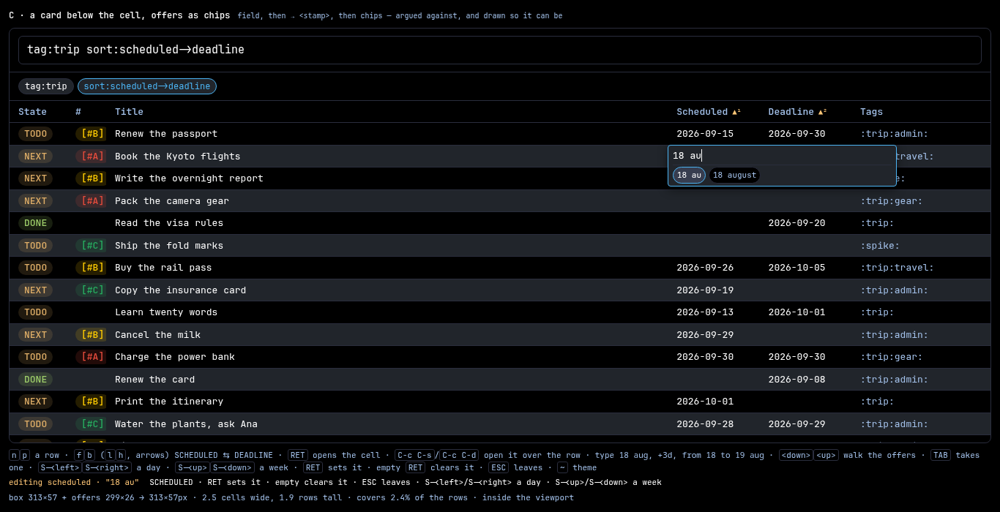 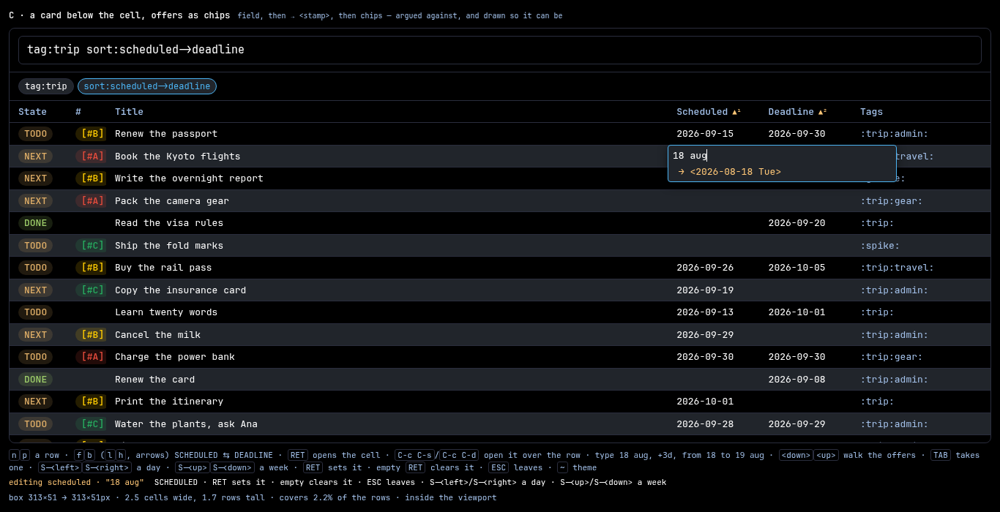

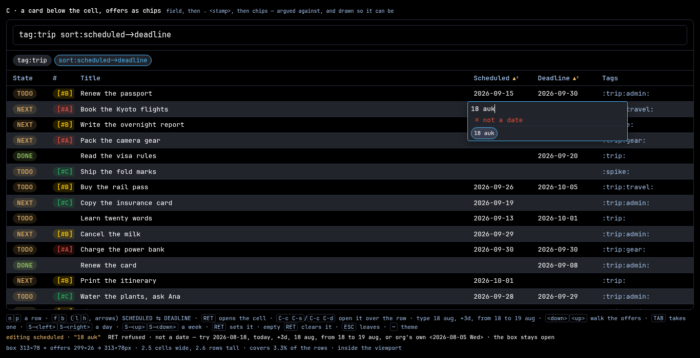 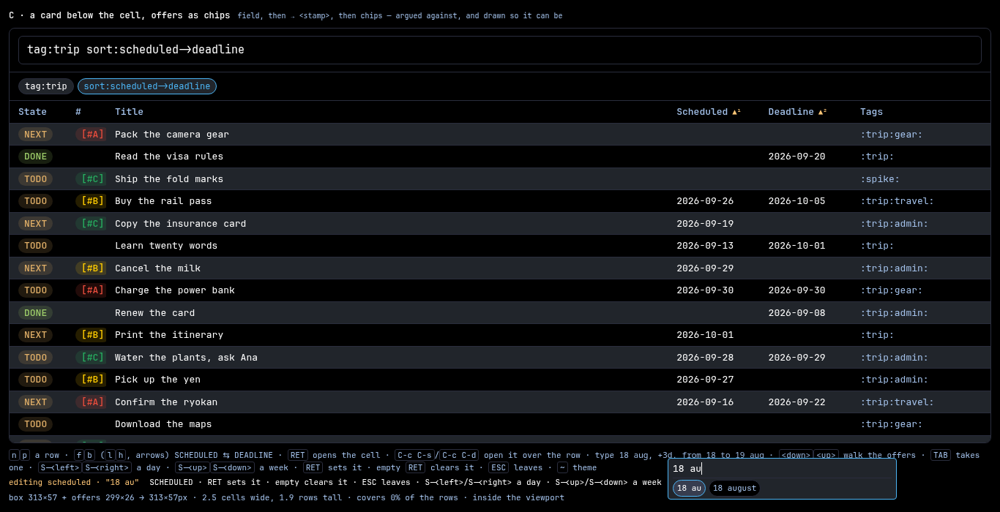

*Field on the first line, `→ <2026-08-18 Tue>` on the second, `18 au` and
`18 august` as chips on the third. 313px — two and a half cells.*

**The shape.** The same `#ddate`, laid out as a grid instead of a flex row:
`#dwhen` on line one, `.dgh` on line two, `#dwoffer` brought in-flow on line
three with `.dof` turned into chips.

**Its laws.** The widget's, plus `TAB` cycling the chips — which is `dateTab`
unchanged, since the offers' walk does not care how they are drawn.

**What it costs, measured.**

| | |
| --- | --- |
| the box | **313×51px**, fixed at 2.5 cells; **313×57** with chips |
| rows tall | 1.9 |
| the share of the drawn rows it hides | 2.4% |
| a range's ghost | whole at 299px — with **10px to spare**. At two cells it would be cut |
| the offers' hint | **gone** |
| the bottom row | wants 65px under a row with 75px; fits here, flips when it does not |

**Why it is argued against — on the fork rather than on the pixels.** **Six
rules fork**:
`#ddate`, `.dgh`, `#dwoffer`, `#dwoffer.on`, `.dof` and `.dot` each need a
second branch (`pane.css`, the `card` block). The markup is the same — C needs
no new element, which is worth knowing — but a box whose every dressing rule has
a table branch is two widgets sharing a `<div>`, and the next change to the
pane's dress has to be made twice or it silently diverges on one surface.

**And it drops the hint column.** `.dot` is the offer RESOLVED — `18 august ·
<2026-08-18 Tue>` — which the 08-23 spike named as *"the one thing a date
vocabulary can do that a property vocabulary cannot"*. It will not fit in a
chip, so C answers "what will `18 august` give me?" with silence where the pane
answers it in the list.

**Its own fixed width is the second tell.** A and B grow to what they hold; C
must be given a number, and 2.5 cells is a number that happens to clear a range's
ghost by 10px at this face and would not at a larger one.

---

## D — BESIDE THE CELL *(argued against)*

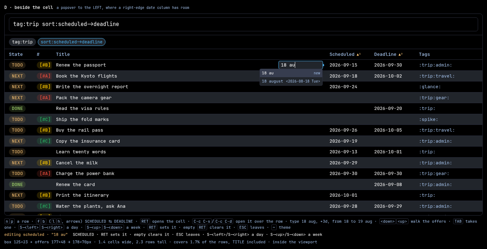 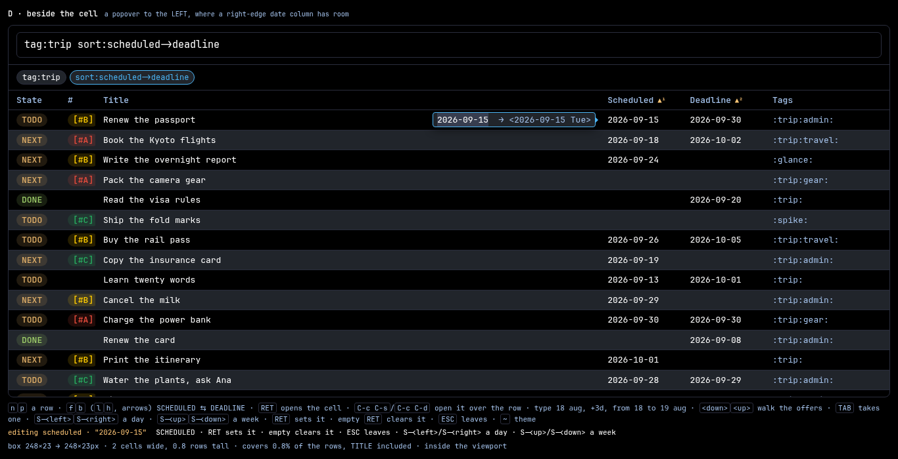

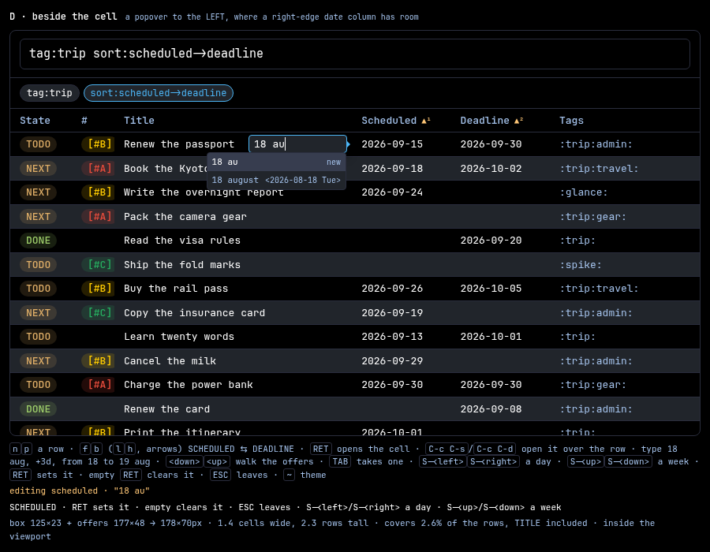

*900px, where the title column starts at 145 and the box starts at 262 — the
title is a word and an ellipsis.*

*The box to the LEFT of the cell, pointer at it, offers under the box and
right-aligned. It is 178px of box lying across the end of `Renew the passport`.*

**The shape.** `left = cell.left − box.width − 6`, vertically centred on the
cell, with `#dwoffer` flipped to `right:0` and a `::after` pointer. The rest is
the shipped box.

**Its laws.** The widget's, and not one of its own.

**What it costs, measured.**

| | |
| --- | --- |
| the box | 248×23 at rest, 178×70 with offers — identical to A |
| rows tall | 2.3 |
| the row's own title | **covered, 178px of it** — and **443px** on a range |
| a range's ghost | whole, but lying across half the title |
| the bottom row | wants 79px under a row with 75px; flips |
| at 900px | box at x=262 with the title column starting at 145 — **the title is all but gone** |

**Why it is argued against.** It is CHEAPER than it sounds — one forked rule, a
pseudo-element, and the box, ghost and offers are the shipped ones — so "a second
widget" is the one charge that will not stick. Two others do.

**It covers the row's own title, every time.** Every other placement leaves the
title clear; D's whole idea is to spend the title column's slack, and the title
is how the reader knows which row they are dating. At 900px it takes the title
almost entirely.

**And the answer ends up on the far side of the question.** The reader's eye
goes right to the cell, left to the box, then back right to check the cell. A
and B are one stop; D is three.

## What the rig holds, so the tabs are honest

They live in `rig.js` and vary between no two tabs.

**One box, built once, from the shipped markup.** `DDATE_HTML` is
`Page.hs:46`-`:50` character for character, appended to the page's root — because
that is where the app hangs it: `#ddate` is `position:fixed` (`page.css:752`) and
`placeEdit` measures a fixed box against `viewRect()` (`20-sheet.js:495`).

**The widget's own code, transcribed.** `paintOffers`, `menuPaint`, `menuWalk`,
`menuTake`, `fitCh`, `drawGhost` and `dateMoved` are `20-sheet.js:879`-`:963`
with their bodies verbatim and the pair box's half left behind. `dateOffers`
comes from `:883` by way of `dates.js`.

**The grammar is the app's, ported and not rewritten.** `dates.js` carries
`readsDate`, `englishDate`, `shippedDate`, `dateWriting`, `dateGhost`,
`dateStep`/`dateStepped` and `verbatimDate` with their bodies verbatim.

**THE PHRASE TRAVELS.** `RET` sends what the reader typed and the server
resolves it (`commitDate`, `20-sheet.js:1092`: *"Send TYPED verbatim: ONE CLOCK
READ, the server's own"*). The footer prints the wire at every commit, and a
rung asserts `"2026-08-18"` rather than `"<2026-08-18 Tue>"` goes out — this is
the one law that CHANGED since the date-cell spike, which sent the resolved
stamp.

**The ghost says three things and no fourth**, and is a SPAN that the caret
cannot enter — pinned by a rung that walks the caret eight times past the end of
`18 august` and finds it clamped at 9.

**Org's own spelling is kept verbatim.** `<2026-08-05 Mon>` adds no ghost though
that day is a Wed (`AGENTS.hs`; `test/TestQuery.hs` pins it).

**ESC restores the spelling the edit FOUND**, and every tab asserts it, for both
spellings — `<2026-09-15 Tue>` in the pane, `2026-09-15` in the cell.

**Nothing moves.** Every rung begins and ends by reading every row's top, and an
overlay that shifted one would be a strip wearing an overlay's coat. Six tabs ×
two readings, all equal.

**One clock read per open**, pinned at `?day=`, asserted per tab.

**The cell cursor and the column walk are the table's**, which they now are in
the tree; the rig walks `f`/`b` between SCHEDULED and DEADLINE the way the
shipped selection does.

## The check

```sh
node shots.mjs
```

160 rungs — **32 per tab, all five green** — over the same laws: the open and its
whole selection, the entry ghost per surface, the offers at an unfinished term
and their silence at a finished one, the walk, `TAB`'s take, the caret's wall,
the four shifted arrows, the commit and what it puts on the wire, the refusal
and its standing box, `ESC`'s byte-identical restore, the empty clear, org's
verbatim stamp, `n` typing an `n`, and every row still where it began.

**That every tab passes the same 32 rungs is itself the finding.** It says all
four placements are the same widget — which is what reusing `#ddate`
was supposed to buy, and it is bought.

## Findings

1. **The placement question is settled by the FOOTPRINT, because the widget is
   fixed.** `#ddate` is `position:fixed` and placed against the viewport, so no
   surface's `overflow` can cut it — not `#mdoc`'s `auto`, not `.tv-root`'s
   `hidden` (`table-view.js:1169`), not `.tv-scroll`'s. There is no clipping
   argument here at all; the four walls are the window's, and the only question
   is what the box LIES ON TOP OF.

2. **A and B reuse `#ddate` with no forked rule at all.** Between them they
   write five numbers — `top`, `left`, `height`, `min-width` and nothing else —
   and the `.cell` dress they wear is already in the tree. The flip costs ONE
   rule (`#ddate.flipped #dwoffer{top:auto;bottom:100%}`). C costs six forked
   rules and the offers' hint column; D costs one rule and the row's title.

3. **The shipped box already covers a neighbouring value, so "B covers the
   neighbour" is not a new cost.** Tab 0's first screenshot has the DEADLINE
   entry under the box, because `placeEdit`'s tight branch runs to the end of the
   `.dp` block. B covering the DEADLINE cell is the same behaviour on the other
   surface. Whatever the objection to B is, it cannot be that one.

4. **A's cost and B's cost are the same size and fall on different things.** A
   covers the NEXT row's date cell; B covers THIS row's. Both leave the title
   clear; both hide about 2% of the drawn rows; both grow to 443px on a range
   without clipping a pixel. The choice is *which* value the reader may not see
   while they type: the one they are replacing, or a stranger's.

5. **A's claim — "the value it is about stays on screen above it" — is worth
   less at entry than it looks.** The box opens with the cell's value in its own
   field, wholly selected, AND with the ghost already resolving it. The cell
   above says `2026-09-15`; the box says `2026-09-15 → <2026-09-15 Tue>`. The
   thing A preserves is a third copy of a value the box is already showing
   twice.

6. **B is the only placement where the answer is drawn on the line the question
   was asked on.** The eye does not travel at all: the field is where the value
   was, the ghost is the next thing to its right, and the offers are directly
   under. A costs one downward glance; D costs three glances and a return.

7. **The flip is real, and the tree has not got it.** `placeEdit`'s `under`
   branch clamps the horizontal (`Math.max(b.left + EDGE, Math.min(a.left,
   b.right - wide - EDGE))`) and says nothing about the vertical. On the last
   visible row A wants 79px below a cell with 75px left — it runs off by 5px in
   this rig, and by more in the app, where the table reaches the window's bottom
   instead of stopping above a 60px footer. **B needs the flip only for its
   offers** (56px under 75px, so usually not at all), which makes B the cheapest
   variant to get right at the bottom edge as well as the top.

8. **The offers are the half the strip could not carry, and they cost 197px.**
   `#dwoffer` is floored at `min-width:12em` = 132px — 7px wider than the whole
   date column — and draws at 197px with `18 august · <2026-08-18 Tue>` in it.
   Any placement that wants the offers wants at least 1.6 cells of width; a
   strip under the row could have had them only by being a menu, which is what
   the review said it was not.

9. **A box that shrink-wraps never clips its ghost; a box given a width does.**
   A, B and D draw the 289px range ghost whole by growing to 443px. C is fixed
   at 2.5 cells = 313px and clears it by 10px at this face — a margin that is an
   accident of the font size, and the reason a fixed-width card is a liability
   rather than a discipline.

10. **The table adds a fourth thing beyond the steer's three: a re-place per
    keystroke.** The pane's box is the line's remainder and never changes width,
    so `dateMoved` does not re-lay it. A box that shrink-wraps its field grows
    as the phrase does, so over a cell the placement has to be recomputed on
    every input or the far edge walks off unclamped. One line, and it belongs in
    the list of what the table owes.

11. **At 900px nothing breaks, because the box never negotiated with the table
    in the first place.** The cell moves left to x=446 and the box follows it;
    the footprint does not change. The one variant that suffers is D, whose box
    at x=262 lies across a title column that starts at 145.

12. **The date-cell spike's finding 1 survives its own conclusion.** *"A table
    column is sized for what it DRAWS, and a date widget needs room for what it
    SENDS"* — 125px of column against a 289px ghost. That gap is why an overlay
    is right and an in-cell layout is not, and it is the one argument from that
    spike that this one leaves standing whole.

## The recommendation

**Ship B: the box in place over the cell, with the ghost running on over the
neighbour.** It is the pane's widget with nothing forked, it puts the answer on
the line the question was asked on, and it is the only variant whose box needs
no flip at the bottom edge.

The reasons, in order of weight:

1. **Same box, same look, same keys — and B and A are tied on this, which is
   why it decides nothing on its own** (findings 1, 2). Both reuse `#ddate`
   verbatim, both write only the numbers the steer allows, both pass the same 32
   rungs. C and D are out on this criterion alone: C forks six rules and drops
   the offers' hint, D spends the row's own title.

2. **B stands in the value's own slot, which is what the widget is FOR**
   (finding 6). The pane's box covers the planning value's slot; B covers the
   cell's. The 08-23 spike spent twenty rounds arriving at *a field standing in
   the value's own slot with the resolution riding after it*, and B is that
   sentence on a table. A is that sentence with the field moved one row down.

3. **B's bottom edge is 23px cheaper than A's, and it is the edge the tree has
   not built yet** (finding 7). A wants 79px under the last row; B wants 56px,
   and only for its offers. Whichever ships, the flip has to be written — and
   B's is the smaller, more often unnecessary case.

4. **The objection to B is already the shipped pane's behaviour** (finding 3).
   "It covers the cell" and "the tail covers the neighbour" are both true of tab
   0 on a planning line, today, in the app the reader already uses.

5. **A's advantage is a third copy of a value the box shows twice** (finding 5),
   and it is bought with covering a DIFFERENT row's date — a stranger's fact
   rather than the one being edited.

**A stays as the thing to keep if B's cell-covering turns out to bother anyone,
and it stays cheaply, because it is already written** (`20-sheet.js:520`).
Switching between them is a branch in one function and no change anywhere else —
which is itself the strongest evidence that reusing `#ddate` was the right call:
the placement became a two-line decision instead of a widget.

**C is argued against on the fork** (finding 2, finding 9). Six rules and a
dropped hint column buy a shape that reads no better than B's and cannot grow.

**D is argued against on the title and the eye** (finding 11, finding 6), and it
is worth writing down that it costs only ONE rule — if a future column layout
ever puts the date columns in the middle of a wide table with nothing to the
right, D is the variant to re-measure.

## What shipping would need

Nothing here is a proposal; this is what the proposal would have to answer.

- **The flip, in `placeEdit`'s `under` branch.** The branch clamps X and not Y
  (`20-sheet.js:520`). It owes the same `Math.max`/`Math.min` treatment on the
  vertical, and `#dwoffer` owes a `bottom:100%` rule for when the stack turns
  over. Whatever the placement, the bottom row is reachable by `n` and the last
  row of a scrolled table is at the window's edge by definition.

- **If B: `s.height` from the anchor, and the `.cell` dress reconsidered.**
  Covering the cell means taking its height, which the branch does not do today.
  `#ddate.cell`'s 1px accent border and `0 4px 14px` shadow were drawn for a box
  standing UNDER the rows (`page.css:762`); a box standing IN a row wants the
  in-cell editor's own sign instead — `outline:2px solid var(--tv-accent);
  outline-offset:-2px` (`table-view.js:1263`) — or it reads as a card dropped on
  the row rather than as the cell's own field. One rule either way, and it is a
  decision about what "this is an input" looks like on a table.

- **The in-cell editor's dress, now that no standing row opens one.** With
  `editableKeys` gone (`00-core.js:208`), `.tv-cell-edit`'s accent outline is
  drawn for the draft's cells alone. If B ships, that outline is the sign a date
  box over a cell should borrow; if A ships, the two signs coexist and want a
  reason.

- **A `/headlines` answer arriving mid-edit.** `00-core.js:253` calls `setRows` on
  every answer — a WAL tick, a poll, a filter change, a sibling write — and the
  rows are re-rendered. The box is `position:fixed` at the page's root and
  survives the repaint, but **its anchor does not**: `cellRect(id, col)` finds
  the `<tr>` by `data-id`, so a repaint that reorders or drops the row leaves the
  box standing over a cell that has moved or gone. `placeEdit` is wired to
  `resize` and to pane `scroll`, and to nothing the table does. Either the table
  tells the producer when it repaints, or the box re-places on a timer, or a row
  that vanishes under an open box closes it.

- **The table's own scroll.** Same seam: `#tablewrap` scrolls under a fixed box
  that is not listening. `20-sheet.js:1345` attaches `placeEdit` to a pane's
  scroll; the mounted table's scroller needs the same wire.

- **The offers over a table are a new stacking question.** `#ddate` is
  `z-index:102` and fixed, so it clears the sticky header (1) and the filter
  dock (91) — that is already reasoned in the CSS comment. Worth a browser case,
  since the numbers are the only thing holding it.

- **The checks.** A browser case under `test/browser/` per law, since every one
  is a paint fault a model-reading test cannot see: `RET` over a date cell opens
  the box on the cell's own value, wholly selected; the box is anchored to the
  cell's rect and moves with a resize; on the last visible row it flips above;
  `18 au` opens the offers and `<down>`/`TAB` takes one; the ghost is silent over
  a half-typed phrase and speaks over a finished one; `RET` over `18 auk` refuses
  with the box still open and nothing written; `RET` over `18 aug` sends
  `"18 aug"` to `set-planning` and the settle brings `2026-08-18` back to the
  cell; `S-<right>` steps the day; `ESC` restores the cell byte for byte; a
  `/headlines` answer arriving mid-edit leaves the box over the right cell. A
  fixture under `test/browser/tree/` with both date columns populated, one row
  holding neither, and enough rows to scroll — the bottom-row case is not
  reachable in a six-row fixture, which this rig found out the hard way.

- **The draft row.** `35-draft.js:115` already opens the same box over a draft's
  date cell with `onCancel: dropDraft` and a `onWalk` ring, so whatever
  placement ships, the draft gets it for nothing. Worth one case per surface
  anyway: `TAB` from the tags cell reaches SCHEDULED, and the capture carries the
  planning line.

`shots.mjs` runs 160 rungs of exactly these keys against these five pages and
all of them are green, which is evidence that the laws are consistent across the
five placements and no evidence at all that the placement is right in the
shipped app.
