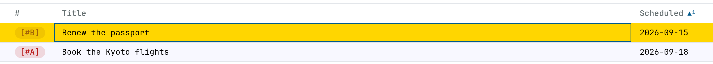
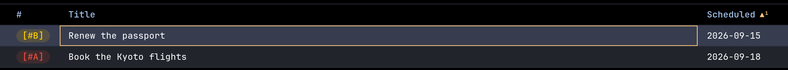

# Spike — a table's columns while a row is being EDITED: what may re-measure, and when

**Date:** 2026-09-13 · **After:**
[`spikes/2026-09-12-capture-in-table/`](../2026-09-12-capture-in-table/README.md),
which put a draft row into the table, and
[`spikes/2026-09-12-date-overlay/`](../2026-09-12-date-overlay/README.md), whose
118px date cell is the very column this spike watches move. The fixture, the
applied query and the six columns are carried from that spike whole, so the two
read as one table.

**The user's call, 2026-09-13:** *while a row is being edited — a draft's cells,
a standing row's in-cell editor — the TABLE'S COLUMN WIDTHS MUST NOT CHANGE.
Optionally the editing row's own cells may.*

**The decision, taken on this spike's evidence: D — frozen always.** A, B and C
are kept below because they are the argument; D is what ships. The measurements
are the same in either case.

---

## 1 · How the widget sizes columns today, and what moves

Read out of `assets/table-view.js` on `feat/capture-row`, then transcribed into
the rig and measured. Every claim here has a line beside it and a number under
it.

### The policy

A view carrying a `title` column turns on the **FILL POLICY** — the table takes
`table-layout: fixed` (`:1665`) and the widths become authoritative rather than
hints. `applyWidths` (`:3050`) then writes `calc(Nch + GROUNDpx)` onto every
`<col>` **except the title's**, which is left with no width at all so the fixed
layout hands it whatever the others left. The table keeps a `min-width` of the
sized columns plus the title's 40-character floor, which is where a narrow
window starts scrolling sideways instead of crushing the title.

`N` is **the widest CELL the whole filtered set holds**, capped at
`COL_MAX_CH = 40` — `colWidths` (`:2988`) walks `ordered()` and takes a
per-column maximum. A header never widens its column; a longer header ellipsizes
into it. Text is spent in `ch`, grounds in `px`: `CELL_PAD = 24` both sides,
plus `PILL_PAD = 17` where a badge column holds anything (`:1061`-`:1070`). The
multi-valued column is measured on what it **draws** — `tagsCh` (`:1086`)
middots and the tag type's `TAG_EM = 0.92` and all.

**Which columns are already fixed today: exactly one, and it is not a data
column.** The gutter is pinned in the sheet at `calc(3ch + 24px)`
(`:1718`, with the coarse-pointer restatement at `:1986`) because it is chrome
and no width measurement sees it. `state`, `priority`, `title`, `scheduled`,
`deadline` and `tag` are all measured from content, every one of them.

The rig reproduces the arithmetic exactly, at 1366px:

```
  state  prio title sched dline  tags
     70    70   855   118   118   110     px, drawn
    4ch   4ch  fill  13ch  13ch  12ch     what `colWidths' measured
   41px  41px  24px  24px  24px  24px     the grounds
```

One `ch` is **7.2px** at the table's face, so a sorted date column is
`calc(13ch + 24px)` = **118px** — ten characters of `isoStamp` plus three of the
header's sort mark, which is the number the two date spikes argued about. The
title is 855px because the other five left that much.

### The cache, and what drops it

`widths` (`:2192`) is a per-view cache. It is dropped by `dropOrder()` (`:2326`)
and rebuilt inside `ordered()` (`:2908`), and **grown** — never narrowed — by
`growWidths(r)` (`:3015`), which `upsertRow` calls on every republished row
(`:5292`). So the measure is not "once per view" and is not "per keystroke"
either: it is *whenever the store is republished*, which is a different thing on
every code path that touches it.

### What actually moves — measured

| moment | what the reader does | columns move? | rows reflowed |
|---|---|---|---|
| a draft opens | `+` → `upsertRow` on an empty row | no | 0 |
| typing a 60-char title | 60 keystrokes into `.tv-cell-edit` | **no** | 0 |
| `TAB` to the next stop | `editCell` → `closeCellEditor` | **SIX EQUAL COLUMNS** | 19 |
| typing a 47-char tag run | 47 keystrokes | no (already equal) | 0 |
| `RET` captures | the row lands, the set re-measures | **−202px title, +202px tags** | 18 |

Three findings, in the order they matter.

**Typing moves nothing.** Under `table-layout: fixed` a cell's content does not
size its column, and `.tv-cell-edit` is `width:100%` of a cell that cannot grow
(`:1263`). The draft's typed value does not reach the widths on the walk either:
`walkDraft` assigns into `drafting.cells` (`frontend/glue/35-draft.js:217`) and
the draft IS the row object the widget holds, so the assignment IS the
republish — but it goes through `editCell`, not through `upsertRow`, so
`growWidths` is not called. Four glue paths do call it, each through
`redrawDraft` (`35-draft.js:74`): a seeded state the destination's cycle lacks
(`askCycle`), a refusal and the keystroke that clears it (`refuseDraft`,
`clearRefusal`), and a date stop folding its phrase back into the row
(`openDraftDate`). **The premise the user worried about is half false already,
and the half that is true is worse.**

**`closeCellEditor` leaves the colgroup bare — six equal columns, on every walk
step and every `ESC`.** `:4017` reads:

```js
    function closeCellEditor() {
      if (!cellEdit) return;
      cellEdit = null;
      renderRows(true);
      renderHead();
    }
```

`renderRows` ends in `applyWidths()` (`:3272`), which writes the widths onto the
`<col>` elements — and `renderHead` (`:3069`) then does `colgroup.innerHTML = ""`
and builds fresh `<col>`s carrying **no width at all**. A fixed-layout table
with a bare colgroup divides the window equally. Nothing re-applies until the
next `renderRows`, and `editCell` (`:4082`) calls `closeCellEditor` before every
open, so **every `TAB` in the draft walk and every `ESC` out of a cell lands the
reader in a table whose six columns are 223px each**. It heals on the next
repaint — a store tick, a scroll, a movement key, or one of the four
`redrawDraft` paths above — which is why it reads as a flicker rather than as a
broken table, and why it has survived. See [`0-walk.png`](0-walk.png).

**When the measure does run, the title pays for everything.** The capture lands,
`ordered()` rebuilds, `colWidths` sees a tag run of 57 drawn characters, writes
the column at its `COL_MAX_CH` ceiling — 40ch, 312px — and the fill column loses
exactly that: **−202px, and all 18 standing rows re-truncate**. At 900px the
same run pushes the table's `min-width` to 999px in an 874px port and the
scroller starts scrolling sideways.

A long **title** costs nothing at any width: the fill column has no width to
change and its 40ch floor is already the `min-width`'s term.

---

## 2 · The five tabs

Each is [`rig.js`](rig.js) with one field changed. The transcription, the
fixture, the query and the keys are identical; what differs is **when the
measure is allowed to run**.

- **0 — [as shipped](0-as-shipped.html).** `colWidths` / `growWidths` /
  `applyWidths` untouched, `closeCellEditor` in its shipped order. The control.
- **A — [frozen widths, clipped cell](a-clipped-cell.html).** At the open every
  column's current drawn width is read off the header and written onto its
  `<col>` in px — *the fill column among them, and the table's own width with
  them*, or fixed layout hands the slack back in proportion and the pin pins
  five columns out of six. The editor is the shipped one and scrolls its own
  text inside a cell that cannot grow. On close the pin lifts and the measure
  runs once.
- **B — [frozen widths, the cell overflows](b-overlay-cell.html).** Same pin.
  The input is a box at the cell's rect, `position:fixed` against the viewport
  the way the app hangs its own laid editor (`assets/page.css:752`), the cell's
  width as a floor and its text's as the rest, z-indexed over its neighbours in
  that row alone. Clamped at the window's right edge, because a cell in the last
  column has nowhere to grow.
- **C — [frozen widths, the row reflows alone](c-row-alone.html).** Same pin for
  every other row. The editing row's `<tr>` stays standing as a spacer, blanked,
  and a one-row line is stacked over its slot: the cells start at the header's
  x-positions and each takes its own content's width. Press `g` to draw the
  header's x-positions over the rows and watch the row walk off them.
- **D — [frozen always](d-frozen-always.html).** The measure runs once per view
  and the answer is written in px and left there. No open re-measures, no close
  re-fits, no upsert grows anything. Long values clip in every row, edit or not.

---

## 3 · The measurements

At 1366px, a 60-character title and a 47-character six-value tag run typed into
a draft, then captured. `node shots.mjs` prints all of it.

| | columns move while editing | rows reflowed | the tag box shows | the one jump on close | goes equal on `TAB` |
|---|---|---|---|---|---|
| **0** as shipped | at `TAB`, and at the capture | 19, then 18 | 28/47 | not one — a re-fit per republish | **yes** |
| **A** clipped cell | **no** | 0 | 13/47, 252px cut | `0 0 −202 0 0 +202` | no |
| **B** overlay | **no** | 0 | **47/47** | `0 0 −202 0 0 +202` | no |
| **C** row alone | **no** | 0 | **47/47** | `0 0 −202 0 0 +202` | no |
| **D** frozen always | **no** | 0 | 13/47, 252px cut | **none — nothing was ever unpinned** | no |

The standing row's own editor, `RET` on a 118px `SCHEDULED` cell and 30 more
characters typed into it:

| | rows moved | the box shows | the laid box | on `ESC` |
|---|---|---|---|---|
| **0** | 0 | 14/40 | — | 18 rows moved, **six equal columns** |
| **A** | 0 | 14/40 | — | 0 rows moved |
| **B** | 0 | **40/40** | 316px, reaching **198px past the cell** — over the whole of DEADLINE | 0 rows moved |
| **C** | 0 | **40/40** | the line, 233px past the cell, the row scrolled 236px | 0 rows moved |
| **D** | 0 | 14/40 | — | 0 rows moved |

At 900px, where the title column is 389px and has no slack to give:

| | the title box shows | over its neighbours | after the run lands |
|---|---|---|---|
| **0** | 51/60 | — | table 999px in an 874px port — **sideways scroll** |
| **A** | 51/60 | — | 999px — sideways scroll |
| **B** | **60/60** | 71px | 999px — sideways scroll |
| **C** | **60/60** | 351px | 999px — sideways scroll |
| **D** | 51/60 | — | **874px in an 874px port — no sideways scroll** |

### D, measured on its own terms

```
  at rest     70    70   855   118   118   110     3 cells clipped

  a 60-character title typed into a draft moves 0px, 0 rows
  a row arriving with a longer run moves      0px, 0 rows
      it is drawn clipped instead: 5 cells cut against 3 before it landed

  `q' drops `sort:' — a view change
     70    70   898    96    96   110
      0     0   +43   -22   -22     0     px, the ONE re-fit

  the window narrows by 266px
     70    70   589   118   118   110     3 cells clipped
      0     0  -266     0     0     0     px, and the fill column pays all of it
```

Two numbers carry D's whole case and D's whole cost. **A draft and an arriving
row move nothing — 0px, 0 rows, both.** And **an arriving row is not paid for
until the next view change**, when it lands all at once: `+22 state, −223 title,
+202 tags`. D does not abolish the jump; it moves it to a moment the reader
caused and can see the reason for.

---

## 4 · The argument — reading stability against seeing what you type

The two goods are in direct opposition and the measurements price both.

**Reading stability** is what the user asked for and what the control fails at
twice over: 19 rows re-laid on a `TAB` the reader pressed to move one cell, and
18 rows re-truncated on the keystroke that commits a capture. A table is a
reading instrument; a column that moves under the eye costs a re-read of every
row, not of the one that changed. All four candidates buy this outright — 0
rows, 0px, at every moment of every walk.

**Seeing what you type** is what A and D give up. A 47-character tag run in a
110px column shows **13 characters**; the reader is typing into a slot and
checking their work by memory. B and C show all 47 and pay elsewhere: B covers
198px of the row's own later cells, so the reader cannot see the DEADLINE they
are about to walk to; C keeps every cell readable but takes the row out of the
grid, and once the row's content passes the window the line scrolls and the
row's own left-hand cells go off the edge (236px, measured). Both put a
different thing in front of the reader's eye than the table they were reading.

**The resolution the decision takes:** the two goods are not symmetric. A column
that moves costs every reader on every row for the rest of the session; a cell
that shows 13 of 47 characters costs one reader for the length of one edit, and
has a cheap independent remedy (the field scrolls, the caret is visible, `HOME`
and `END` work, and the value is one `ESC` from being seen whole in the row
below). A and D differ only in when the pin is taken, and D takes it at a moment
no reader is looking. **D.**

### Weight-ordered

1. **A column must not move under a reading eye.** Costs every reader, every
   row, for the rest of the session. 0, alone, fails it — 19 rows on a `TAB`,
   18 on a capture. *A, B, C and D all pass.*
2. **A column must not move for a reason the reader cannot see.** A capture
   landing, a WAL tick, a daemon delta: today each of them re-sizes the table
   from outside the reader's attention. A, B and C leave this standing. **Only
   D passes.**
3. **The widget must not grow a seam the producer can get wrong.** A
   `freezeColumns()` / `thawColumns()` pair on the handle makes "are the columns
   pinned?" a question two objects can answer differently, and every path out of
   an editor has to remember to thaw. A, B and C need it. **D needs no handle
   method at all.**
4. **The reader should see what they type.** B and C pay it in full (47/47), A
   and D in part (13/47, with the field scrolling to the caret). This is the one
   good D gives up, and the only one.
5. **A long value should read whole at rest.** 3 cells clipped in eighteen rows
   before anything lands, 5 after. D pays this; 0, A, B and C re-fit and clip
   less — and move more.
6. **Nothing should need a second overlay.** B and C each add a laid box with
   its own clamping, flipping and scroll-following. D adds no box.

And D answers something the others do not. A, B and C all still let the *set*
re-measure — at every capture, every WAL tick that republishes a row, every
`upsertRow` from the daemon. They freeze the edit and leave the table fluid the
rest of the time, which means the column the reader is about to click still
moved out from under them a second ago for a reason they never saw. D makes the
column a fact of the VIEW, which is the thing the reader chose.

---

## 5 · What shipping D would need

All line numbers are `assets/table-view.js` on `feat/capture-row`.

### 5.1 · Repair `closeCellEditor` first — it is a bug on its own

`:4017` must re-apply the widths after rebuilding the head, or reorder the pair.
The minimum is one line:

```js
      renderRows(true);
      renderHead();
      applyWidths();          // the colgroup is new; the widths are not on it
```

This is worth its own file under `docs/bugs/` and its own failing browser case
before anything else lands — a case that opens an editor, closes it, and asserts
the six columns are not equal. Every pinning variant in this spike had to repair
it before it could pin anything, and the control reproduces it from the keyboard
in two presses (`RET`, `ESC`).

### 5.2 · WHEN the widths are computed — once per view

One new function, `fitColumns()`, is the only caller of the measure. It runs on
exactly three occasions and no others:

1. **the first rows paint after mount** — today's `renderRows` → `applyWidths`
   path (`:3272`), reduced to a first-time call;
2. **a view or query change** — `setView`, `setRows` with a new shape, and
   anything that calls `dropSorted()` / `dropOrder()` (`:2326`, `:2328`) because
   the *result set* changed rather than one row of it;
3. **a window resize** — a `ResizeObserver` on the scroller, debounced, because
   pinned px do not stretch and the fill column would keep a width the window no
   longer has.

Everything else stops re-measuring. Concretely:

- **`growWidths` (`:3015`) loses its caller.** `upsertRow` (`:5292`) keeps
  `texts.delete`, `place`, `placeProducers` and `repaint`, and drops
  `growWidths(row)`. A WAL tick, a delta, a daemon push and a landed capture all
  become width-neutral.
- **`ordered()` (`:2908`) stops setting `widths = null`.** A filter keystroke
  narrows the set without re-sizing the columns, which is the same policy under
  a different name — the widths belong to the view, and a filter is not one.
  (If a filter *should* re-fit, it is occasion 2 and calls `fitColumns()`
  explicitly; the spike takes no position, but the call must be named.)
- **`dropOrder()` (`:2326`) drops the order alone**, the widths coming off
  `fitColumns()`.

### 5.3 · FROM what

Unchanged from `colWidths` (`:2988`), and it is already the right measure: the
header word, the widest value in the result set **at that moment**, `CELL_PAD`
and `PILL_PAD` grounds, `tagsCh`'s drawn measure for the multi-valued column,
`COL_MAX_CH = 40` ceiling, `TITLE_MIN_CH = 40` floor for the fill column. The
only change is that its answer is now durable.

A per-key fixed `ch` is **not** wanted where a measure exists: the rig ran both
and the measured answer is better at every width — `13ch` for a sorted date
column is exactly `isoStamp` plus its mark, and a hand-written constant would
have to be re-derived every time a sort chain changed. The gutter's
`calc(3ch + 24px)` (`:1718`) stays what it is: chrome, outside the measure, as
it already is.

### 5.4 · HOW they are pinned

The existing mechanism, with one addition. `applyWidths` (`:3050`) already
writes `calc(Nch + GROUNDpx)` onto the `<col>`s under `table-layout: fixed`
(`:1665`). `fitColumns()` keeps that and adds **the table's own width**:

```js
      table.style.width = px(total);      // fixed layout hands slack back in
      table.style.minWidth = px(total);   // proportion; a pin must take it too
```

`min-width`/`max-width` per column class is the wrong tool here — under
`table-layout: fixed` a cell's own width is inert (`:1716` already says so for
the gutter), so the pin has to be on the `<col>`, and the table width has to be
pinned with it or five columns are pinned and the sixth absorbs. The fill column
keeps carrying no width at rest and takes the remainder; `fitColumns()` pins
the *total*, not the title.

### 5.5 · Long values at rest

`.tv-fill th:not(.tv-box), .tv-fill td:not(.tv-box)` already carry
`overflow:hidden; text-overflow:ellipsis` (`:1671`). Nothing changes: a value
past its column ends in an ellipsis, the multi-valued column keeps drawing whole
values with `TAG_MORE` behind them (`tagsFit`, `:257`), and truncation stays
paint alone — what is searched, sorted and filtered is the whole cell the
producer sent (`:3031`). The title column takes the slack, as now. The cost, at
rest, in the rig's eighteen rows: **3 cells clipped before anything lands, 5
after a row with a longer run arrives.**

### 5.6 · The in-cell editor and the producer row inside a pinned column

Nothing changes, which is the point. `.tv-cell-edit` is already
`width:100%; box-sizing:border-box` (`:1263`) and already scrolls its own text
inside a cell that cannot grow; `openCellEditor` (`:4040`) already puts it in
the td. A producer row's cells are the same cells. The one thing that has to
stop is the *implicit* re-measure on the way out — §5.1 and §5.2.

The reader's remedy for a clipped field costs nothing and is already there: the
input scrolls to the caret, `HOME`/`END` work, and `ESC` puts the drawn value
back in a row the reader can read. If it proves insufficient in use, **B is the
upgrade path and it is additive** — a laid box over the cell changes no width
and can be added later without touching `fitColumns`.

### 5.7 · What a resize costs

One `colWidths()` — O(rows × columns) over the filtered set, the same pass the
mount already pays — plus one write per `<col>`. Debounced on a
`ResizeObserver`, that is one measure per settled resize rather than one per
frame. Measured in the rig: narrowing 1366px → 1100px moves **the fill column
alone, by the whole 266px**, and the five sized columns hold their px exactly.

### 5.8 · The seam, and the vendored copy

`fitColumns()` belongs **inside the widget**. Nothing a producer can
reach from outside decides when a column is measured, and nothing should: a
`freezeColumns()` on the handle — the shape A, B and C would have needed — puts
the widget's own invariant in the producer's hands and makes "are the columns
pinned?" a question two objects can disagree about. D needs no handle method at
all, which is the quiet argument for it.

**It does need the vendored copy to change**, so it belongs on the upstream
list. `docs/tasks.org`, under *"Upstream the producer row, `getEditing` and
`onCellKey` to `../table-view` before the next sync-renderer"* (the headline at
`:543`), add:

> - **`fitColumns()` — the column measure runs ONCE PER VIEW** and not per
>   republish. `colWidths` is unchanged; what changes is its callers.
>   `growWidths` loses its call in `upsertRow`, `ordered()` stops nulling
>   `widths`, and the measure is driven by three occasions instead: the first
>   rows paint, a view or query change, and a debounced resize. The answer is
>   pinned as `<col>` widths plus the table's own width under
>   `table-layout: fixed`. A row that arrives with a longer value is drawn
>   clipped and is paid for at the next view change.
> - **`closeCellEditor` re-applies the widths after `renderHead`** (`:4017`).
>   Without it the colgroup is left bare and a fixed-layout table divides the
>   window equally — see the bug file.

`make sync-renderer` copies the sibling over the vendored copy, so both must go
upstream before the next sync or they are clobbered without a word.

---

## 6 · The cell highlight

The rig draws a **cell cursor inside the row cursor**, and the user wants it in
the shipped widget.




### What the rig draws

Two rules, and only one of them is new:

```css
/* the ROW cursor — the widget's own, unchanged (table-view.js:1778) */
.tv-table tbody tr.tv-sel{
  background:var(--tv-sel);
}
/* the CELL cursor — a 1px inset ring, no ground, no radius */
.cd-at{
  box-shadow:inset 0 0 0 1px var(--g-point);
}
```

`--g-point` is `#005A8D` light, `#FFC777` dark (`Theme/Default.hs`, carried in
[`pane.css`](pane.css)); `--tv-sel` is `--g-sel`, `#FFD600` light and `#373D4F`
dark. No radius, no border, no ground on the cell. Measured from the page:

| | row ground | cell ground | the ring |
|---|---|---|---|
| light | `rgb(255, 214, 0)` | `rgba(0, 0, 0, 0)` | `rgb(0, 90, 141) 0 0 0 1px inset` |
| dark | `rgb(55, 61, 79)` | `rgba(0, 0, 0, 0)` | `rgb(255, 199, 119) 0 0 0 1px inset` |

There is no selected-column dress in the rig — the rig's cursor is a row and a
cell within it, and no band.

### Against the shipped dress

The widget draws a cell selection as **three grounds and no ring** (`:1859`ff),
and says so explicitly: *"all three are grounds — no outline, no border, no
shadow anywhere in the selection."*

```css
.tv-table th.tv-colsel{                              /* :1881 */
  background:color-mix(in srgb,var(--tv-col) var(--tv-col-wash),var(--tv-bg));
}
.tv-table tbody td.tv-colsel{                        /* :1884 */
  background:color-mix(in srgb,var(--tv-col) var(--tv-col-wash),transparent);
}
.tv-table tbody td.tv-cell-sel{                      /* :1887 */
  background:color-mix(in srgb,var(--tv-col) var(--tv-cell-wash),transparent);
}
```

with `--tv-col-wash` 35% light / 8% dark and `--tv-cell-wash` 60% / 9%
(`:1155`-`:1159`, `:1191`-`:1192`). The row's own gold is `tr.tv-sel` (`:1778`),
and the classes are stamped at `:3193`-`:3194` and `:3474`.

**Rule by rule, to make the shipped widget draw the rig's dress:**

| rule | today | change |
|---|---|---|
| `tr.tv-sel` (`:1778`) | `background:var(--tv-sel)` | **keep** — the row cursor is the one gold and it does not move |
| `th.tv-colsel` (`:1881`) | opaque amber wash in the header | **keep** — the column locator is a different question and the header is sticky |
| `td.tv-colsel` (`:1884`) | translucent amber wash over the row | **keep** — this is the column BAND, not the cell |
| `td.tv-cell-sel` (`:1887`) | a stronger wash of the same amber | **replace the ground with a ring**: `box-shadow:inset 0 0 0 1px var(--tv-col); background:transparent;` |

One rule changes. `--tv-col` is the amber the band is already mixed from, so the
ring is the band's own hue at full strength rather than a fourth colour, and no
new token is needed. `--tv-cell-wash` then has no remaining reader and goes with
it (`:1159`, `:1192`, `:1214`, `:1235`).

The `:1859` comment block has to be rewritten with it — it currently states the
no-shadow rule as a design law and gives the dark-theme reasoning that the crop
below makes moot.

### Against "one gold at a time"

`docs/invariants.md:278` — *"One gold at a time; the coarser ground lifts."*
`--g-sel` is spent twice, so a finer gold standing inside a coarser one is drawn
on the colour already behind it unless the coarser lifts.

**The ring satisfies the invariant more cleanly than the wash it replaces**, and
this is the strongest argument for the change. The shipped `td.tv-cell-sel` is a
third ground, one grain finer than the row's, laid over the cursor row's gold —
exactly the shape the invariant warns about, and it is only legal today because
it is a *different hue* (amber over gold) rather than a second `--g-sel`, and
because the row writes the `tr` while the cell writes the `td`, so the two never
contest a slot. That is a narrow escape, and it is the reason the dark theme's
cell wash had to be tuned down to **9%** — one point more and the tag ink falls
under 4.5:1 on the cursor row (`:1877`-`:1881`).

A ring writes **no background slot at all**. It cannot stack with the row's
gold, it cannot stack with the mark, flag or zebra washes, and it needs no
contrast budget from the ground it sits on — so the dark theme's 9% ceiling
stops being a constraint. The rig's own check, run in both themes on the real
computed style:

```
  light  row ground rgb(255, 214, 0)   cell ground rgba(0, 0, 0, 0)
         ring rgb(0, 90, 141) 0px 0px 0px 1px inset
  dark   row ground rgb(55, 61, 79)    cell ground rgba(0, 0, 0, 0)
         ring rgb(255, 199, 119) 0px 0px 0px 1px inset
  ok  light: the cell writes no ground of its own
  ok  light: and the row keeps the one gold
  ok  dark:  the cell writes no ground of its own
  ok  dark:  and the row keeps the one gold
```

**What shipping the highlight would need:** the one rule above, the comment
block rewritten, `--tv-cell-wash` retired from all four theme blocks, and a
browser case that reads PIXELS rather than a class — the invariant's own note
says a stacked wash is *"a state only PIXELS see"*, and the entry's case counts
them (`cases.mjs:4026`, `:4460`) for exactly that reason. The pixel to count is
the cell's own ground inside the cursor row: it must be the row's gold and
nothing over it.

---

## 7 · What a `file://` page could not do

- **The daemon.** No WAL tick, no `/delta`, no `applyDelta` — so the most
  frequent real re-measure in the shipped app, a row republished by a store
  change while the reader is mid-edit, is reproduced here by `a` and by the
  draft's own commit rather than by the thing itself. D's claim that a delta
  must not re-size a column is argued from the code path, not from a live tick.
- **The virtualizer.** Eighteen rows fit, so `renderRows`'s window, `OVERSCAN`,
  the spacers and `measure()`'s row-height feedback loop are absent. A pin
  interacts with them — `measure()` can call `renderRows(true)` a second time —
  and that interaction is unmeasured here.
- **The real fonts.** JetBrains Mono is not in headless Chromium, so `ch` is the
  fallback's 7.2px. Every px figure scales with the face; every `ch` figure does
  not, which is why the tables quote both.
- **Two engines.** The prior spikes ran under Firefox as well and found timing
  the single engine missed. This one is Chromium only.
- **The producer row's real dress in tab C.** The detached line renders its
  cells as plain text, so a badge in a detached row loses its pill. Shipping C
  would have had to re-draw the cells properly; since C is not the decision,
  the gap is recorded rather than closed.
- **`make sync-renderer`.** The upstream note in §5.8 is written, not executed;
  nothing outside this directory was touched.

---

## 8 · Running it

```
node shots.mjs      # every PNG, every number, and 69 rungs
```

Chromium headless, `file://`, no build step, no dependencies. No clock is read,
so a run tomorrow is the same run — this rig draws no date box and computes no
day, which is why there is no `?day=` to pin.

Open [`index.html`](index.html) to read the five tabs side by side; click the
pane once (a `file://` iframe is an opaque origin and the shell cannot hand it
the keyboard), then `+`.

| file | |
|---|---|
| [`rig.js`](rig.js) | the transcription, the five policies, `RIG_TEST` |
| [`pane.css`](pane.css) | the surfaces, copied from the date-overlay spike's own |
| [`cdp.mjs`](cdp.mjs) | the Chromium client, copied, plus a clip and a theme |
| [`shots.mjs`](shots.mjs) | the shots, the measurements, the check |
| `0-*.png` … `d-*.png` | five moments a tab: rest, title, walk, tags, after, cell, spill, shut, 900 |
| `highlight-light.png`, `highlight-dark.png` | the cell dress, cropped and magnified ×3 |
